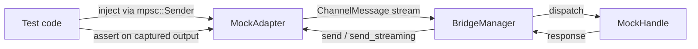

# Other — librefang-channels-tests

# librefang-channels Integration Tests

## Purpose

This module provides integration tests for the `BridgeManager` dispatch pipeline. Tests exercise the **complete message flow** — from adapter ingestion through routing, kernel dispatch, and response delivery — without contacting any external service. All communication happens in-process via real tokio channels and tasks.

## Architecture

Each test follows the same wiring pattern:



**Key production types under test:**
- `BridgeManager` — orchestrates adapter lifecycles and message dispatch
- `AgentRouter` — maps `(ChannelType, user_id)` → `AgentId`
- `ChannelBridgeHandle` — the kernel-side trait the bridge dispatches to
- `ChannelAdapter` — the channel-side trait that produces/consumes messages

## Mock Types

### Channel Adapters

| Mock | Streaming | Purpose |
|------|-----------|---------|
| `MockAdapter` | No | Basic adapter. Captures `send()` output as `(platform_id, text)` pairs. Flattens interactive button labels into text for assertion. |
| `MockStreamingAdapter` | Yes | Overrides `send_streaming()`. Records streamed deltas separately from non-streaming sends, allowing tests to assert which path was taken. |
| `MockFailingStreamingAdapter` | Yes (always fails) | `send_streaming()` drains the delta channel then returns `Err`. Used to exercise the buffered-text fallback branch. |

All adapters are created via a `new(name, channel_type)` function that returns `(Arc<Self>, mpsc::Sender<ChannelMessage>)`. Inject test messages through the sender; inspect captured output via `get_sent()` / `get_streamed()`.

### Kernel Handles

| Mock | Streaming | Progress | Purpose |
|------|-----------|----------|---------|
| `MockHandle` | No | — | Echoes messages. Serves a static agent list. Records received `(AgentId, message)` pairs. |
| `MockStreamingHandle` | Yes (word deltas) | — | Splits the echo response into per-word deltas emitted over an `mpsc::channel`. |
| `MockProgressHandle` | Via `send_message_streaming_with_sender_status` | 🔧 markers | Emits a progress line (`🔧 \`tool_name\``) followed by prose. Tests the V2 contract where progress is surfaced on all channels. |
| `MockKernelErrorHandle` | Yes | 🔧 markers | Sends partial deltas then reports `Err` via the status oneshot. Tests the double-failure outcome (transport + kernel both fail). |
| `MockKernelOkHandle` | Yes | — | Sends clean deltas and reports `Ok(())`. Implements `record_delivery()` to capture `(success, err)` pairs — used to assert the metric contract from the Bug 1 fix. |

## Helper Functions

### `make_text_msg(channel, user_id, text) → ChannelMessage`

Constructs a `ChannelMessage` with `ChannelContent::Text`. Useful for testing normal message dispatch.

### `make_command_msg(channel, user_id, cmd, args) → ChannelMessage`

Constructs a `ChannelMessage` with `ChannelContent::Command`. Used for slash-command tests (`/agents`, `/help`, `/agent`, `/status`).

## Test Catalog

### Basic Dispatch

| Test | What it verifies |
|------|-----------------|
| `test_bridge_dispatch_text_message` | A text message from a pre-routed user reaches the kernel handle and the echo response is delivered back through the adapter's `send()`. |
| `test_bridge_dispatch_no_agent_assigned` | An unrouted user receives a "No agents available" error response. |

### Command Handling

| Test | What it verifies |
|------|-----------------|
| `test_bridge_dispatch_agents_command` | `/agents` command lists all registered agents by name. |
| `test_bridge_dispatch_help_command` | `/help` returns help text mentioning `/agents` and `/agent`. |
| `test_bridge_dispatch_agent_select_command` | `/agent coder` updates the router so subsequent messages from that user route to the selected agent. Asserts both the confirmation message and `router.resolve()` state. |
| `test_bridge_dispatch_status_command` | `/status` returns uptime info including running agent count. |
| `test_bridge_dispatch_slash_command_in_text` | Plain text `/agents` (not the `Command` variant) is still handled as a command by the bridge. |

### Lifecycle & Multi-Adapter

| Test | What it verifies |
|------|-----------------|
| `test_bridge_manager_lifecycle` | Start adapter → send 5 messages → all 5 echo responses received → `stop()` completes without hanging. |
| `test_bridge_multiple_adapters` | Two adapters (Telegram + Discord) run simultaneously on the same `BridgeManager`. Messages sent to each adapter produce responses on the correct adapter. |

### Streaming Paths

| Test | What it verifies |
|------|-----------------|
| `test_bridge_streaming_adapter_uses_send_streaming` | When both the adapter and handle support streaming, `send_streaming()` is called and `send()` is **not** called. |
| `test_bridge_non_streaming_adapter_falls_back_to_send` | A non-streaming adapter uses `send()` even when the handle supports streaming. |
| `test_default_send_streaming_collects_and_sends` | The default `ChannelAdapter::send_streaming()` implementation collects all deltas and calls `self.send()` with the assembled text. |

### Progress Markers & Error Recovery

| Test | What it verifies |
|------|-----------------|
| `test_bridge_non_streaming_adapter_sees_progress_markers` | Non-streaming adapters (Discord/Slack/Matrix) receive progress markers (🔧 `tool_name`) in the consolidated response via the V2 `send_message_streaming_with_sender_status` path. |
| `test_bridge_streaming_adapter_kernel_and_transport_both_fail` | When both `send_streaming()` fails and the kernel reports an error, the fallback `send()` delivers the buffered partial text including progress markers. |
| `test_bridge_streaming_adapter_kernel_ok_transport_fail_records_clean_success` | **Bug 1 regression test.** When the kernel succeeds but `send_streaming()` fails, the fallback delivers buffered text and `record_delivery()` is called with `(success=true, err=None)` — never `err=Some(...)` when success is true. |

## Writing New Tests

To add a new integration test:

1. **Choose or create a mock handle** — start with `MockHandle` unless you need streaming, progress markers, or specific error injection.
2. **Choose or create a mock adapter** — use `MockAdapter` for basic tests, `MockStreamingAdapter` for streaming paths.
3. **Wire everything up:**
   ```rust
   let handle = Arc::new(MockHandle::new(vec![(agent_id, "name".into())]));
   let router = Arc::new(AgentRouter::new());
   router.set_user_default("user1".into(), agent_id);  // if needed

   let (adapter, tx) = MockAdapter::new("test-name", ChannelType::Telegram);
   let adapter_ref = adapter.clone();

   let mut manager = BridgeManager::new(handle, router);
   manager.start_adapter(adapter).await.unwrap();
   ```
4. **Inject messages** via `tx.send(make_text_msg(...)).await.unwrap()`.
5. **Wait** with `tokio::time::sleep(Duration::from_millis(100..300))` for the async pipeline.
6. **Assert** on `adapter_ref.get_sent()` (and `get_streamed()` for streaming adapters).
7. **Clean up** with `manager.stop().await`.