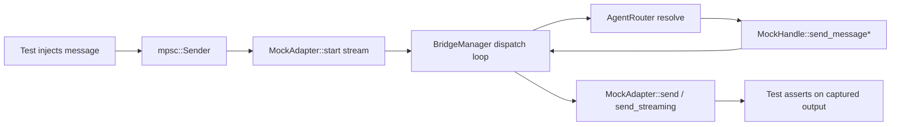

# Other — librefang-channels-tests

# librefang-channels Tests — Bridge Integration Tests

Integration tests for the `BridgeManager` dispatch pipeline in `librefang-channels`. These tests exercise the full message routing path — from adapter ingestion through kernel dispatch back to adapter delivery — using in-process mocks instead of external services.

## Architecture

Every test follows the same wiring pattern: a mock adapter (injectable messages, observable output), a mock kernel handle, and a real `BridgeManager` + `AgentRouter` glued together via tokio channels.

## Mock Infrastructure

### MockAdapter

A non-streaming `ChannelAdapter` implementation used in most basic tests.

- **Message injection**: Constructed with an `mpsc::Sender<ChannelMessage>`. Test code sends messages through this sender; the adapter's `start()` method wraps the corresponding receiver as a `ReceiverStream`.
- **Response capture**: All calls to `send()` record `(platform_id, text)` pairs in a shared `Arc<Mutex<Vec<...>>>`. Access via `get_sent()`.
- **Content handling**: `Text` is stored verbatim. `Interactive` content flattens button labels into the text (appended on newlines). Other content variants are silently accepted.

Created via `MockAdapter::new(name, channel_type)`, which returns `(Arc<Self>, mpsc::Sender<ChannelMessage>)`.

### MockHandle

Implements `ChannelBridgeHandle` with minimal behavior:

- **`send_message`**: Records `(agent_id, message)` and returns `Ok("Echo: {message}")`.
- **`find_agent_by_name`**: Looks up from the `agents` vector passed at construction.
- **`list_agents`**: Returns the full agent list.
- **`spawn_agent_by_name`**: Always returns `Err("mock: spawn not implemented")`.

### MockStreamingAdapter

Extends the mock pattern for streaming-capable adapters (`supports_streaming() -> true`).

- Maintains separate capture buffers: `streamed` for `send_streaming` output, `sent` for `send` output.
- `send_streaming` accumulates all deltas from the `mpsc::Receiver<String>` into a single string, then stores it in `streamed`.
- Access via `get_streamed()` and `get_sent()`.

### MockStreamingHandle

A `ChannelBridgeHandle` that supports `send_message_streaming`.

- `send_message_streaming` splits the echo response into word-by-word deltas emitted via a spawned tokio task.
- Also provides the basic `send_message` echo path.

### MockProgressHandle

Simulates the kernel's streaming-with-status path that produces progress markers (e.g., `🔧 tool_name`).

- `send_message_streaming_with_sender_status` emits a synthetic progress line followed by prose text, then reports `Ok(())` via the status oneshot.
- Does **not** implement `record_delivery` (not needed for progress-marker tests).

### MockFailingStreamingAdapter

A streaming adapter whose `send_streaming` **always** returns `Err`. Used to exercise the buffered-text fallback branch: it drains the delta receiver (so the bridge's tee task can populate `buffered_text`), then fails.

### MockKernelErrorHandle / MockKernelOkHandle

Specialized handles for error-path testing via `send_message_streaming_with_sender_status`:

| Handle | Delta stream | Status oneshot | Purpose |
|--------|-------------|----------------|---------|
| `MockKernelErrorHandle` | Progress + partial text | `Err("rate limit hit")` | Tests outcome: transport fail + kernel fail |
| `MockKernelOkHandle` | Clean reply text | `Ok(())` | Tests outcome: transport fail + kernel OK (Bug 1 fix) |

`MockKernelOkHandle` additionally captures `record_delivery` calls in a `DeliveryLog` (`Arc<Mutex<Vec<(bool, Option<String>)>>>`) so tests can assert on the `(success, error)` metric contract.

## Helper Functions

### `make_text_msg(channel, user_id, text) -> ChannelMessage`

Constructs a `ChannelMessage` with `ChannelContent::Text`. Sets fixed values for `platform_message_id`, `display_name`, `timestamp`, and `metadata`.

### `make_command_msg(channel, user_id, cmd, args) -> ChannelMessage`

Constructs a `ChannelMessage` with `ChannelContent::Command { name, args }`. Same fixed defaults as `make_text_msg`.

## Test Coverage

### Basic Dispatch

| Test | What it verifies |
|------|-----------------|
| `test_bridge_dispatch_text_message` | Text message routes through `AgentRouter` → kernel `send_message` → adapter `send` with echo response |
| `test_bridge_dispatch_no_agent_assigned` | Unrouted user receives a "No agents available" error message |
| `test_bridge_manager_lifecycle` | Start → send 5 messages → stop completes cleanly; all 5 echo responses delivered in order |
| `test_bridge_multiple_adapters` | Two adapters (Telegram + Discord) run simultaneously; messages on each adapter route independently |

### Command Dispatch

| Test | What it verifies |
|------|-----------------|
| `test_bridge_dispatch_agents_command` | `/agents` command returns a listing of all running agents |
| `test_bridge_dispatch_help_command` | `/help` returns help text mentioning `/agents` and `/agent` |
| `test_bridge_dispatch_agent_select_command` | `/agent coder` selects an agent and updates the router; subsequent `router.resolve()` returns the correct agent ID |
| `test_bridge_dispatch_status_command` | `/status` returns uptime info including agent count |
| `test_bridge_dispatch_slash_command_in_text` | `/agents` sent as plain text (not `ChannelContent::Command`) is still parsed and handled as a command |

### Streaming Path

| Test | What it verifies |
|------|-----------------|
| `test_bridge_streaming_adapter_uses_send_streaming` | Streaming-capable adapter + streaming handle → `send_streaming` called, `send` **not** called |
| `test_bridge_non_streaming_adapter_falls_back_to_send` | Non-streaming adapter + streaming handle → falls back to `send()` with the full echo |
| `test_default_send_streaming_collects_and_sends` | Default `send_streaming` on `ChannelAdapter` collects all deltas and calls `self.send()` with assembled text |

### Error and Progress Paths

| Test | What it verifies |
|------|-----------------|
| `test_bridge_non_streaming_adapter_sees_progress_markers` | Non-streaming adapter receives progress markers (🔧) in the consolidated response via the V2 streaming-with-status pipeline |
| `test_bridge_streaming_adapter_kernel_and_transport_both_fail` | Streaming adapter `send_streaming` fails + kernel reports error → fallback `send()` delivers buffered partial text with progress markers preserved |
| `test_bridge_streaming_adapter_kernel_ok_transport_fail_records_clean_success` | **Bug 1 regression test**: streaming adapter fails + kernel succeeds → `record_delivery` records `(success=true, err=None)`, not `(success=true, err=Some(stream_error))` |

### Bug 1 Fix Detail

The `test_bridge_streaming_adapter_kernel_ok_transport_fail_records_clean_success` test guards against a metric contradiction that was introduced and fixed during review:

- **Before fix**: When the kernel succeeded but `send_streaming` returned `Err`, the delivery record was `(success=true, err=Some(transport_error))` — a nonsensical combination.
- **After fix**: `err` is `None` whenever `success` is `true`, because the transport-level stream error is irrelevant when the kernel completed successfully and the fallback `send_response` delivered the buffered text.

## Interaction with Production Code

All tests depend on three production types from `librefang-channels`:

- **`BridgeManager`** — created per test, receives the mock handle and router, orchestrates adapter lifecycle and message dispatch.
- **`AgentRouter`** — real router used directly (calls to `set_user_default` / `resolve`).
- **`ChannelBridgeHandle`** — the trait mocked by all handle implementations; the bridge dispatches agent communication through this interface.
- **`ChannelAdapter`** — the trait mocked by all adapter implementations; the bridge consumes message streams from and sends responses through this interface.

No external services, databases, or network calls are involved. All communication uses tokio channels within a single process. Tests include short `tokio::time::sleep` pauses (100–300ms) to allow the async dispatch loop to process messages before asserting.