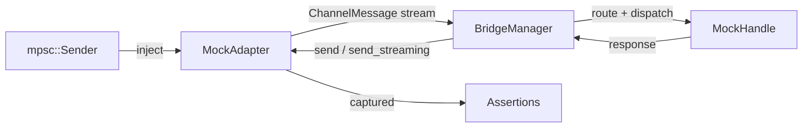

# Other — librefang-channels-tests

# Bridge Integration Tests

Integration tests for the `BridgeManager` dispatch pipeline in `librefang-channels`. These tests exercise the full message dispatch flow end-to-end — from adapter ingestion through routing, kernel invocation, and response delivery — without contacting any external service. All communication happens in-process via tokio channels and tasks.

## Architecture

Every test follows the same wiring pattern: construct mock implementations of the two key traits, hand them to a real `BridgeManager`, inject messages, and assert on captured outputs.



The real production types under test are `BridgeManager`, `AgentRouter`, `ChannelMessage`, and the `ChannelAdapter`/`ChannelBridgeHandle` traits. Only the trait implementations are mocked.

## Test Infrastructure

### `wait_until`

```rust
async fn wait_until<F>(label: &str, mut cond: F)
where
    F: FnMut() -> bool,
```

Deadline-bounded polling helper (2-second budget, 5ms poll interval). Replaces fixed `tokio::time::sleep` waits so tests pass as fast as the pipeline allows and fail promptly on regressions. Panics with a descriptive label on timeout.

### Mock Adapters

All mock adapters follow the same construction pattern: `MockXxx::new(name, channel_type)` returns `(Arc<Self>, mpsc::Sender<ChannelMessage>)`. The sender injects test messages into the adapter's stream; the adapter captures outbound responses in an `Arc<Mutex<Vec<...>>>` for later inspection.

| Adapter | `supports_streaming` | `send_streaming` behavior | Purpose |
|---|---|---|---|
| `MockAdapter` | `false` | default (collects → `send`) | Basic non-streaming channels (Discord, Slack) |
| `MockStreamingAdapter` | `true` | collects deltas, stores separately | Streaming-capable channels (Telegram) |
| `MockFailingStreamingAdapter` | `true` | drains then returns `Err` | Exercising fallback paths when transport fails |

Response capture methods:
- `get_sent()` — messages delivered via `send()` as `(platform_id, text)` pairs
- `get_streamed()` — (streaming adapter only) text assembled from streaming deltas

### Mock Handles

All implement `ChannelBridgeHandle`. Each serves a specific test scenario:

| Handle | `send_message` | Streaming support | Special behavior |
|---|---|---|---|
| `MockHandle` | Returns `Ok("Echo: {msg}")` | No | Records received messages in `self.received` |
| `MockStreamingHandle` | Returns `Ok("Echo: {msg}")` | Yes — emits word-by-word deltas via `send_message_streaming` | Records received messages |
| `MockProgressHandle` | Basic echo | Yes — emits `🔧 tool_name` progress line + prose via `send_message_streaming_with_sender_status` | Tests progress marker surfacing on non-streaming adapters |
| `MockKernelErrorHandle` | Basic echo | Yes — emits partial deltas then reports `Err("rate limit hit")` via status oneshot | Tests dual-failure outcome |
| `MockKernelOkHandle` | Basic echo | Yes — emits clean text then reports `Ok(())` via status oneshot | Records `record_delivery` calls for metric assertion |

`MockKernelOkHandle` exposes a `deliveries()` method returning `Vec<(bool, Option<String>)>` — the `(success, error)` pairs from every `record_delivery` call. This is critical for verifying the metric contract (Bug 1 regression test).

### Message Constructors

```rust
fn make_text_msg(channel: ChannelType, user_id: &str, text: &str) -> ChannelMessage
fn make_command_msg(channel: ChannelType, user_id: &str, cmd: &str, args: Vec<&str>) -> ChannelMessage
```

Build `ChannelMessage` instances with sensible defaults. `make_command_msg` uses the `ChannelContent::Command` variant; `make_text_msg` uses `ChannelContent::Text`. All messages are non-group, have no `thread_id`, and use a fixed `platform_message_id` of `"msg1"`.

## Test Cases

### Basic Dispatch

| Test | What it verifies |
|---|---|
| `test_bridge_dispatch_text_message` | A text message from a pre-routed user reaches the correct agent; the echo response is delivered back to the adapter; both the handle's `received` log and the adapter's `sent` log reflect the exchange. |
| `test_bridge_manager_lifecycle` | Full start → 5 sequential messages → stop lifecycle. Confirms ordering (responses arrive in order) and clean shutdown. |
| `test_bridge_multiple_adapters` | Two adapters (Telegram + Discord) run concurrently on one `BridgeManager`. Each receives its own response without cross-talk. |

### Command Handling

| Test | Command | What it verifies |
|---|---|---|
| `test_bridge_dispatch_agents_command` | `/agents` | Lists all registered agents by name in the response. |
| `test_bridge_dispatch_help_command` | `/help` | Response mentions `/agents` and `/agent`. |
| `test_bridge_dispatch_agent_select_command` | `/agent coder` | Confirmation message contains "Now talking to agent: coder"; router's `resolve` for that user returns the correct `AgentId` after selection. |
| `test_bridge_dispatch_status_command` | `/status` | Response contains "{N} agent(s) running". |
| `test_bridge_dispatch_slash_command_in_text` | `/agents` sent as plain text | The bridge detects the `/agents` prefix in a `ChannelContent::Text` message and treats it as a command rather than forwarding to an agent. |

### Error and Edge Cases

| Test | What it verifies |
|---|---|
| `test_bridge_dispatch_no_agent_assigned` | An unrouted user (no default agent, no agents registered) receives a "No agents available" message instead of a silent drop. |

### Streaming Paths

| Test | Scenario | What it verifies |
|---|---|---|
| `test_bridge_streaming_adapter_uses_send_streaming` | Streaming-capable adapter + streaming handle | `send_streaming` is called (not `send`); `get_streamed()` contains the echo; `get_sent()` is empty. |
| `test_bridge_non_streaming_adapter_falls_back_to_send` | Non-streaming adapter + streaming handle | The adapter's `send()` is called with the full response; streaming capability on the handle side is irrelevant. |
| `test_default_send_streaming_collects_and_sends` | Direct call to default `send_streaming` on `MockAdapter` | The default trait implementation collects all deltas from the channel, assembles them, and calls `self.send()` with the concatenated text. |

### Progress Markers

| Test | What it verifies |
|---|---|
| `test_bridge_non_streaming_adapter_sees_progress_markers` | A non-streaming adapter (Discord) receives a consolidated response that includes the `🔧 tool_name` progress line and post-tool prose. This validates the V2 contract that progress is surfaced on every channel type, not just streaming-capable ones. |

### Failure Scenarios

| Test | Outcome under test | What it verifies |
|---|---|---|
| `test_bridge_streaming_adapter_kernel_and_transport_both_fail` | `send_streaming` returns `Err` + kernel status reports `Err` | The fallback path delivers the buffered partial text (including progress markers) via `send()`. No silent data loss. |
| `test_bridge_streaming_adapter_kernel_ok_transport_fail_records_clean_success` | `send_streaming` returns `Err` + kernel status reports `Ok(())` | The buffered text is delivered. `record_delivery` is called with `(success=true, err=None)` — the transport-side stream error must not leak into the metric's error field. This is the Bug 1 regression test. |

## How to Add a New Test

1. **Choose or create your mock** — pick the existing adapter/handle that matches the behavior you need, or create a new one following the established pattern (constructor returns `(Arc<Self>, Sender)`, captures outputs in `Arc<Mutex<Vec<...>>>`).
2. **Wire the pipeline** — construct `MockHandle`, `AgentRouter`, and your adapter. Pre-route users with `router.set_user_default(...)` if the test requires agent assignment.
3. **Create a `BridgeManager`** — `BridgeManager::new(handle, router)` then `manager.start_adapter(adapter).await`.
4. **Inject messages** via the `mpsc::Sender` returned by the mock constructor.
5. **Poll for results** using `wait_until("label", || !adapter_ref.get_sent().is_empty())`.
6. **Assert** on the captured outputs.
7. **Clean up** with `manager.stop().await`.