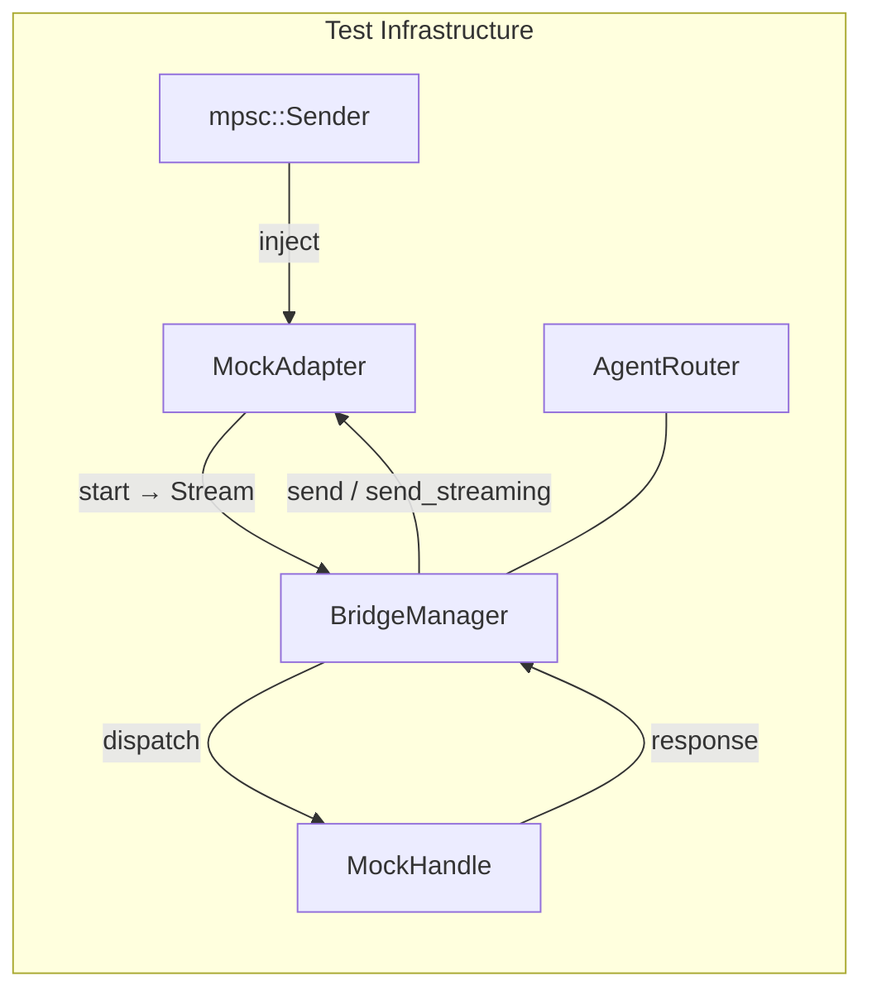

# Other — librefang-channels-tests

# Bridge Integration Tests

End-to-end tests for the `BridgeManager` dispatch pipeline. No external services are contacted — all communication is in-process via real tokio channels and tasks.

## Architecture

The tests wire together three real production components (`BridgeManager`, `AgentRouter`, `ChannelMessage` types) with mock implementations of the two trait boundaries the bridge depends on:



- **`ChannelAdapter`** — mocked to inject test messages and capture outbound responses
- **`ChannelBridgeHandle`** — mocked to echo messages, serve agent lists, simulate streaming deltas, or inject errors

## Mock Implementations

### Channel Adapters

| Adapter | Streaming | Purpose |
|---|---|---|
| `MockAdapter` | No | Basic text/command flow. Captures `send()` output as `(platform_id, text)` pairs. Interactive button labels are flattened into text for assertions. |
| `MockStreamingAdapter` | Yes (`supports_streaming → true`) | Captures `send_streaming()` deltas separately from `send()` calls, allowing tests to verify which code path was taken. |
| `MockFailingStreamingAdapter` | Yes (always errors) | `send_streaming()` drains the delta channel then returns `Err`. Used to exercise fallback branches where the buffered text must be delivered via `send()` instead. |

All adapters are constructed via a `new(name, channel_type) → (Arc<Self>, mpsc::Sender<ChannelMessage>)` pattern. The sender is used by tests to inject messages into the adapter's stream.

### Kernel Handles

| Handle | `send_message_streaming_with_sender_status` | Purpose |
|---|---|---|
| `MockHandle` | N/A | Echoes via `send_message`. Records `(AgentId, message)` pairs. |
| `MockStreamingHandle` | Emits words as individual deltas | Tests the streaming dispatch path. |
| `MockProgressHandle` | Emits `🔧 tool_name` progress line + prose | Verifies non-streaming adapters (Discord/Slack) receive progress markers. |
| `MockKernelErrorHandle` | Emits deltas then signals `Err` on status oneshot | Exercises the "both kernel and transport fail" outcome. |
| `MockKernelOkHandle` | Emits text then signals `Ok` on status oneshot | Records `record_delivery` calls to verify metric correctness (Bug 1 fix). |

## Message Helpers

- **`make_text_msg(channel, user_id, text)`** — constructs a `ChannelMessage` with `ChannelContent::Text`
- **`make_command_msg(channel, user_id, cmd, args)`** — constructs a `ChannelMessage` with `ChannelContent::Command`

Both set sensible defaults (`platform_message_id: "msg1"`, `is_group: false`, `thread_id: None`, empty metadata).

## Test Coverage

### Basic Dispatch

| Test | Verifies |
|---|---|
| `test_bridge_dispatch_text_message` | Text message routes to the correct agent via `AgentRouter`; the echo response is sent back through the adapter; the handle receives the original message. |
| `test_bridge_dispatch_agents_command` | `/agents` command returns a listing containing all registered agent names. |
| `test_bridge_dispatch_help_command` | `/help` command returns text mentioning `/agents` and `/agent`. |
| `test_bridge_dispatch_agent_select_command` | `/agent coder` updates the router so future messages from that user route to the selected agent. Also verifies the confirmation message. |
| `test_bridge_dispatch_status_command` | `/status` returns agent count (e.g., "2 agent(s) running"). |
| `test_bridge_dispatch_slash_command_in_text` | Plain text starting with `/agents` (not the `Command` variant) is still intercepted and handled as a command. |

### Error Handling

| Test | Verifies |
|---|---|
| `test_bridge_dispatch_no_agent_assigned` | When a user has no routed agent and none exist, a "No agents available" message is returned. |

### Lifecycle and Multi-Adapter

| Test | Verifies |
|---|---|
| `test_bridge_manager_lifecycle` | Start adapter → send 5 messages → verify 5 sequential echo responses → `stop()` completes without hanging. |
| `test_bridge_multiple_adapters` | Two adapters (Telegram + Discord) run simultaneously in one `BridgeManager`. Messages sent to each adapter produce responses on the correct adapter only. |

### Streaming Dispatch

| Test | Verifies |
|---|---|
| `test_bridge_streaming_adapter_uses_send_streaming` | When both adapter and handle support streaming, `send_streaming` is called on the adapter and `send()` is **not** called. |
| `test_bridge_non_streaming_adapter_falls_back_to_send` | When the adapter lacks streaming support, `send()` is used even though the handle supports streaming. |
| `test_default_send_streaming_collects_and_sends` | The default `ChannelAdapter::send_streaming` implementation collects all deltas and calls `self.send()` with the assembled text. |

### Progress Markers (V2 Pipeline)

| Test | Verifies |
|---|---|
| `test_bridge_non_streaming_adapter_sees_progress_markers` | Non-streaming adapters receive progress markers (`🔧`) in the consolidated response, not just streaming-capable ones. |

### Failure Path Recovery

| Test | Verifies |
|---|---|
| `test_bridge_streaming_adapter_kernel_and_transport_both_fail` | When both `send_streaming` errors and the kernel reports failure, the fallback delivers the buffered partial text (including progress markers) via `send()`. |
| `test_bridge_streaming_adapter_kernel_ok_transport_fail_records_clean_success` | **Bug 1 regression test.** When the kernel succeeds but `send_streaming` fails, the fallback `send()` delivers the buffered text and `record_delivery` is called with `(success=true, err=None)` — the transport-side stream error must not leak into the error field. |

## Test Pattern

Every test follows the same structure:

```
1. Create mock handle with known agents
2. Create AgentRouter, optionally pre-route users
3. Create mock adapter(s)
4. Instantiate BridgeManager::new(handle, router)
5. manager.start_adapter(adapter).await
6. Inject message(s) via mpsc::Sender
7. tokio::time::sleep(100-300ms) — allow async dispatch
8. Assert on adapter.get_sent() / adapter.get_streamed()
9. Assert on handle.received / handle.deliveries()
10. manager.stop().await
```

## Adding New Tests

1. Determine which mock adapter and handle combination you need (see tables above).
2. Use `make_text_msg` or `make_command_msg` to construct the inbound message.
3. Pre-configure the `AgentRouter` via `set_user_default` if the test requires a routed user.
4. Inject the message through the adapter's `mpsc::Sender`.
5. Sleep briefly, then assert on the captured output.
6. Always call `manager.stop().await` at the end to clean up spawned tasks.