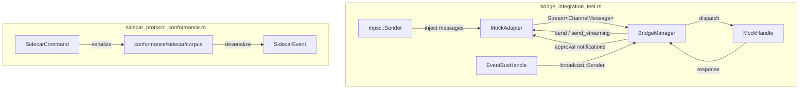

# Other — librefang-channels-tests

# librefang-channels Tests

Integration and conformance tests for the `librefang-channels` crate, exercising the `BridgeManager` dispatch pipeline end-to-end and validating the sidecar wire protocol against a shared corpus.

## Architecture

All tests run entirely in-process using real `tokio` channels and tasks. No external services are contacted.


```mermaid
graph TD
    subgraph "bridge_integration_test.rs"
        TX[mpsc::Sender] -->|inject messages| MA[MockAdapter]
        MA -->|Stream&lt;ChannelMessage&gt;| BM[BridgeManager]
        BM -->|dispatch| MH[MockHandle]
        MH -->|response| BM
        BM -->|send / send_streaming| MA
        EB[EventBusHandle] -->|broadcast::Sender| BM
        BM -->|approval notifications| MA
    end

    subgraph "sidecar_protocol_conformance.rs"
        CORPUS[conformance/sidecar/corpus] -->|deserialize| SE[SidecarEvent]
        SC[SidecarCommand] -->|serialize| CORPUS
    end
```

## Test Utilities

### `wait_until` — Deadline-Bounded Polling

Replaces fixed `sleep()` waits with a 2-second deadline loop that polls every 5ms. This gives the async dispatch pipeline exactly as long as it needs (typically tens of milliseconds) while failing fast on regressions.

```rust
async fn wait_until<F>(label: &str, mut cond: F)
where
    F: FnMut() -> bool,
```

Panics with a labeled message if the condition is not met within 2 seconds.

### Message Constructors

- **`make_text_msg(channel, user_id, text)`** — Builds a `ChannelMessage` with `ChannelContent::Text`.
- **`make_command_msg(channel, user_id, cmd, args)`** — Builds a `ChannelMessage` with `ChannelContent::Command`.

Both set `is_group: false`, `thread_id: None`, and a placeholder `platform_message_id`.

## Mock Adapters

### `MockAdapter`

Basic `ChannelAdapter` implementation. Messages are injected via the `mpsc::Sender` returned from `MockAdapter::new()`. Outbound responses are captured in an `Arc<Mutex<Vec<(String, String)>>>` accessible via `get_sent()`.

Supports per-instance `ChannelOverrides` through `new_with_overrides()`, mirroring how a sidecar built from `[[sidecar_channels]]` carries its own command policy.

### `MockStreamingAdapter`

Reports `supports_streaming() → true`. Captures streaming deltas into a separate `streamed` buffer (distinct from the `sent` buffer used by `send()`), allowing tests to assert which delivery path was taken.

### `MockFailingStreamingAdapter`

Reports `supports_streaming() → true` but `send_streaming()` always drains the delta channel and returns `Err`. Used to exercise the buffered-text fallback branch in the bridge.

### `NotifyingAdapter`

Overrides `notification_recipients()` to return a configured list of operator users, and optionally exposes `account_id()` for multi-bot scoping. Returns an immediately-closed stream from `start()` since it is only used for outbound notification tests.

Factory methods:
- `new(name, recipients)` — basic adapter with recipients
- `with_account(name, account_id, recipients)` — multi-bot adapter with account scoping
- `with_channel_and_account(name, channel_type, account_id, recipients)` — non-Telegram multi-bot

## Mock Kernel Handles

All implement `ChannelBridgeHandle`.

| Handle | Behavior |
|---|---|
| `MockHandle` | Echoes messages via `send_message`; serves a static agent list from construction. Records received messages. |
| `MockStreamingHandle` | Emits word-by-word deltas through `send_message_streaming`. Falls back to echo for non-streaming `send_message`. |
| `MockProgressHandle` | `send_message_streaming_with_sender_status` emits a `🔧 tool_name` progress line followed by prose, with `Ok(())` status. |
| `MockKernelErrorHandle` | Emits progress + partial text deltas, then reports `Err("rate limit hit")` via the status oneshot. |
| `MockKernelOkHandle` | Emits clean text, reports `Ok(())` status. Also implements `record_delivery` to capture `(success, err)` metric tuples — used to verify the Bug 1 fix. |
| `EventBusHandle` | Exposes a real `tokio::sync::broadcast` channel through `subscribe_events()`. All other methods return errors or empty results. |

## Bridge Integration Tests

### Basic Dispatch

| Test | What it verifies |
|---|---|
| `test_bridge_dispatch_text_message` | A text message from a pre-routed user reaches the agent via `send_message`, and the echo response is delivered back through the adapter's `send()`. |
| `test_bridge_dispatch_agents_command` | `/agents` command returns a formatted list of all running agents. |
| `test_bridge_dispatch_help_command` | `/help` command returns help text mentioning `/agents` and `/agent`. |
| `test_bridge_dispatch_agent_select_command` | `/agent coder` updates the router so subsequent messages from that user route to the selected agent. Verifies both the confirmation reply and the router state change via `router.resolve()`. |
| `test_bridge_dispatch_status_command` | `/status` command returns uptime info including the count of running agents. |
| `test_bridge_dispatch_slash_command_in_text` | `/agents` sent as plain `ChannelContent::Text` is still recognized and handled as a command. |
| `test_bridge_dispatch_no_agent_assigned` | An unrouted user receives a "No agents available" error message instead of silence. |
| `test_bridge_manager_lifecycle` | Start, send 5 sequential messages, verify all 5 echo responses arrive in order, then stop without hanging. |
| `test_bridge_multiple_adapters` | Two adapters (Telegram + Discord) running simultaneously in the same `BridgeManager` each dispatch and receive responses independently. |

### Security / Command Gating

**`test_bridge_allowlist_empty_fails_closed_gates_command_5931`** — Regression test for #5931. Constructs a real `SidecarAdapter` with `command_policy = "allowlist"` and an empty `allowed_commands` list. Verifies:

1. `channel_overrides()` produces `disable_commands = true` (fail-closed).
2. A `/agent coder` command is **not** executed as a switch — it is forwarded verbatim to the agent as plain text input.
3. The router state is unchanged.

### Streaming Dispatch

| Test | What it verifies |
|---|---|
| `test_bridge_streaming_adapter_uses_send_streaming` | When both adapter and handle support streaming, `send_streaming` is called and `send` is not. |
| `test_bridge_non_streaming_adapter_falls_back_to_send` | A non-streaming adapter uses `send()` even when the handle supports streaming. |
| `test_default_send_streaming_collects_and_sends` | The default `ChannelAdapter::send_streaming` implementation collects all deltas and calls `self.send()` with the assembled text. |

### Progress Markers

**`test_bridge_non_streaming_adapter_sees_progress_markers`** — A non-streaming adapter (simulating Discord/Slack/Matrix) receives progress markers (`🔧 tool_name`) as part of the consolidated response. This validates the V2 contract: progress information is surfaced on every channel type, not just streaming-capable ones.

### Error and Fallback Paths

| Test | What it verifies |
|---|---|
| `test_bridge_streaming_adapter_kernel_and_transport_both_fail` | Outcome 4: `send_streaming` returns `Err` and the kernel status oneshot reports `Err`. The fallback path delivers the buffered partial text (including progress markers) via `send()`. |
| `test_bridge_streaming_adapter_kernel_ok_transport_fail_records_clean_success` | Bug 1 fix (V3): `send_streaming` returns `Err` but kernel reports `Ok`. The buffered text is delivered via fallback `send()`, and `record_delivery` is called with `(success=true, err=None)` — not the contradictory `(success=true, err=Some(stream_error))` that the bug produced. |

### Approval Listener Tests

These tests exercise `BridgeManager::start_approval_listener()`, which subscribes to the kernel's event bus and delivers `ApprovalRequested` events to adapters' notification recipients.

#### Scoping Evolution

The approval listener underwent multiple fixes tracked by PR numbers:

- **#4875** — Wired up the previously-dead approval listener.
- **#4985** — Prevented cross-agent broadcast: approvals are scoped to adapters whose router binding matches the requesting agent.
- **#4994** — Prevented qualified-key fallback to bare key in multi-bot configs.
- **#5002** — Added binding-aware fallback for adapters without `default_agent`.

#### Test Matrix

| Test | PR | Scenario |
|---|---|---|
| `test_approval_listener_delivers_to_configured_recipients` | #4875 | Happy path: approval reaches configured notification recipients with correct formatting (8-char ID prefix, tool name, `/approve`/`/reject` hints). |
| `test_approval_listener_skips_adapter_without_recipients` | #4875 | Adapter with no recipients produces zero `send()` calls. |
| `test_approval_listener_scopes_delivery_to_requesting_agent_adapter` | #4985 | Two adapters on account-qualified keys (`telegram:bot-a`, `telegram:bot-b`); approval for agent A only reaches adapter A. |
| `test_approval_listener_skips_unbound_adapter` | #4985 | Adapter with no `channel_default` binding receives nothing. |
| `test_approval_listener_drops_malformed_agent_id` | #4994 | Event with non-UUID `agent_id` is silently dropped rather than broadcast. |
| `test_approval_listener_does_not_fall_back_from_qualified_to_bare_key` | #4994 | Mixed single-bot + multi-bot config; the multi-bot adapter does not fall back to the bare `telegram` key. |
| `test_approval_listener_scopes_to_non_telegram_multibot_adapter` | #4994 | Scoping works for Discord (`discord:guild-1` vs `discord:guild-2`), confirming channel-type-agnostic key construction. |
| `test_approval_listener_falls_back_to_agent_binding_when_default_unset` | #5002 | Adapter with `default_agent = None` but an `AgentBinding` mapping chat `chat-z` → agent X still receives the approval. |
| `test_approval_listener_binding_fallback_does_not_leak_cross_agent` | #5002 | Same setup, approval for an unbound agent Y produces no delivery. |
| `test_approval_listener_fans_out_to_all_bound_chats` | #5002 | Agent bound to two chats receives the approval in both. |
| `test_approval_listener_skips_binding_with_no_peer_id` | #5002 | Catch-all binding (channel-only, no `peer_id`) is skipped — no chat to deliver to. |
| `test_approval_listener_binding_respects_account_id_scope` | #5002 | Binding scoped to `account_id=bot-a` does not fire on `bot-b`. |

## Sidecar Protocol Conformance Tests

**`sidecar_protocol_conformance.rs`** validates the sidecar wire protocol against a shared JSON corpus located at `conformance/sidecar/corpus/`. The same corpus is used by the Python SDK's conformance suite (`sdk/python/tests/test_sidecar_conformance.py`), making drift on either side fail its own CI.

### Directionality

- **Events** (corpus dir `events/`): produced by adapters, consumed by Rust. Tests assert every corpus event deserializes into the expected `SidecarEvent` variant.
- **Commands** (corpus dir `commands/`): produced by Rust, consumed by adapters. Tests assert each `SidecarCommand` serializes to the exact corpus JSON value.

Equality is structural JSON value equality, not byte equality.

### Test Functions

| Test | What it verifies |
|---|---|
| `corpus_files_are_well_formed` | Every `.json` file under `events/` and `commands/` is a JSON object with a string `method` field. Also asserts the corpus is non-empty. |
| `events_deserialize_into_expected_variant` | Each corpus event file parses into the `SidecarEvent` variant matching its `method` string (`message`, `ready`, `error`, `typing`, `qr_ready`, `qr_status`). |
| `ready_full_and_minimal_both_parse` | The `ready` event parses in both full form (with capabilities, account_id, protocol_version) and minimal legacy form (empty capabilities, no protocol_version). This backward-compatibility guarantee is corpus-pinned. |
| `commands_serialize_to_corpus` | Every `SidecarCommand` variant serializes to its matching corpus file. The test asserts the set of covered corpus files exactly matches the corpus directory — a fixture with no producer assertion fails the test. |

### Adding New Protocol Messages

1. Add a `.json` file to `conformance/sidecar/corpus/events/` or `commands/` with the canonical frame.
2. If it's an event: add a match arm to `events_deserialize_into_expected_variant`.
3. If it's a command: add a case to the `cases` vector in `commands_serialize_to_corpus`.
4. Run the Python conformance suite to validate the other side.

## Running the Tests

```bash
# All channel tests
cargo test -p librefang-channels --test bridge_integration_test
cargo test -p librefang-channels --test sidecar_protocol_conformance

# Single test
cargo test -p librefang-channels --test bridge_integration_test -- test_approval_listener_scopes_delivery_to_requesting_agent_adapter
```

All tests are `#[tokio::test]` async tests. The `wait_until` helper ensures they complete in under 2 seconds on healthy code; a stuck dispatch surfaces as a panic rather than a hang.