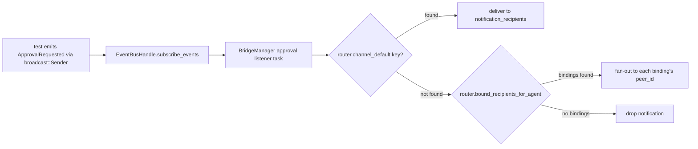

# Other — librefang-channels-tests

# librefang-channels-tests

Integration and conformance tests for the `librefang-channels` crate. Two test files cover distinct concerns:

- **`bridge_integration_test.rs`** — end-to-end dispatch pipeline tests exercising `BridgeManager` with mock adapters and kernel handles
- **`sidecar_protocol_conformance.rs`** — protocol serialization/deserialization conformance against a shared JSON corpus used by both the Rust sidecar implementation and the Python SDK

No external services are contacted. All communication is in-process via tokio channels and tasks.

---

## Test Infrastructure (`bridge_integration_test.rs`)

### `wait_until` — Deadline-Bounded Condition Polling

```rust
async fn wait_until<F>(label: &str, mut cond: F)
where
    F: FnMut() -> bool,
```

Replaces fixed `sleep()` waits with a 2-second deadline loop polling every 5ms. Gives the dispatch pipeline exactly as much time as it needs while failing fast on regressions. The 2s budget is well above the ~tens-of-ms in-process latency but tight enough that a stuck dispatch surfaces quickly.

Panics with a labeled message on timeout.

### Mock Adapters

All mock adapters implement `ChannelAdapter`. They inject test messages via an `mpsc::Sender<ChannelMessage>` and capture outbound responses in an `Arc<Mutex<Vec<...>>>` for assertion.

| Adapter | Streaming | `send_streaming` behavior | Purpose |
|---|---|---|---|
| `MockAdapter` | No | Default (collect → `send()`) | Basic text/command dispatch tests |
| `MockStreamingAdapter` | Yes (`supports_streaming() → true`) | Assembles deltas, records in `streamed` | Verifies streaming path is taken |
| `MockFailingStreamingAdapter` | Yes | Drains deltas then returns `Err` | Exercises fallback on transport failure |
| `NotifyingAdapter` | No | N/A | Approval listener tests; overrides `notification_recipients()` and `account_id()` |

Each adapter's `new()` returns `(Arc<Self>, mpsc::Sender<ChannelMessage>)`. The sender injects `ChannelMessage` instances into the adapter's inbound stream; the adapter captures all `send()` output as `(platform_id, text)` pairs.

`MockAdapter::send()` also flattens `ChannelContent::Interactive` button labels into text for assertion convenience.

### Mock Kernel Handles

All implement `ChannelBridgeHandle`. They serve agent lists, record received messages, and optionally provide streaming or event-bus support.

| Handle | Streaming | Event Bus | Key Behavior |
|---|---|---|---|
| `MockHandle` | No | No | Echoes messages: `Ok("Echo: {message}")` |
| `MockStreamingHandle` | Yes (word-at-a-time deltas) | No | Splits response into space-delimited word deltas via `mpsc::channel` |
| `MockProgressHandle` | With status | No | Emits `🔧 tool_name` progress line + prose; simulates tool-use streaming |
| `MockKernelErrorHandle` | With status | No | Emits partial deltas + progress, then reports `Err("rate limit hit")` via status oneshot |
| `MockKernelOkHandle` | With status | No | Emits clean text, reports `Ok(())` via status oneshot; records `record_delivery` calls for metric contract assertions |
| `EventBusHandle` | No | Yes (`broadcast::Sender`) | Exposes `subscribe_events()` with a real broadcast channel for approval listener tests |

### Message Constructors

```rust
fn make_text_msg(channel: ChannelType, user_id: &str, text: &str) -> ChannelMessage
fn make_command_msg(channel: ChannelType, user_id: &str, cmd: &str, args: Vec<&str>) -> ChannelMessage
```

Build `ChannelMessage` instances with sensible defaults (`platform_message_id: "msg1"`, `is_group: false`, current timestamp, empty metadata). `make_command_msg` constructs a `ChannelContent::Command` variant; `make_text_msg` constructs `ChannelContent::Text`.

---

## Dispatch Pipeline Tests

### Message Routing

| Test | Verifies |
|---|---|
| `test_bridge_dispatch_text_message` | Text message reaches the correct agent (pre-routed via `router.set_user_default`); echo response returns through the adapter |
| `test_bridge_dispatch_no_agent_assigned` | Unrouted user gets "No agents available" error message |
| `test_bridge_dispatch_slash_command_in_text` | Plain text "/agents" is intercepted and handled as a command (not forwarded to an agent) |

### Command Handling

| Test | Command | Verifies |
|---|---|---|
| `test_bridge_dispatch_agents_command` | `/agents` | Response lists all registered agents by name |
| `test_bridge_dispatch_help_command` | `/help` | Response mentions `/agents` and `/agent` |
| `test_bridge_dispatch_agent_select_command` | `/agent coder` | Confirmation message; `router.resolve()` returns the selected agent for subsequent messages |
| `test_bridge_dispatch_status_command` | `/status` | Response contains "N agent(s) running" |

### Lifecycle and Concurrency

| Test | Verifies |
|---|---|
| `test_bridge_manager_lifecycle` | Start adapter → send 5 messages → verify 5 echo responses in order → `stop()` completes without hanging |
| `test_bridge_multiple_adapters` | Two adapters (Telegram + Discord) run simultaneously in one `BridgeManager`; messages routed to correct adapter |

---

## Streaming Tests

The streaming tests exercise the interaction between three capabilities: adapter streaming support, kernel streaming support, and error fallback paths.

### Happy Paths

```
Kernel supports     Adapter supports      Path taken
─────────────────   ──────────────────   ──────────────────────
streaming           streaming             send_streaming (delta-by-delta)
streaming           non-streaming         send() (collected text)
non-streaming       streaming             send() (collected text)
non-streaming       non-streaming         send() (collected text)
```

| Test | Scenario |
|---|---|
| `test_bridge_streaming_adapter_uses_send_streaming` | Streaming adapter + streaming handle → `send_streaming` called, `send` not called |
| `test_bridge_non_streaming_adapter_falls_back_to_send` | Non-streaming adapter + streaming handle → falls back to `send()` |
| `test_default_send_streaming_collects_and_sends` | Direct call to default `send_streaming` on `MockAdapter`; verifies deltas assemble into `"Hello world!"` before `send()` is called |

### Error and Fallback Paths

These tests cover the V2 dispatch pipeline's error handling matrix:

| Test | Kernel | Transport (`send_streaming`) | Expected |
|---|---|---|---|
| `test_bridge_non_streaming_adapter_sees_progress_markers` | Success (with progress) | N/A (non-streaming) | Consolidated reply includes `🔧` progress markers |
| `test_bridge_streaming_adapter_kernel_and_transport_both_fail` | Error (`"rate limit hit"`) | Error (`"simulated transport failure"`) | Fallback `send()` delivers buffered partial text + progress markers |
| `test_bridge_streaming_adapter_kernel_ok_transport_fail_records_clean_success` | Success | Error | Fallback `send()` delivers buffered text; `record_delivery(success=true, err=None)` — the transport stream error must not leak into the metric err field (Bug 1 regression guard) |

---

## Approval Listener Tests

Regression coverage for `BridgeManager::start_approval_listener()`. Tests span three PRs that closed progressively discovered scoping bugs:

```
#4875  Listener was dead code → wired up, basic delivery works
  ↓
#4985  Cross-agent broadcast leak → scoped by router channel_default
  ↓
#4994  Qualified-key fallback leak → no fallback from qualified to bare key
  ↓
#5002  Binding-only adapters dropped → fallback to AgentBinding fan-out
```

### Basic Delivery

| Test | Verifies |
|---|---|
| `test_approval_listener_delivers_to_configured_recipients` | `ApprovalRequested` event reaches adapter's `notification_recipients()` with formatted text including tool name, approval ID prefix, and `/approve`/`/reject` hints |
| `test_approval_listener_skips_adapter_without_recipients` | Adapter with empty recipients list produces no `send()` calls |

### Agent Scoping (#4985)

| Test | Verifies |
|---|---|
| `test_approval_listener_scopes_delivery_to_requesting_agent_adapter` | Two adapters bound to two agents via account-qualified keys (`telegram:bot-a`, `telegram:bot-b`); approval for agent A only reaches adapter A |
| `test_approval_listener_skips_unbound_adapter` | Adapter with no `channel_default` entry in the router receives nothing |
| `test_approval_listener_drops_malformed_agent_id` | Non-UUID `agent_id` on the event drops the notification rather than broadcasting |

### Qualified Key Regression (#4994)

| Test | Verifies |
|---|---|
| `test_approval_listener_does_not_fall_back_from_qualified_to_bare_key` | Mixed single-bot + multi-bot config; account-qualified adapter must not fall back to bare-key binding |
| `test_approval_listener_scopes_to_non_telegram_multibot_adapter` | Scoping is channel-type-agnostic; Discord adapters with `account_id` use qualified keys (`discord:guild-1`) |

### Binding-Aware Scoping (#5002)

When an adapter has no `default_agent` (no `channel_default` entry), the listener falls back to `AgentRouter::bound_recipients_for_agent` to find bindings whose agent matches the requesting agent.

| Test | Verifies |
|---|---|
| `test_approval_listener_falls_back_to_agent_binding_when_default_unset` | Binding maps `chat-z` → agent X; approval for X arrives at `chat-z` |
| `test_approval_listener_binding_fallback_does_not_leak_cross_agent` | Approval for unrelated agent Y produces no delivery on adapter bound only to X |
| `test_approval_listener_fans_out_to_all_bound_chats` | Agent bound to `chat-z1` and `chat-z2`; both receive the notification |
| `test_approval_listener_skips_binding_with_no_peer_id` | Catch-all channel binding with no `peer_id` is skipped (no chat to deliver to) |
| `test_approval_listener_binding_respects_account_id_scope` | Binding scoped to `(telegram, bot-a)` does not fire on `bot-b` |

### Approval Test Architecture


```mermaid
graph LR
    A[test emits ApprovalRequested via broadcast::Sender] --> B[EventBusHandle.subscribe_events]
    B --> C[BridgeManager approval listener task]
    C --> D{router.channel_default key?}
    D -- found --> E[deliver to notification_recipients]
    D -- not found --> F{router.bound_recipients_for_agent}
    F -- bindings found --> G[fan-out to each binding's peer_id]
    F -- no bindings --> H[drop notification]
```

---

## Sidecar Protocol Conformance (`sidecar_protocol_conformance.rs`)

Dual-implementation conformance testing against a shared JSON corpus at `conformance/sidecar/corpus/`. The Rust and Python SDKs both assert against the same files; drift on either side fails its respective test suite.

### Directionality

- **Events** (`corpus/events/`): adapters *produce* them, Rust *consumes* them — tests assert deserialization into the correct `SidecarEvent` variant
- **Commands** (`corpus/commands/`): Rust *produces* them — tests assert serialization matches corpus JSON structurally

### Corpus Structure

```
conformance/sidecar/corpus/
├── events/
│   ├── message.json
│   ├── ready_full.json
│   ├── ready_minimal.json
│   ├── error.json
│   └── typing.json
└── commands/
    ├── send_full.json
    ├── send_minimal.json
    ├── ready_ack.json
    ├── shutdown.json
    ├── heartbeat.json
    ├── typing.json
    ├── reaction.json
    ├── interactive.json
    ├── stream_start.json
    ├── stream_start_threaded.json
    ├── stream_delta.json
    └── stream_end.json
```

Every corpus file is a JSON object with a string `method` field.

### Test Cases

| Test | What it asserts |
|---|---|
| `corpus_files_are_well_formed` | Every `.json` under `events/` and `commands/` is a JSON object with a string `method` field |
| `events_deserialize_into_expected_variant` | Each corpus event deserializes into the `SidecarEvent` variant matching its `method` (`"message"` → `SidecarEvent::Message`, etc.) |
| `ready_full_and_minimal_both_parse` | `ready_full.json` parses with capabilities and `account_id`; `ready_minimal.json` parses with empty capabilities and no `protocol_version` — backward-compat guarantee |
| `commands_serialize_to_corpus` | Each `SidecarCommand` serializes to exactly the corresponding corpus JSON (structural `Value` equality); the list of asserted files must exactly match the corpus directory contents |

### Adding New Protocol Messages

1. Add the corpus JSON file(s) to `conformance/sidecar/corpus/`
2. For events: ensure `events_deserialize_into_expected_variant` covers the new `method` string in its match arms
3. For commands: add a case to the `cases` vector in `commands_serialize_to_corpus`; the test asserts exhaustive coverage by comparing sorted filenames against the corpus directory