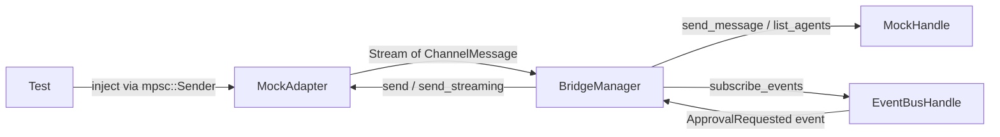

# Other — librefang-channels-tests

# librefang-channels Tests

Integration and conformance tests for the channel bridge dispatch pipeline and sidecar protocol.

## Overview

This module contains two top-level test files:

| File | Purpose |
|------|---------|
| `bridge_integration_test.rs` | End-to-end tests for `BridgeManager` dispatch, streaming, error handling, and the approval listener |
| `sidecar_protocol_conformance.rs` | Serialization/deserialization conformance against the shared sidecar protocol corpus |

No external services are contacted. All communication is in-process via real tokio channels and tasks.

## Architecture

The tests construct mock implementations of the two key traits — `ChannelAdapter` and `ChannelBridgeHandle` — wire them through the real `BridgeManager`, and verify behavior by inspecting captured outputs.

```mermaid
graph LR
    T[Test] -->|inject via mpsc::Sender| MA[MockAdapter]
    MA -->|Stream of ChannelMessage| BM[BridgeManager]
    BM -->|send_message / list_agents| MH[MockHandle]
    BM -->|send / send_streaming| MA
    BM -->|subscribe_events| EB[EventBusHandle]
    EB -->|ApprovalRequested event| BM
```

## Test Infrastructure

### Condition-Based Polling

`wait_until(label, cond)` replaces fixed `tokio::time::sleep` calls. It polls `cond()` every 5 ms with a 2-second deadline. Tests fail fast on regressions rather than flaking on slow CI runners. Every async test uses this to wait for dispatch pipeline results.

### Mock Adapters

| Adapter | Streaming | Purpose |
|---------|-----------|---------|
| `MockAdapter` | No | Injects messages via `mpsc::Sender`, captures responses in `sent`. Optional `ChannelOverrides` for command-policy tests. |
| `MockStreamingAdapter` | Yes (`supports_streaming() → true`) | Captures streamed text in `streamed`, non-streamed text in `sent`. Used to verify the streaming path is taken. |
| `MockFailingStreamingAdapter` | Yes (always fails) | `send_streaming()` drains deltas then returns `Err`. Exercises the `buffered_text` fallback branch. |
| `NotifyingAdapter` | No | Overrides `notification_recipients()` and `account_id()`. Closes its inbound stream immediately — used exclusively for approval-listener tests. |

All adapters are constructed as `Arc<Self>` with an accompanying `mpsc::Sender<ChannelMessage>` for test injection. Captured outputs (`sent`, `streamed`) are `Arc<Mutex<Vec<_>>>` for lock-and-clone inspection.

### Mock Kernel Handles

| Handle | Key Behavior |
|--------|-------------|
| `MockHandle` | `send_message` echoes `"Echo: {msg}"`. `find_agent_by_name` / `list_agents` serve a static agent list. |
| `MockStreamingHandle` | `send_message_streaming` emits the echo as individual word deltas over an `mpsc::Receiver<String>`. |
| `MockProgressHandle` | `send_message_streaming_with_sender_status` emits a `🔧 tool_name` progress line followed by prose. Tests that non-streaming adapters see progress markers. |
| `MockKernelErrorHandle` | Streams progress + partial text, then reports `Err("rate limit hit")` on the status oneshot. Exercises the dual-failure outcome. |
| `MockKernelOkHandle` | Streams clean text, reports `Ok(())`. Records every `record_delivery` call in `deliveries: DeliveryLog` for metric-contract assertions. |
| `EventBusHandle` | Exposes a real `tokio::sync::broadcast` channel via `subscribe_events()`. Used for approval-listener tests. |

### Message Constructors

- **`make_text_msg(channel, user_id, text)`** — builds a `ChannelMessage` with `ChannelContent::Text`.
- **`make_command_msg(channel, user_id, cmd, args)`** — builds a `ChannelMessage` with `ChannelContent::Command`.

Both set `is_group: false`, empty `metadata`, and `timestamp: chrono::Utc::now()`.

## Bridge Dispatch Tests

### Basic Message and Command Routing

| Test | What it verifies |
|------|-----------------|
| `test_bridge_dispatch_text_message` | A text message from a pre-routed user reaches the correct agent. The handle receives the raw text; the adapter receives the echo response. |
| `test_bridge_dispatch_agents_command` | `/agents` command returns a listing containing all registered agent names. |
| `test_bridge_dispatch_help_command` | `/help` returns text mentioning `/agents` and `/agent`. |
| `test_bridge_dispatch_agent_select_command` | `/agent coder` selects the agent, confirms with "Now talking to agent: coder", and updates the `AgentRouter` so subsequent `resolve` returns the chosen agent. |
| `test_bridge_dispatch_status_command` | `/status` returns "N agent(s) running" reflecting the handle's agent count. |
| `test_bridge_dispatch_slash_command_in_text` | `/agents` sent as plain text (`ChannelContent::Text`) is still recognized and handled as a command. |
| `test_bridge_dispatch_no_agent_assigned` | A message from an unrouted user receives a "No agents available" error. |

### Streaming

| Test | What it verifies |
|------|-----------------|
| `test_bridge_streaming_adapter_uses_send_streaming` | When both adapter and handle support streaming, `send_streaming` is called instead of `send`. The non-streaming `sent` buffer remains empty. |
| `test_bridge_non_streaming_adapter_falls_back_to_send` | When the adapter does not support streaming (even though the handle does), the regular `send()` path is used. |
| `test_default_send_streaming_collects_and_sends` | The default `ChannelAdapter::send_streaming` implementation collects all deltas and forwards the assembled text to `send()`. Tested by calling the method directly. |
| `test_bridge_non_streaming_adapter_sees_progress_markers` | A non-streaming adapter (Discord/Slack/Matrix shape) receives `🔧` progress markers as part of the consolidated response via the `send_message_streaming_with_sender_status` → `send_response` pipeline. |

### Error Handling and Fail-Closed Behavior

| Test | Regression | What it verifies |
|------|-----------|-----------------|
| `test_bridge_allowlist_empty_fails_closed_gates_command_5931` | #5931 | A sidecar with `command_policy = "allowlist"` and an empty `allowed_commands` maps to `disable_commands = true`. A `/agent coder` command is NOT executed — it is forwarded to the agent as plain text. The router is unchanged. Uses the real `SidecarAdapter` → `overrides_from_sidecar_config` mapping path. |
| `test_bridge_streaming_adapter_kernel_and_transport_both_fail` | — | When `send_streaming` returns `Err` AND the kernel status oneshot reports `Err`, the fallback delivers the buffered partial text (including progress markers) via `send()`. |
| `test_bridge_streaming_adapter_kernel_ok_transport_fail_records_clean_success` | Bug 1 (review-driven) | When `send_streaming` returns `Err` but the kernel succeeded (`Ok(())`), `record_delivery` must record `(success=true, err=None)`. The pre-fix code incorrectly set `err=Some(stream_error)`, producing contradictory metrics. |

### Lifecycle and Multi-Adapter

| Test | What it verifies |
|------|-----------------|
| `test_bridge_manager_lifecycle` | Start adapter, send 5 sequential messages, verify all 5 echo responses arrive in order, stop without hanging. |
| `test_bridge_multiple_adapters` | Two adapters (Telegram + Discord) run simultaneously in the same `BridgeManager`. Messages injected into each adapter's sender produce the correct echo on that adapter only. |

## Approval Listener Tests

These tests cover the `BridgeManager::start_approval_listener` subsystem, which forwards `ApprovalRequested` events from the kernel's event bus to channel adapters' notification recipients.

### Historical Context

| PR | Issue | Fix |
|----|-------|-----|
| #4875 | Listener was dead code — no caller wired it up | Added `start_approval_listener()` call site |
| #4985 | Every approval broadcast to every adapter regardless of agent | Scoped delivery through `AgentRouter::channel_default` keyed by `(channel_type, account_id)` |
| #4994 | Qualified-key adapters fell back to bare-key lookup, leaking approvals | Removed `or_else` fallback; account-qualified adapters only look up their qualified key |
| #5002 | Binding-routed adapters (no `default_agent`) had no `channel_default` entry → silently dropped | Fallback to `AgentRouter::bound_recipients_for_agent` walks the binding list |

### Test Coverage

| Test | PR | What it verifies |
|------|-----|-----------------|
| `test_approval_listener_delivers_to_configured_recipients` | #4875 | An `ApprovalRequested` event reaches the adapter's configured `notification_recipients` with correct formatting (8-char approval ID prefix, tool name, `/approve`/`/reject` hints). |
| `test_approval_listener_skips_adapter_without_recipients` | #4875 | An adapter returning empty `notification_recipients` produces no `send()` calls — no crash, no spurious delivery. |
| `test_approval_listener_scopes_delivery_to_requesting_agent_adapter` | #4985 | Two Telegram bots (`telegram:bot-a`, `telegram:bot-b`) bound to different agents. An approval from agent A reaches only adapter A's recipient. Adapter B receives nothing. |
| `test_approval_listener_skips_unbound_adapter` | #4985 | An adapter with no `channel_default` binding receives nothing (pre-fix code would broadcast). |
| `test_approval_listener_drops_malformed_agent_id` | Defense-in-depth | An event with `agent_id: "not-a-uuid"` is dropped rather than falling through to broadcast. |
| `test_approval_listener_does_not_fall_back_from_qualified_to_bare_key` | #4994 | In a mixed config (one bare-key single-bot + one qualified-key multi-bot), the qualified adapter must not fall back to the bare key's binding. |
| `test_approval_listener_scopes_to_non_telegram_multibot_adapter` | #4994 | The scoping mechanism works for any channel type — verified with Discord adapters using `discord:guild-1` / `discord:guild-2` keys. |
| `test_approval_listener_falls_back_to_agent_binding_when_default_unset` | #5002 | An adapter with `default_agent = None` but an `AgentBinding` routing `chat-z → agent X` delivers approvals to `chat-z`. Pre-fix code returned `None` from `channel_default` and dropped silently. |
| `test_approval_listener_binding_fallback_does_not_leak_cross_agent` | #5002 | Same setup but approval is for an unbound agent. The fallback must not re-introduce the #4985 cross-agent leak. |
| `test_approval_listener_fans_out_to_all_bound_chats` | #5002 | An agent bound to two chats receives the approval in both — every binding is a valid delivery target. |
| `test_approval_listener_skips_binding_with_no_peer_id` | #5002 | A catch-all binding (channel-only, no `peer_id`) is skipped — there is no chat to send to. |
| `test_approval_listener_binding_respects_account_id_scope` | #5002 | A binding scoped to `(telegram, bot-a)` does not fire on `bot-b`. |

### Event Subscription Setup Pattern

All approval-listener tests follow this sequence:

1. Create `EventBusHandle` (provides `subscribe_events()` returning a real broadcast receiver).
2. Configure `AgentRouter` with `set_channel_default` and/or `load_bindings`.
3. Create `NotifyingAdapter(s)` with appropriate `notification_recipients` and optional `account_id`.
4. `BridgeManager::start_adapter` + `start_approval_listener`.
5. Wait until `event_tx.receiver_count() >= 1` (listener subscribed).
6. Broadcast an `ApprovalRequested` event.
7. `wait_until` the adapter's `get_sent()` is non-empty.
8. Assert delivery targets and message content.

## Sidecar Protocol Conformance Tests

File: `sidecar_protocol_conformance.rs`

These tests assert that Rust's `SidecarEvent` deserialization and `SidecarCommand` serialization match the shared corpus at `conformance/sidecar/corpus/`. The Python SDK runs the same corpus in the opposite direction.

### Directionality

- **Events** (corpus `events/`): Rust is the *consumer*. Tests deserialize each corpus file into the expected `SidecarEvent` variant.
- **Commands** (corpus `commands/`): Rust is the *producer*. Tests serialize each `SidecarCommand` and assert structural JSON equality against the corpus file.

| Test | What it verifies |
|------|-----------------|
| `corpus_files_are_well_formed` | Every `.json` under `events/` and `commands/` is a JSON object with a string `method` field. |
| `events_deserialize_into_expected_variant` | Each corpus event deserializes into the `SidecarEvent` variant matching its `method` field (`message`, `ready`, `error`, `typing`, `qr_ready`, `qr_status`). |
| `ready_full_and_minimal_both_parse` | Backward compat: `ready_full.json` parses with full capabilities, account_id, and protocol_version. `ready_minimal.json` parses with empty capabilities and no protocol_version. |
| `commands_serialize_to_corpus` | Every corpus command file has a corresponding `SidecarCommand` case. Serialized output matches the corpus JSON value exactly. Covers: `send_full`, `send_minimal`, `ready_ack`, `shutdown`, `heartbeat`, `typing`, `reaction`, `interactive`, `stream_start`, `stream_start_threaded`, `stream_delta`, `stream_end`. |

The `commands_serialize_to_corpus` test also asserts that the set of covered corpus files matches the set of corpus files on disk — a fixture without a producer assertion fails the test.

## Adding New Tests

### Bridge dispatch test

1. Create or reuse a mock adapter via `MockAdapter::new` / `MockStreamingAdapter::new`.
2. Create or reuse a mock handle.
3. Pre-configure the `AgentRouter` (set user/channel defaults, register bindings).
4. Instantiate `BridgeManager::new(handle, router)`, call `start_adapter`, optionally `start_approval_listener`.
5. Inject messages via the `mpsc::Sender`.
6. Use `wait_until` to poll for the expected side effect.
7. Assert on captured outputs (`get_sent`, `get_streamed`, `handle.received`, etc.).
8. Call `manager.stop().await`.

### Sidecar conformance test

1. Add a new `.json` file to `conformance/sidecar/corpus/events/` or `commands/`.
2. For events: verify it deserializes under `events_deserialize_into_expected_variant` (add a new match arm if the method is new).
3. For commands: add a case to the `cases` vector in `commands_serialize_to_corpus`. The test will fail if the corpus file exists but is not covered.