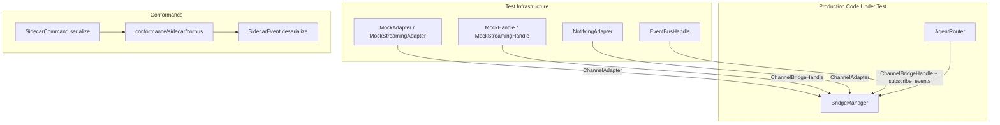

# Other — librefang-channels-tests

# librefang-channels — Integration & Conformance Tests

## Overview

This test module validates two distinct contracts:

1. **Bridge dispatch pipeline** (`bridge_integration_test.rs`) — end-to-end integration tests that wire mock adapters and mock kernel handles through the real `BridgeManager`, verifying message dispatch, command handling, streaming, error recovery, and approval notification delivery.

2. **Sidecar protocol conformance** (`sidecar_protocol_conformance.rs`) — structural JSON equality tests pinned to a shared corpus (`conformance/sidecar/corpus/`) that both the Rust sidecar implementation and the Python SDK validate against, preventing protocol drift.

No external services are contacted. All communication is in-process via real tokio channels and tasks.

---

## Architecture


```mermaid
graph TD
    subgraph "Test Infrastructure"
        MA[MockAdapter / MockStreamingAdapter]
        MH[MockHandle / MockStreamingHandle]
        SA[NotifyingAdapter]
        EH[EventBusHandle]
    end

    subgraph "Production Code Under Test"
        BM[BridgeManager]
        AR[AgentRouter]
    end

    subgraph "Conformance"
        CORPUS[conformance/sidecar/corpus]
        SE[SidecarEvent deserialize]
        SC[SidecarCommand serialize]
    end

    MA -->|ChannelAdapter| BM
    MH -->|ChannelBridgeHandle| BM
    SA -->|ChannelAdapter| BM
    EH -->|ChannelBridgeHandle + subscribe_events| BM
    AR --> BM

    CORPUS --> SE
    SC --> CORPUS
```

---

## Bridge Integration Tests

### Test Infrastructure

#### `wait_until` — Deadline-Bounded Polling

Replaces fixed `tokio::time::sleep` calls with a 2-second deadline loop that polls every 5ms. This gives the dispatch pipeline exactly as much time as it needs (typically tens of milliseconds in-process) while failing fast on stuck dispatches rather than timing out on slow CI runners.

```rust
async fn wait_until<F>(label: &str, mut cond: F)
where
    F: FnMut() -> bool,
```

Panics with a labeled message on timeout, making failures easy to attribute to a specific test condition.

#### Mock Adapters

All mock adapters implement `ChannelAdapter` and capture outbound responses for assertion.

| Adapter | Streaming | `send_streaming` behavior | Purpose |
|---|---|---|---|
| `MockAdapter` | No | N/A | Basic dispatch, command handling, non-streaming fallback |
| `MockStreamingAdapter` | Yes | Collects deltas, records assembled text | Streaming path validation |
| `MockFailingStreamingAdapter` | Yes | Drains deltas then returns `Err` | Kernel-ok/transport-fail error path (Bug 1) |
| `NotifyingAdapter` | No | N/A | Approval listener delivery; exposes `notification_recipients()` and `account_id()` |

Each adapter is constructed via a `new()` factory that returns `(Arc<Self>, mpsc::Sender<ChannelMessage>)` — inject test messages through the sender, inspect responses via `get_sent()` (or `get_streamed()` for streaming adapters).

#### Mock Kernel Handles

All mock handles implement `ChannelBridgeHandle`. The echo-based handles return `format!("Echo: {message}")` so the round-trip is trivially verifiable.

| Handle | `send_message_streaming_with_sender_status` | `subscribe_events` | Purpose |
|---|---|---|---|
| `MockHandle` | N/A | N/A | Basic dispatch tests |
| `MockStreamingHandle` | Emits word-at-a-time deltas | N/A | Streaming adapter path |
| `MockProgressHandle` | Emits `🔧 tool_name` + prose | N/A | Progress marker visibility on non-streaming adapters |
| `MockKernelErrorHandle` | Emits deltas, then `Err("rate limit hit")` via status oneshot | N/A | Dual-failure path (transport + kernel both fail) |
| `MockKernelOkHandle` | Emits clean text, `Ok(())` status, records `record_delivery` calls | N/A | Bug 1 regression: `success=true` must have `err=None` |
| `EventBusHandle` | N/A | Returns real `broadcast::Receiver` | Approval listener tests — inject events via the broadcast sender |

#### Message Constructors

- `make_text_msg(channel, user_id, text)` — creates a `ChannelMessage` with `ChannelContent::Text`
- `make_command_msg(channel, user_id, cmd, args)` — creates a `ChannelMessage` with `ChannelContent::Command`

Both set sensible defaults for `platform_message_id`, `sender.display_name`, `timestamp`, `is_group`, `thread_id`, and `metadata`.

### Test Categories

#### 1. Basic Dispatch

| Test | What it verifies |
|---|---|
| `test_bridge_dispatch_text_message` | A text message from a routed user reaches the correct agent via `ChannelBridgeHandle::send_message`, and the echo response is sent back through the adapter's `send()` |
| `test_bridge_dispatch_no_agent_assigned` | An unrouted user receives a "No agents available" error message rather than a silent drop |
| `test_bridge_dispatch_agents_command` | The `/agents` command returns a formatted list of all running agents by name |
| `test_bridge_dispatch_help_command` | The `/help` command returns help text mentioning `/agents` and `/agent` |
| `test_bridge_dispatch_agent_select_command` | The `/agent <name>` command updates the `AgentRouter` so subsequent messages from that user route to the selected agent, and confirms with "Now talking to agent: <name>" |
| `test_bridge_dispatch_slash_command_in_text` | Slash commands like `/agents` embedded in plain `ChannelContent::Text` are intercepted and handled as commands, not forwarded to agents |
| `test_bridge_dispatch_status_command` | The `/status` command returns a string containing "N agent(s) running" |
| `test_bridge_manager_lifecycle` | Multiple sequential messages through the same manager all receive responses; `manager.stop()` completes cleanly |
| `test_bridge_multiple_adapters` | Two adapters (Telegram + Discord) run concurrently on the same `BridgeManager`, each receiving and responding independently |

#### 2. Streaming

| Test | What it verifies |
|---|---|
| `test_bridge_streaming_adapter_uses_send_streaming` | When both the adapter (`supports_streaming() = true`) and handle (`send_message_streaming` available) support streaming, the bridge calls `send_streaming` instead of `send`. The `send()` path is never invoked. |
| `test_bridge_non_streaming_adapter_falls_back_to_send` | A non-streaming adapter uses `send()` even when the handle supports streaming — the bridge degrades gracefully. |
| `test_default_send_streaming_collects_and_sends` | The default `send_streaming` implementation on `ChannelAdapter` collects all deltas into a single string and calls `send()` — adapters that don't override it still work correctly. |

#### 3. Error Recovery and Progress

| Test | What it verifies |
|---|---|
| `test_bridge_non_streaming_adapter_sees_progress_markers` | Non-streaming adapters (Discord/Slack/Matrix) receive `🔧` progress markers and post-tool prose in the consolidated response — the V2 contract that progress is surfaced on every channel type. |
| `test_bridge_streaming_adapter_kernel_and_transport_both_fail` | When `send_streaming` returns `Err` AND the kernel reports failure via the status oneshot, the bridge falls back to `send()` with whatever partial text was buffered, preserving progress markers. |
| `test_bridge_streaming_adapter_kernel_ok_transport_fail_records_clean_success` | **Bug 1 regression guard**: when the kernel succeeds but `send_streaming` fails, the fallback `send()` delivers the buffered text and `record_delivery` is called with `(success=true, err=None)`. Previously the transport error leaked into the `err` field, creating contradictory metrics. |

#### 4. Approval Listener

The approval listener tests cover PRs #4875, #4985, #4994, and #5002, verifying that `BridgeManager::start_approval_listener` correctly routes `ApprovalRequested` events to the right adapter recipients.

**Delivery basics:**

| Test | What it verifies |
|---|---|
| `test_approval_listener_delivers_to_configured_recipients` | An `ApprovalRequested` event reaches every configured notification recipient with formatted text including the approval ID prefix, tool name, and `/approve`/`/reject` hints. |
| `test_approval_listener_skips_adapter_without_recipients` | An adapter with empty `notification_recipients()` produces no `send()` calls — the approval has nowhere to land. |

**Scoping (#4985 — cross-agent leak fix):**

| Test | What it verifies |
|---|---|
| `test_approval_listener_scopes_delivery_to_requesting_agent_adapter` | Two Telegram bots bound to different agents via account-qualified keys (`telegram:bot-a`, `telegram:bot-b`). An approval from agent A only reaches bot A's recipient. |
| `test_approval_listener_skips_unbound_adapter` | An adapter with no `channel_default` binding receives nothing — "no bound agent" means "cannot scope safely, drop". |
| `test_approval_listener_drops_malformed_agent_id` | A non-UUID `agent_id` on the event drops the notification rather than falling back to broadcast. |

**Qualified key isolation (#4994):**

| Test | What it verifies |
|---|---|
| `test_approval_listener_does_not_fall_back_from_qualified_to_bare_key` | In a mixed config (single-bot adapter on bare `telegram` key + multi-bot adapter on `telegram:bot-b`), the multi-bot adapter must NOT fall back to the bare key binding when its qualified key has no entry. |
| `test_approval_listener_scopes_to_non_telegram_multibot_adapter` | The scoping mechanism is channel-type-agnostic — a Discord adapter with `account_id = Some("guild-1")` produces the qualified key `discord:guild-1`. |

**Binding-based fallback (#5002):**

Adapters that route purely via `AgentBinding` (no `default_agent`) have no `channel_defaults` entry. The fix falls back to `AgentRouter::bound_recipients_for_agent` when `channel_default` returns `None`.

| Test | What it verifies |
|---|---|
| `test_approval_listener_falls_back_to_agent_binding_when_default_unset` | An adapter with no `channel_default` but an `AgentBinding` mapping chat `chat-z` to agent X delivers the approval to `chat-z`. |
| `test_approval_listener_binding_fallback_does_not_leak_cross_agent` | An approval for an agent with no binding on this adapter is silently dropped — the binding fallback does not re-introduce the cross-agent broadcast from #4985. |
| `test_approval_listener_fans_out_to_all_bound_chats` | An agent bound to two chats (`chat-z1`, `chat-z2`) receives the approval in both — fan-out is to every matching binding. |
| `test_approval_listener_skips_binding_with_no_peer_id` | A channel-only binding (catch-all, no specific `peer_id`) is not a delivery target — there is no chat to send to. |
| `test_approval_listener_binding_respects_account_id_scope` | A binding scoped to `(channel=telegram, account_id=bot-a)` does not fire approvals on `bot-b` — the account isolation extends to the binding layer. |

---

## Sidecar Protocol Conformance Tests

### Shared Corpus

The corpus at `conformance/sidecar/corpus/` is the single oracle for both the Rust and Python protocol implementations. It contains:

- `events/*.json` — frames produced by adapters, consumed by Rust
- `commands/*.json` — frames produced by Rust, consumed by adapters

Each file is a JSON object with a string `method` field identifying the variant.

### Directionality

- **Events** (adapter → Rust): Rust is the **deserializer**. Tests assert every corpus event parses into the expected `SidecarEvent` variant.
- **Commands** (Rust → adapter): Rust is the **serializer**. Tests assert each `SidecarCommand` serializes to the exact corpus JSON value.

Equality is structural JSON value equality (`serde_json::Value` comparison), not byte equality — formatting differences are irrelevant.

### Tests

| Test | What it verifies |
|---|---|
| `corpus_files_are_well_formed` | Every file under `events/` and `commands/` is a JSON object with a string `method` field. |
| `events_deserialize_into_expected_variant` | Every corpus event parses into the `SidecarEvent` variant matching its `method` field (`message`, `ready`, `error`, `typing`, `qr_ready`, `qr_status`). |
| `ready_full_and_minimal_both_parse` | Backward-compat: `ready_full.json` parses with full `capabilities`, `account_id`, and `protocol_version`; `ready_minimal.json` parses with empty capabilities and no protocol version. |
| `commands_serialize_to_corpus` | Every `SidecarCommand` variant serializes to the exact JSON structure in the corpus. A completeness check asserts that every corpus file has a corresponding test case — orphan fixtures fail the test. |

### Adding New Protocol Methods

1. Add the corpus file to `conformance/sidecar/corpus/events/` or `commands/`.
2. For events: `events_deserialize_into_expected_variant` will pick it up automatically (add a new match arm if the variant mapping changes).
3. For commands: add a new tuple to the `cases` vector in `commands_serialize_to_corpus`. The completeness check will fail if you miss this step.
4. Update the Python SDK's conformance test in `sdk/python/tests/test_sidecar_conformance.py` to match.

---

## Conventions for Contributors

- **Use `wait_until` instead of `sleep`** for async condition polling. Fixed sleeps cause flaky failures on slow CI and waste time on fast machines.
- **Mock adapters return `(Arc<Self>, Sender)`** from their constructors — store the `Arc` for assertions, use the `Sender` to inject messages.
- **Approval listener tests must wait for subscription** using `wait_until("approval listener subscribed", || event_tx.receiver_count() >= 1)` before emitting events, otherwise the broadcast races the `spawn`.
- **Negative assertions** (verifying something was *not* delivered) use a 100ms sleep window — sufficient for in-process dispatch latency to surface a regression without making tests slow.
- **Do not add `tracing_test`** or other heavyweight test dependencies for log-level assertions. Prefer behavioral checks on captured outputs.