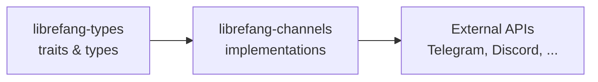

# Other — librefang-channels

# librefang-channels

## Overview

`librefang-channels` is the **Channel Bridge Layer** for LibreFang. It provides a unified abstraction over 40+ messaging platforms, translating LibreFang's internal message format into protocol-specific payloads for each supported service. Every channel is feature-gated, so you compile only what you need.

## Architecture

```
┌─────────────────────────────────────────────────────────┐
│                    LibreFang Core                        │
└──────────────────────┬──────────────────────────────────┘
                       │  unified message interface
┌──────────────────────▼──────────────────────────────────┐
│               librefang-channels                         │
│  ┌─────────┐ ┌─────────┐ ┌─────────┐ ┌─────────┐       │
│  │Telegram │ │ Discord │ │  Slack  │ │ Matrix  │  ...   │
│  └─────────┘ └─────────┘ └─────────┘ └─────────┘       │
└──────────────────────┬──────────────────────────────────┘
                       │  platform-specific SDKs/protocols
          ┌────────────┼────────────┐
          ▼            ▼            ▼
       Telegram      Discord      Email/SMTP
        Bot API      Bot API      IMAP/etc.
```

Each channel implementation follows a common trait-based contract (defined in `librefang-types`), accepting a normalized message and handling serialization, authentication, and transport internally.

## Feature Flags

All channels are opt-in via Cargo features. The `default` profile enables every channel except MQTT. The `all-channels` profile adds MQTT on top.

### Channels with No Extra Dependencies

Most channels rely solely on the shared dependencies (HTTP via `reqwest`, WebSocket via `tokio-tungstenite`, webhook handling via `axum`):

`channel-telegram`, `channel-discord`, `channel-slack`, `channel-matrix`, `channel-webhook`, `channel-whatsapp`, `channel-signal`, `channel-teams`, `channel-mattermost`, `channel-irc`, `channel-twitch`, `channel-rocketchat`, `channel-zulip`, `channel-xmpp`, `channel-bluesky`, `channel-line`, `channel-mastodon`, `channel-messenger`, `channel-reddit`, `channel-revolt`, `channel-viber`, `channel-voice`, `channel-flock`, `channel-guilded`, `channel-keybase`, `channel-nextcloud`, `channel-pumble`, `channel-threema`, `channel-twist`, `channel-webex`, `channel-dingtalk`, `channel-discourse`, `channel-gitter`, `channel-gotify`, `channel-linkedin`, `channel-mumble`, `channel-ntfy`, `channel-qq`, `channel-wechat`

### Channels with Optional Dependencies

| Feature Flag | Dependencies | Purpose |
|---|---|---|
| `channel-email` | `lettre`, `imap`, `rustls-connector`, `mailparse` | SMTP sending, IMAP receiving, email parsing |
| `channel-google-chat` | `rsa` | RSA signing for Google service account auth |
| `channel-feishu` | `aes`, `cbc` | AES-CBC encryption for Lark/Feishu event verification |
| `channel-wecom` | `aes`, `cbc`, `roxmltree` | AES-CBC decryption + XML parsing for WeCom callbacks |
| `channel-nostr` | `k256` | Secp256k1 cryptographic operations for Nostr events |
| `channel-mqtt` | `rumqttc` | MQTT v5 client for IoT/push messaging |

### Selecting a Minimal Subset

To reduce compile time and binary size, disable default features and enable only what you need:

```toml
[dependencies]
librefang-channels = { path = "...", default-features = false, features = [
    "channel-telegram",
    "channel-discord",
] }
```

## Core Dependencies

### Async Runtime & Concurrency

- **`tokio`** — async runtime for all I/O operations
- **`futures`** / **`async-trait`** — trait-based async channel interfaces
- **`dashmap`** — concurrent hash maps for tracking channel state, rate-limit counters, and session caches
- **`tokio-stream`** — stream utilities for long-polling and event-driven channels

### HTTP & WebSocket Transport

- **`reqwest`** — primary HTTP client for REST-based channel APIs
- **`tokio-tungstenite`** — WebSocket client for real-time channels (Discord gateway, Slack socket mode, Matrix sync, etc.)
- **`axum`** — HTTP server for webhook-receiving channels; handles inbound POST callbacks and signature verification
- **`webpki-roots`** / **`rustls-native-certs`** / **`rustls`** — TLS certificate bundles for secure connections

### Cryptography & Verification

- **`hmac`**, **`sha2`**, **`sha1`** — HMAC-based webhook signature verification (used by Slack, Discord, WhatsApp Business, etc.)
- **`base64`**, **`hex`** — encoding for signature headers and token payloads
- **`zeroize`** — secure clearing of secrets (API keys, tokens) from memory

### Data Handling

- **`serde`** / **`serde_json`** — JSON serialization for API payloads
- **`image`** — image processing (JPEG, PNG, WebP) for media attachments and avatar handling
- **`regex`** / **`regex-lite`** — pattern matching for command parsing and mention extraction
- **`html-escape`** — HTML entity handling for channels that use HTML markup (Matrix, Email, Discord embeds)
- **`smallvec`** — stack-allocated small vectors to reduce allocations in hot paths

## Integration with LibreFang

This crate sits between `librefang-types` and the external world:

1. **`librefang-types`** provides the shared message traits, envelope types, and error definitions that every channel must conform to.
2. **`librefang-channels`** implements those traits for each platform, handling the specifics of authentication, rate limiting, message formatting, and media upload.
3. The core application dispatches messages through the channel layer without knowing the underlying transport details.



## Benchmarking

The crate includes a dispatch benchmark at `benches/dispatch`. Run it with:

```bash
cargo bench --bench dispatch
```

This measures the overhead of message routing through the channel abstraction layer, including trait dispatch, serialization, and any internal buffering.

## Adding a New Channel

1. Add a feature flag in `[features]`: `channel-<name> = ["dep:optional-crate"]` if extra dependencies are needed, otherwise `channel-<name> = []`.
2. Add the flag to both the `default` and `all-channels` arrays.
3. Declare any new optional dependencies in `[dependencies]` with `optional = true`.
4. Implement the channel trait from `librefang-types` behind `#[cfg(feature = "channel-<name>")]`.
5. Register the channel in the dispatch/factory layer so the runtime can instantiate it from configuration.