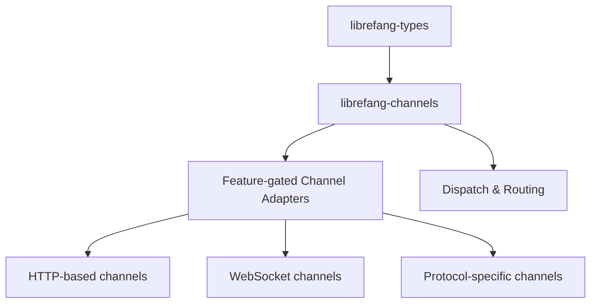

# Other — librefang-channels

# librefang-channels

## Overview

**Channel Bridge Layer** — a feature-flag-driven collection of pluggable messaging integrations for LibreFang. This module provides the adapter layer between LibreFang's internal dispatch system and 45+ external messaging platforms, from major chat networks (Telegram, Discord, Slack) to niche protocols (Nostr, XMPP, IRC).

Every channel is gated behind an individual Cargo feature, allowing downstream consumers to compile only the integrations they need.

## Architecture



Each channel adapter translates between LibreFang's canonical message types (from `librefang-types`) and the target platform's API or protocol. The module ships with its own dispatch benchmark (`benches/dispatch`) to measure routing overhead.

## Feature Flag System

### Default Features

The `default` feature enables every channel adapter except `channel-mqtt`. This is the "batteries-included" configuration suitable for development and monolithic deployments.

### `all-channels`

The `all-channels` feature enables every adapter **including** `channel-mqtt`. Use this when you explicitly need MQTT and want a single feature flag to rule them all.

### Selective Compilation

Enable only the channels you need by disabling default features and cherry-picking:

```toml
[dependencies]
librefang-channels = { path = "...", default-features = false, features = [
    "channel-telegram",
    "channel-discord",
] }
```

This keeps compile times and binary size proportional to your actual integrations.

## Channel Catalog

### HTTP / Webhook-Based Channels

These channels communicate primarily via REST APIs. They rely on the shared `reqwest` and `axum` dependencies for outbound HTTP and inbound webhook handling.

| Feature Flag | Platform | Notes |
|---|---|---|
| `channel-telegram` | Telegram Bot API | |
| `channel-discord` | Discord | |
| `channel-slack` | Slack | |
| `channel-teams` | Microsoft Teams | |
| `channel-mattermost` | Mattermost | |
| `channel-twitch` | Twitch | |
| `channel-rocketchat` | Rocket.Chat | |
| `channel-zulip` | Zulip | |
| `channel-bluesky` | Bluesky (AT Protocol) | |
| `channel-line` | LINE | |
| `channel-mastodon` | Mastodon | |
| `channel-messenger` | Facebook Messenger | |
| `channel-reddit` | Reddit | |
| `channel-revolt` | Revolt | |
| `channel-viber` | Viber | |
| `channel-flock` | Flock | |
| `channel-guilded` | Guilded | |
| `channel-pumble` | Pumble | |
| `channel-threema` | Threema | |
| `channel-twist` | Twist | |
| `channel-webex` | Cisco Webex | |
| `channel-dingtalk` | DingTalk | |
| `channel-discourse` | Discourse | |
| `channel-gitter` | Gitter | |
| `channel-gotify` | Gotify | |
| `channel-linkedin` | LinkedIn | |
| `channel-ntfy` | ntfy.sh | |
| `channel-webhook` | Generic Webhook | Catch-all HTTP endpoint |
| `channel-voice` | Voice/TTS | Voice-specific delivery |

### Channels with Cryptographic Dependencies

| Feature Flag | Platform | Extra Dependencies | Purpose |
|---|---|---|---|
| `channel-email` | Email (SMTP/IMAP) | `lettre`, `imap`, `rustls-connector`, `mailparse` | Full email send/receive pipeline |
| `channel-google-chat` | Google Chat | `rsa` | Google service account authentication (JWT signing) |
| `channel-feishu` | Feishu / Lark | `aes`, `cbc` | AES-CBC encryption for event verification |
| `channel-wecom` | WeCom (企业微信) | `aes`, `cbc` | AES-CBC decryption for callback payloads |
| `channel-nostr` | Nostr | `k256` | secp256k1 key generation and event signing |
| `channel-mqtt` | MQTT | `rumqttc` | MQTT v5 pub/sub transport |

### Protocol-Based Channels

| Feature Flag | Platform | Transport |
|---|---|---|
| `channel-matrix` | Matrix | HTTP (Sync) / WebSocket |
| `channel-xmpp` | XMPP | XML stream |
| `channel-irc` | IRC | Plain/TLS TCP |
| `channel-mumble` | Mumble | Protobuf over TLS |
| `channel-whatsapp` | WhatsApp Business | HTTP API |
| `channel-signal` | Signal | HTTP API |
| `channel-nextcloud` | Nextcloud Talk | HTTP API |
| `channel-keybase` | Keybase | HTTP API |
| `channel-qq` | QQ | HTTP API |
| `channel-wechat` | WeChat | HTTP API |

## Key Dependencies

### Shared Across All Channels

| Crate | Role |
|---|---|
| `librefang-types` | Canonical message types shared across the LibreFang workspace |
| `tokio` | Async runtime |
| `reqwest` | HTTP client for outbound API calls |
| `axum` | HTTP server for inbound webhook endpoints |
| `tokio-tungstenite` | WebSocket transport (used by several real-time channels) |
| `serde` / `serde_json` | Serialization of API payloads |
| `hmac` / `sha2` / `sha1` | Webhook signature verification |
| `dashmap` | Concurrent channel state management |
| `tracing` | Structured logging |
| `url` | URL parsing and construction |

### Cryptographic / Verification

| Crate | Role |
|---|---|
| `base64` / `hex` | Encoding for signature payloads |
| `zeroize` | Secure memory clearing for key material |
| `rustls` + `webpki-roots` / `rustls-native-certs` | TLS without OpenSSL |

### Utility

| Crate | Role |
|---|---|
| `image` | Image processing (JPEG, PNG, WebP) for media attachments |
| `regex` / `regex-lite` | Pattern matching for command parsing |
| `html-escape` | HTML sanitization for cross-platform rendering |
| `smallvec` | Stack-allocated small collections to reduce allocations |
| `bytes` | Zero-copy byte buffer handling |
| `uuid` | Correlation ID generation |
| `chrono` | Timestamp handling |
| `futures` / `tokio-stream` / `async-trait` | Async trait definitions and stream combinators |

## Benchmarking

The module includes a dispatch benchmark at `benches/dispatch`, runnable via:

```sh
cargo bench -p librefang-channels --bench dispatch
```

This measures the overhead of message routing through the channel layer, which is critical for deployments bridging many platforms simultaneously.

## Relationship to Other Modules

This module sits between `librefang-types` and the application layer:

- **Depends on** `librefang-types` for all shared message, event, and configuration types. Channel adapters consume these types as input and produce them from incoming platform events.
- **Consumed by** the core application or bot framework, which instantiates channel adapters based on runtime configuration and feeds messages through the dispatch pipeline.

The channel adapters are designed to be interchangeable — the rest of the system should not need to know which specific platform is handling a given message.