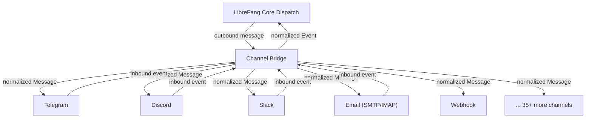

# Other — librefang-channels

# librefang-channels

Channel Bridge Layer — pluggable messaging integrations for LibreFang.

## Overview

`librefang-channels` provides a unified abstraction over 40+ messaging platforms, enabling LibreFang to send, receive, and synchronize messages across disparate communication services. Each channel is a compile-time selectable feature, allowing deployments to include only the integrations they need and keep binary size and dependency count minimal.

## Architecture

All channels implement a common async interface (defined in `librefang-types`), which the core dispatch layer uses to route outbound messages and accept inbound ones. The crate handles protocol-specific concerns — HTTP webhook verification, WebSocket lifecycle management, encryption/decryption, signature validation, and message format translation — behind that uniform interface.



## Feature Flags

Every channel is individually gated behind a Cargo feature. Two meta-features control bulk inclusion:

| Feature | Behavior |
|---|---|
| `default` | Enables all channels **except** `channel-mqtt`. Covers the 44 most common integrations. |
| `all-channels` | Enables every channel including `channel-mqtt`. |

To build with only specific channels, disable default features and list the ones you need:

```toml
[dependencies]
librefang-channels = { path = "../librefang-channels", default-features = false, features = [
    "channel-telegram",
    "channel-discord",
    "channel-email",
] }
```

### Available Channels

| Feature | Platform | Extra Dependencies |
|---|---|---|
| `channel-telegram` | Telegram Bot API | — |
| `channel-discord` | Discord | — |
| `channel-slack` | Slack | — |
| `channel-matrix` | Matrix | — |
| `channel-email` | Email (SMTP + IMAP) | `lettre`, `imap`, `rustls-connector`, `mailparse` |
| `channel-webhook` | Generic webhooks | — |
| `channel-whatsapp` | WhatsApp Business | — |
| `channel-signal` | Signal | — |
| `channel-teams` | Microsoft Teams | — |
| `channel-mattermost` | Mattermost | — |
| `channel-irc` | IRC | — |
| `channel-google-chat` | Google Chat | `rsa` |
| `channel-twitch` | Twitch | — |
| `channel-rocketchat` | Rocket.Chat | — |
| `channel-zulip` | Zulip | — |
| `channel-xmpp` | XMPP | — |
| `channel-bluesky` | Bluesky (AT Protocol) | — |
| `channel-feishu` | Feishu / Lark | `aes`, `cbc` |
| `channel-line` | LINE | — |
| `channel-mastodon` | Mastodon | — |
| `channel-messenger` | Facebook Messenger | — |
| `channel-reddit` | Reddit | — |
| `channel-revolt` | Revolt | — |
| `channel-viber` | Viber | — |
| `channel-voice` | Voice / telephony | — |
| `channel-flock` | Flock | — |
| `channel-guilded` | Guilded | — |
| `channel-keybase` | Keybase | — |
| `channel-nextcloud` | Nextcloud Talk | — |
| `channel-nostr` | Nostr | `k256` |
| `channel-pumble` | Pumble | — |
| `channel-threema` | Threema | — |
| `channel-twist` | Twist | — |
| `channel-webex` | Cisco Webex | — |
| `channel-dingtalk` | DingTalk | — |
| `channel-discourse` | Discourse | — |
| `channel-gitter` | Gitter | — |
| `channel-gotify` | Gotify | — |
| `channel-linkedin` | LinkedIn | — |
| `channel-mumble` | Mumble | — |
| `channel-ntfy` | ntfy.sh | — |
| `channel-qq` | QQ | — |
| `channel-wechat` | WeChat | — |
| `channel-wecom` | WeCom (Enterprise WeChat) | `aes`, `cbc`, `roxmltree` |
| `channel-mqtt` | MQTT | `rumqttc` |

## Shared Infrastructure

While each channel handles its own protocol specifics, several cross-cutting capabilities are shared across the crate:

### HTTP Transport

`reqwest` provides the HTTP client for REST-based channels. `axum` is included for channels that receive inbound events via webhook — it spins up lightweight HTTP listeners to accept platform callbacks.

### WebSocket Transport

`tokio-tungstenite` supports channels requiring persistent real-time connections (e.g., Discord gateway, IRC, some Matrix transports).

### Cryptographic Verification

Channels that validate webhook signatures or decrypt payloads share these crates:

- **`hmac` + `sha2` / `sha1`** — HMAC-based signature verification (Slack, WhatsApp, Viber, generic webhooks, etc.)
- **`aes` + `cbc`** — AES-CBC decryption for platforms that encrypt callback payloads (Feishu, WeCom)
- **`k256`** — Elliptic curve operations for Nostr event signing/verification
- **`rsa`** — RSA signature validation for Google Chat service account authentication

### Media Handling

The `image` crate (with JPEG, PNG, and WebP support) handles avatar and attachment processing — resizing, format conversion, and thumbnail generation for platforms with media constraints.

### Concurrency

`dashmap` provides lock-free concurrent maps for tracking active connections, rate limiters, and per-channel state. `tokio-stream` and `futures` manage async event pipelines.

## Relationship to Other Crates

```
librefang-types  ← defines the Channel trait, Message, Event, and shared types
        ↑
librefang-channels ← implements Channel for each platform (this crate)
        ↑
librefang-core    ← dispatches messages through the Channel interface
```

`librefang-channels` depends on `librefang-types` for trait definitions and shared data structures. It does not depend on the core crate — direction is strictly outward. The core engine calls into channels; channels never call back into core directly. Inbound events are returned through the trait interface for the core to process.

## Benchmarks

The crate ships a Criterion benchmark suite (`benches/dispatch`) for measuring channel dispatch throughput. Run with:

```sh
cargo bench -p librefang-channels --bench dispatch
```

## Adding a New Channel

1. Add a new feature flag in `Cargo.toml`:
   ```toml
   channel-newplatform = ["dep:some-crate"]
   ```
2. Add the feature to both the `default` and `all-channels` lists.
3. Declare any optional dependencies the channel requires.
4. Implement the channel trait (from `librefang-types`) in a new module within the crate, gated by `#[cfg(feature = "channel-newplatform")]`.
5. Register the channel in the factory/registry so the core can discover it at runtime.