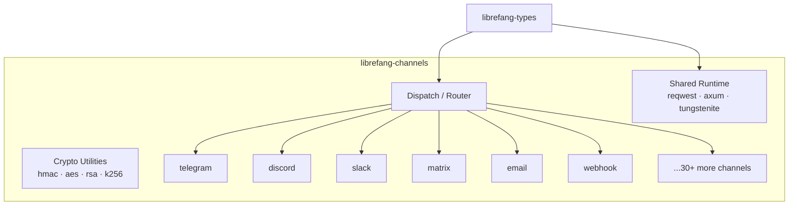

# Other — librefang-channels

# librefang-channels

Channel Bridge Layer — pluggable messaging integrations for LibreFang.

## Purpose

`librefang-channels` is the messaging abstraction layer that connects LibreFang's core bot logic to the outside world. It provides a uniform interface for sending and receiving messages across 40+ messaging platforms, handling the idiosyncrasies of each platform's API, authentication model, payload format, and event streaming mechanism behind a single consistent contract.

Rather than scattering platform-specific HTTP calls, webhook handlers, and WebSocket listeners throughout the codebase, this crate isolates every channel integration behind feature-gated modules. Consumers depend only on the channels they need.

## Architecture



Every channel module follows the same lifecycle pattern:

1. **Configuration** — Channel-specific credentials (API keys, tokens, webhook secrets) are loaded from the shared config, typed through `librefang-types`.
2. **Inbound** — Messages arrive via webhook (handled by the built-in `axum` server), WebSocket stream (`tokio-tungstenite`), long-polling (`reqwest`), or protocol-specific listeners (IMAP for email, MQTT for IoT).
3. **Dispatch** — The router normalizes inbound payloads into a platform-agnostic message representation.
4. **Outbound** — Responses and proactive messages are dispatched back through the appropriate channel client.

## Feature Flags

Each channel is an independent Cargo feature. This allows minimal-compilation builds — only compile what you ship.

### Default Features

The `default` feature activates every channel except `channel-mqtt`:

```
channel-telegram      channel-discord       channel-slack
channel-matrix        channel-email         channel-webhook
channel-whatsapp      channel-signal        channel-teams
channel-mattermost    channel-irc           channel-google-chat
channel-twitch        channel-rocketchat    channel-zulip
channel-xmpp          channel-bluesky       channel-feishu
channel-line          channel-mastodon      channel-messenger
channel-reddit        channel-revolt        channel-viber
channel-voice         channel-flock         channel-guilded
channel-keybase       channel-nextcloud     channel-nostr
channel-pumble        channel-threema       channel-twist
channel-webex         channel-dingtalk      channel-discourse
channel-gitter        channel-gotify        channel-linkedin
channel-mumble        channel-ntfy          channel-qq
channel-wechat        channel-wecom
```

### Opt-in Channels

| Feature | Extra Dependencies | Notes |
|---|---|---|
| `channel-mqtt` | `rumqttc` | IoT/MQTT broker connectivity — not in `default`, included in `all-channels` |

### Channels Requiring Additional Crates

Several channels pull in cryptography or protocol-specific dependencies only when enabled:

| Feature | Dependencies | Reason |
|---|---|---|
| `channel-email` | `lettre`, `imap`, `rustls-connector`, `mailparse` | SMTP sending, IMAP receiving, TLS, MIME parsing |
| `channel-google-chat` | `rsa` | Service account JWT signing |
| `channel-feishu` | `aes`, `cbc` | AES-CBC encryption for event payload verification |
| `channel-wecom` | `aes`, `cbc` | AES-CBC decryption for WeCom callback data |
| `channel-nostr` | `k256` | Secp256k1 key pairs for Nostr identity |
| `channel-mqtt` | `rumqttc` | MQTT v5 client |

### Selecting a Subset

To build with only the channels you deploy, disable default features and list what you need:

```toml
[dependencies]
librefang-channels = { path = "../librefang-channels", default-features = false, features = [
    "channel-telegram",
    "channel-discord",
    "channel-webhook",
] }
```

## Core Dependencies

The crate reuses workspace-level dependencies to stay consistent with the rest of LibreFang:

| Dependency | Role |
|---|---|
| `librefang-types` | Shared domain types — message structs, channel config, error enums |
| `tokio` | Async runtime for all I/O |
| `reqwest` | HTTP client for REST-based channel APIs |
| `axum` | HTTP server for inbound webhook endpoints |
| `tokio-tungstenite` | WebSocket client for real-time streaming channels (Discord, Slack, Twitch, etc.) |
| `serde` / `serde_json` | Serialization of API payloads and config |
| `dashmap` | Concurrent map for tracking active connections/sessions |
| `hmac` / `sha2` / `sha1` | Webhook signature verification |
| `base64` / `hex` | Encoding for cryptographic operations |
| `image` | Image thumbnailing and format conversion (JPEG, PNG, WebP only — no default features to keep compile times down) |
| `tracing` | Structured logging across all channel operations |

## Relationship to `librefang-types`

This crate is a pure consumer of `librefang-types`. It does **not** define its own public message or error types. All structs for channel configuration, normalized messages, and error variants live in the types crate. This ensures the rest of the codebase can reason about messages without depending on the channel implementations.

## Benchmarks

The `dispatch` benchmark (`benches/dispatch/`) measures message routing throughput — how quickly the dispatch layer can accept an inbound payload, match it to the correct channel handler, and produce an outbound response. Run with:

```bash
cargo bench -p librefang-channels
```

## Adding a New Channel

1. Add a new feature flag in `[features]` with an empty `[]` or list its extra dependencies using `dep:` syntax.
2. If the channel needs crypto or protocol crates not already present, add them as optional dependencies under `[dependencies]`.
3. Create the channel module following the same interface pattern used by existing channels (configuration struct, inbound handler, outbound client).
4. Add the feature to both the `default` list and the `all-channels` list.
5. Add a benchmark variant if the channel has non-trivial dispatch overhead.