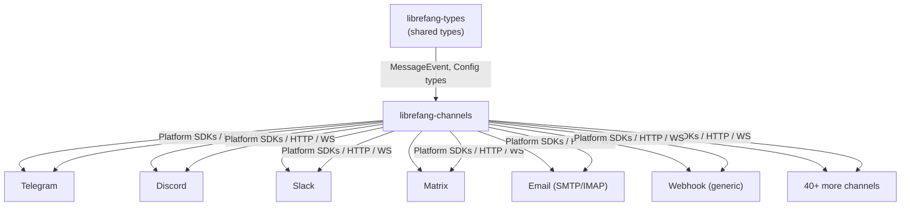

# Other — librefang-channels

# librefang-channels

**Channel Bridge Layer** — pluggable messaging integrations for LibreFang.

## Overview

`librefang-channels` is the messaging abstraction layer that bridges LibreFang's core alerting and event system to dozens of external communication platforms. It translates LibreFang's internal message types into platform-specific API calls, webhook payloads, and protocol messages, and vice versa — ingesting replies and interactions back into the system.

Every supported platform is gated behind a Cargo feature flag, allowing downstream consumers to compile only the channels they need and minimize dependency bloat.

## Architecture



Each channel implementation follows a uniform interface defined in terms of `librefang-types`, so the rest of the codebase can dispatch messages without knowing which platform sits at the other end.

## Feature Flags

### Default

The `default` feature enables all channels listed below **except** `channel-mqtt`. This gives a batteries-included experience for typical deployments.

### `all-channels`

Enables every channel including `channel-mqtt`. Useful for testing or building a universal binary.

### Individual channel features

Each channel is independently selectable. Combine them as needed:

```toml
# Minimal build — only Telegram and Discord
[dependencies]
librefang-channels = { version = "0.1", default-features = false, features = [
    "channel-telegram",
    "channel-discord",
] }
```

### Full feature list

| Feature flag | Platform | Extra dependencies |
|---|---|---|
| `channel-telegram` | Telegram Bot API | — |
| `channel-discord` | Discord | — |
| `channel-slack` | Slack | — |
| `channel-matrix` | Matrix | — |
| `channel-email` | Email (SMTP + IMAP) | `lettre`, `imap`, `rustls-connector`, `mailparse` |
| `channel-webhook` | Generic webhooks | — |
| `channel-whatsapp` | WhatsApp | — |
| `channel-signal` | Signal | — |
| `channel-teams` | Microsoft Teams | — |
| `channel-mattermost` | Mattermost | — |
| `channel-irc` | IRC | — |
| `channel-google-chat` | Google Chat | `rsa` |
| `channel-twitch` | Twitch | — |
| `channel-rocketchat` | Rocket.Chat | — |
| `channel-zulip` | Zulip | — |
| `channel-xmpp` | XMPP | — |
| `channel-bluesky` | Bluesky (AT Protocol) | — |
| `channel-feishu` | Feishu / Lark | `aes`, `cbc` |
| `channel-line` | LINE | — |
| `channel-mastodon` | Mastodon | — |
| `channel-messenger` | Facebook Messenger | — |
| `channel-reddit` | Reddit | — |
| `channel-revolt` | Revolt | — |
| `channel-viber` | Viber | — |
| `channel-voice` | Voice / telephony gateway | — |
| `channel-flock` | Flock | — |
| `channel-guilded` | Guilded | — |
| `channel-keybase` | Keybase | — |
| `channel-nextcloud` | Nextcloud Talk | — |
| `channel-nostr` | Nostr | `k256` |
| `channel-pumble` | Pumble | — |
| `channel-threema` | Threema | — |
| `channel-twist` | Twist | — |
| `channel-webex` | Cisco Webex | — |
| `channel-dingtalk` | DingTalk | — |
| `channel-discourse` | Discourse | — |
| `channel-gitter` | Gitter | — |
| `channel-gotify` | Gotify | — |
| `channel-linkedin` | LinkedIn | — |
| `channel-mumble` | Mumble | — |
| `channel-ntfy` | ntfy | — |
| `channel-qq` | QQ | — |
| `channel-wechat` | WeChat | — |
| `channel-wecom` | WeCom (Enterprise WeChat) | `aes`, `cbc`, `roxmltree` |
| `channel-mqtt` | MQTT | `rumqttc` |

## Core Dependencies

These are always linked regardless of which channels are enabled:

| Crate | Role |
|---|---|
| `librefang-types` | Shared domain types — message events, channel configs, error types |
| `tokio` | Async runtime for all channel I/O |
| `reqwest` | HTTP client for REST-based channel APIs |
| `axum` | HTTP server for receiving webhook callbacks |
| `tokio-tungstenite` | WebSocket client for streaming platforms |
| `serde` / `serde_json` | Serialization of payloads and configs |
| `dashmap` | Concurrent maps for channel state tracking |
| `async-trait` | Trait object support for channel implementations |
| `hmac` / `sha2` / `sha1` | Signature verification on incoming webhooks |
| `base64` / `hex` | Encoding utilities |
| `image` | Image processing (JPEG, PNG, WebP) for media attachments |
| `tracing` | Structured logging |
| `uuid` | Correlation IDs for message tracking |
| `url` | URL parsing and construction |

## Benchmarks

The crate ships a Criterion benchmark suite under `benches/dispatch` measuring message dispatch throughput:

```sh
cargo bench --bench dispatch
```

## Relationship to Other Crates

- **`librefang-types`** — Defines the `MessageEvent`, `ChannelConfig`, and related types that this crate consumes and produces. Every channel implementation translates between these shared types and its platform-specific wire format.
- **Downstream consumers** — The main LibreFang binary or other workspace crates depend on `librefang-channels` to get a ready-to-use set of channel drivers without touching individual platform SDKs.

## Adding a New Channel

1. Add a new feature flag in `Cargo.toml`:

   ```toml
   channel-example = []
   ```

   Add any platform-specific optional dependencies if needed. Include the feature in both `default` and `all-channels` lists.

2. Create the channel module under the appropriate source file, implementing the shared channel trait from `librefang-types`.

3. Gate the module with `#[cfg(feature = "channel-example")]`.

4. Register the channel in the dispatch registry so it can be resolved by name at runtime.