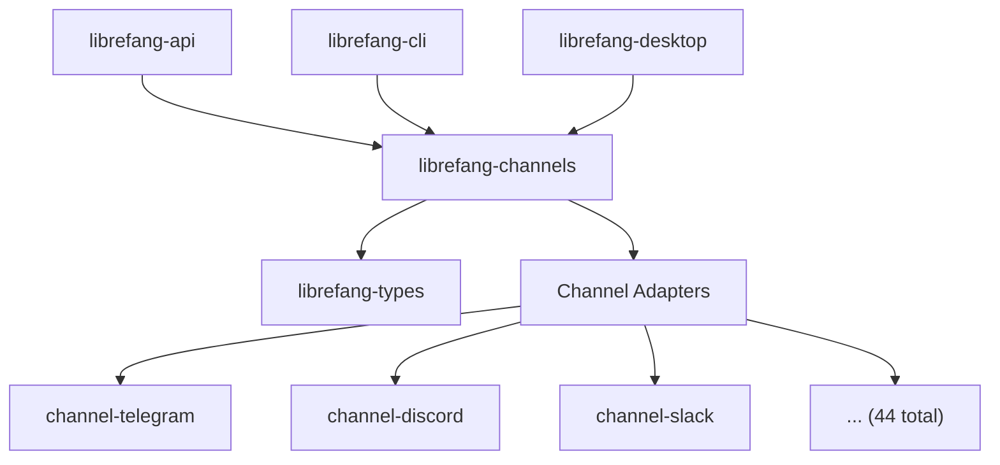

# Other — librefang-channels

# librefang-channels

Pluggable channel bridge layer for LibreFang — provides messaging adapter integrations for 40+ platforms and protocols.

## Overview

`librefang-channels` is a feature-gated crate that isolates every third-party messaging integration behind individual Cargo feature flags. Downstream workspace members (`librefang-api`, `librefang-cli`, `librefang-desktop`) depend on this crate with `default-features = false` and enable only the channel adapters they need.

This design keeps compile times and binary size minimal for any given deployment — you only pay for the integrations you actually use.

## Architecture



All adapters share a common interface defined against types from `librefang-types`, allowing the rest of the codebase to dispatch messages uniformly regardless of the target platform.

## Feature Flags

### No default features

The `default` feature set is intentionally **empty**. Every consumer must explicitly declare which channels it requires. This avoids the pitfalls of a previous design where ~25 channels were enabled by default and often drifted out of sync with `all-channels` (see issue #3655).

### Enabling a single channel

```toml
[dependencies]
librefang-channels = { path = "../librefang-channels", default-features = false, features = ["channel-telegram", "channel-discord"] }
```

### Enabling all channels

The `all-channels` feature is a meta-feature that activates every adapter the crate ships:

```toml
[dependencies]
librefang-channels = { path = "../librefang-channels", features = ["all-channels"] }
```

This is intended for CI, release builds, and packaging pipelines — not for everyday development.

### Available channel features

| Feature flag | Optional dependencies |
|---|---|
| `channel-telegram` | — |
| `channel-discord` | — |
| `channel-slack` | — |
| `channel-matrix` | — |
| `channel-email` | `lettre`, `imap`, `rustls-connector`, `mailparse` |
| `channel-webhook` | — |
| `channel-whatsapp` | — |
| `channel-signal` | — |
| `channel-teams` | — |
| `channel-mattermost` | — |
| `channel-irc` | — |
| `channel-google-chat` | `rsa` |
| `channel-twitch` | — |
| `channel-rocketchat` | — |
| `channel-zulip` | — |
| `channel-xmpp` | — |
| `channel-bluesky` | — |
| `channel-feishu` | `aes`, `cbc` |
| `channel-line` | — |
| `channel-mastodon` | — |
| `channel-messenger` | — |
| `channel-reddit` | — |
| `channel-revolt` | — |
| `channel-viber` | — |
| `channel-voice` | — |
| `channel-flock` | — |
| `channel-guilded` | — |
| `channel-keybase` | — |
| `channel-nextcloud` | — |
| `channel-nostr` | `k256` |
| `channel-pumble` | — |
| `channel-threema` | — |
| `channel-twist` | — |
| `channel-webex` | — |
| `channel-dingtalk` | — |
| `channel-discourse` | — |
| `channel-gitter` | — |
| `channel-gotify` | — |
| `channel-linkedin` | — |
| `channel-mumble` | — |
| `channel-ntfy` | — |
| `channel-qq` | — |
| `channel-wechat` | — |
| `channel-wecom` | `aes`, `cbc` |
| `channel-mqtt` | `rumqttc` |

Channels with cryptographic or protocol-specific needs (e.g., AES-CBC for Feishu/WeCom, RSA for Google Chat, secp256k1 for Nostr, MQTT client) pull in their respective dependencies only when that feature is enabled.

## Core Dependencies

Every channel adapter has access to the following shared workspace dependencies, regardless of which feature is active:

- **`librefang-types`** — shared type definitions for messages, events, and configuration
- **`tokio`** / **`futures`** / **`async-trait`** — async runtime and trait infrastructure
- **`reqwest`** / **`tokio-tungstenite`** — HTTP and WebSocket clients
- **`serde`** / **`serde_json`** — serialization
- **`axum`** — inbound webhook endpoint handling
- **`hmac`** / **`sha2`** / **`sha1`** — signature verification for platform webhooks
- **`dashmap`** — concurrent state maps
- **`tracing`** — structured logging
- **`image`** — image processing (JPEG, PNG, WebP) for media handling
- **`regex`** / **`regex-lite`** — pattern matching

## Adding a New Channel Adapter

When adding a new channel to this crate, three places must be updated in `Cargo.toml`:

1. **Add a new `channel-<name> = []` feature** (with any optional dependencies it needs).
2. **Add `"channel-<name>"` to the `all-channels` array** so it is included in complete builds.
3. **Add any channel-specific optional dependencies** under `[dependencies]` with `optional = true`.

Keep the entries alphabetically sorted within their respective sections to maintain consistency with the existing 44 adapters.

## Benchmarks

The crate includes a Criterion benchmark suite:

```sh
cargo bench --bench dispatch
```

This measures message dispatch throughput across the active channel adapters, useful for regression testing when modifying the dispatch path.

## Relationship to the Workspace

```
librefang-types          ← shared type definitions
    ↑
librefang-channels       ← this crate
    ↑
┌───────┼───────────┐
│       │           │
api    cli      desktop
```

- **`librefang-api`** — exposes channels via the HTTP/gRPC API surface
- **`librefang-cli`** — enables channels for command-line tooling
- **`librefang-desktop`** — enables channels for the desktop application

Each downstream crate forwards only the channel features its users are expected to need.