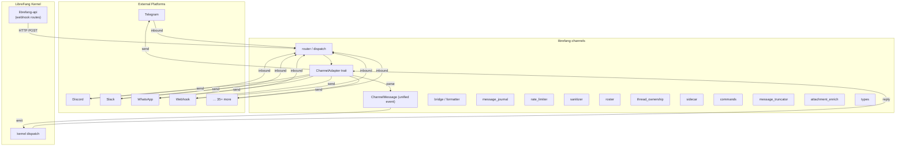

# Other — librefang-channels

# librefang-channels

Channel Bridge Layer for LibreFang. Converts messages from 40+ messaging platforms into unified `ChannelMessage` events and routes agent replies back out through the appropriate adapter.

## Architecture



The kernel sits above channels. It calls into channel dispatch — channels never import the kernel directly. Session IDs for channel conversations are derived via `SessionId::for_channel(agent, "channel:chat")`.

## Cargo Features

`default = []`. Always. Every workspace consumer (`librefang-api`, `librefang-cli`, `librefang-desktop`) sets `default-features = false` and forwards only the adapters it needs.

### Available features

| Feature | Additional dependencies |
|---|---|
| `channel-telegram` | — |
| `channel-discord` | — |
| `channel-slack` | — |
| `channel-matrix` | `pulldown-cmark` |
| `channel-email` | `lettre`, `imap`, `rustls-connector`, `mailparse`, `rustls-pemfile` |
| `channel-webhook` | — |
| `channel-whatsapp` | — |
| `channel-signal` | — |
| `channel-teams` | — |
| `channel-mattermost` | — |
| `channel-irc` | — |
| `channel-google-chat` | `rsa` |
| `channel-twitch` | — |
| `channel-rocketchat` | — |
| `channel-zulip` | — |
| `channel-xmpp` | — |
| `channel-bluesky` | — |
| `channel-feishu` | `aes`, `cbc` |
| `channel-line` | — |
| `channel-mastodon` | — |
| `channel-messenger` | — |
| `channel-reddit` | — |
| `channel-revolt` | — |
| `channel-viber` | — |
| `channel-voice` | — |
| `channel-flock` | — |
| `channel-guilded` | — |
| `channel-keybase` | — |
| `channel-nextcloud` | — |
| `channel-nostr` | `k256` |
| `channel-pumble` | — |
| `channel-threema` | — |
| `channel-twist` | — |
| `channel-webex` | — |
| `channel-dingtalk` | — |
| `channel-discourse` | — |
| `channel-gitter` | — |
| `channel-gotify` | — |
| `channel-linkedin` | — |
| `channel-mumble` | — |
| `channel-ntfy` | — |
| `channel-qq` | — |
| `channel-wechat` | — |
| `channel-wecom` | `aes`, `cbc` |
| `channel-mqtt` | `rumqttc` |

`all-channels` activates every adapter listed above. Use it only in CI/release pipelines.

### Usage example

```toml
# In your Cargo.toml
[dependencies]
librefang-channels = { path = "../librefang-channels", default-features = false, features = [
    "channel-telegram",
    "channel-discord",
    "channel-webhook",
] }
```

## Always-Compiled Core

Regardless of which adapter features are enabled, these internal modules always compile:

- **`types`** — `ChannelMessage` event type and shared type definitions
- **`bridge`** — dispatch glue connecting adapters to the kernel event pipeline
- **`router`** — message routing logic
- **`commands`** — channel command parsing and handling
- **`formatter`** — output formatting for platform-specific message constraints
- **`message_journal`** — message persistence/logging
- **`message_truncator`** — truncates messages to platform limits
- **`rate_limiter`** — per-channel rate limiting
- **`roster`** — contact/participant management
- **`sanitizer`** — input sanitization from external platforms
- **`sidecar`** — auxiliary channel services
- **`thread_ownership`** — conversation thread tracking
- **`attachment_enrich`** — attachment metadata extraction and processing

### Re-exported utilities

The core re-exports helpers for dealing with platform message size limits:

- `split_to_utf16_chunks` — split text into UTF-16 chunks
- `truncate_to_utf16_limit` — truncate to a UTF-16 byte ceiling
- `utf16_len` — compute UTF-16 length
- `DISCORD_MESSAGE_LIMIT` — 2000 characters
- `TELEGRAM_MESSAGE_LIMIT` — 4096 characters
- `TELEGRAM_CAPTION_LIMIT` — 1024 characters

## ChannelAdapter Trait

Every adapter implements `ChannelAdapter`. The trait and dispatch machinery live in the always-compiled core; individual adapter implementations live under `src/<channel>/mod.rs` and are feature-gated.

The adapter handles:
1. **Inbound** — parsing platform-specific payloads into `ChannelMessage` events
2. **Outbound** — calling `send()` to deliver agent replies back to the platform

## Webhook Security

HMAC verification is **mandatory** for platforms that support it. There is no bypass.

| Platform | Environment variable | Config key | On missing signature | On mismatch |
|---|---|---|---|---|
| Messenger | `MESSENGER_APP_SECRET` | `[channels.messenger] app_secret_env` | 400 | 401 |
| Teams | `TEAMS_SECURITY_TOKEN` | `[channels.teams] security_token_env` | 400 | 401 |
| LINE | Platform-specific header | — | 400 | 401 |
| Viber | Platform-specific header | — | 400 | 401 |
| DingTalk | Platform-specific header | — | 400 | 401 |

Health check probes (curl, monitoring) that lack the platform's signature header will receive 4xx responses. This is intentional. Do not add passthrough logic.

## Outbound Webhook SSRF Guard

When configuring `[channels.webhook] callback_url`, the URL must resolve to a publicly routable IP. The adapter refuses to start if the DNS resolution points at any of:

- **Private ranges:** 10.0.0.0/8, 172.16.0.0/12, 192.168.0.0/16
- **Carrier-grade NAT:** 100.64.0.0/10
- **Loopback:** 127.0.0.0/8, ::1
- **Link-local and multicast:** 169.254.0.0/16, 224.0.0.0/4
- **Cloud metadata:** 169.254.169.254
- **IPv6 special forms:** `[::]`, `[::ffff:127.0.0.1]`, NAT64 prefixes
- **Trailing-dot FQDNs:** `example.com.`

For local development, either use a public tunnel (ngrok, cloudflared) or omit `callback_url` entirely.

## Module Boundaries

### What this crate owns

- `ChannelAdapter` trait definition
- `ChannelMessage` event type
- All adapter implementations under `src/<channel>/`
- Dispatch, routing, formatting, rate limiting, sanitization

### What this crate depends on

- `librefang-types` — shared type definitions
- `librefang-extensions` — vault access, shared HTTP client
- `librefang-http` — HTTP infrastructure

### What this crate does NOT depend on

- `librefang-kernel` — channels are below the kernel in the dependency hierarchy
- `librefang-runtime` — no direct dependency

### What lives elsewhere

- HTTP webhook route handlers → `librefang-api/src/routes/channels.rs`
- Per-`(agent, session)` lock management → `librefang-kernel`

## Testing

### Inbound tests

795 tests cover inbound message parsing across adapters.

### Outbound send() tests

Outbound `send()` coverage has historically been near zero (see issue #3820). New requirements:

- Every adapter **must** include a wiremock-based test file at `tests/<channel>_wiremock.rs`
- Minimum coverage: send() happy path + one error response
- PRs adding or modifying adapters without send() tests will be rejected

```rust
// Example structure: tests/telegram_wiremock.rs
use wiremock::{MockServer, Mock, ResponseTemplate};
use wiremock::matchers::{method, path};

#[tokio::test]
async fn send_happy_path() {
    let server = MockServer::start().await;
    server.mock(|when, then| {
        when.method("POST").path("/bot123:abc/sendMessage");
        then.set_status(200)
            .set_body_json(serde_json::json!({"ok": true}));
    }).await;
    // ... invoke adapter send() against server.uri()
}

#[tokio::test]
async fn send_error_response() {
    let server = MockServer::start().await;
    server.mock(|when, then| {
        when.method("POST").path("/bot123:abc/sendMessage");
        then.set_status(429)
            .set_body_json(serde_json::json!({"ok": false, "error_code": 429}));
    }).await;
    // ... verify error handling
}
```

## Adding a New Channel Adapter

1. **Create the adapter** — new file `src/<channel>/mod.rs` implementing `ChannelAdapter`. Add any platform-specific code in submodules within the same directory.

2. **Register the cargo feature** — add `channel-<name> = []` (plus any optional dependencies) to `Cargo.toml`. Also add `"channel-<name>"` to the `all-channels` list.

3. **Default is off** — every channel ships disabled by default. `all-channels` is the only aggregate.

4. **Wire the webhook route** (if the platform uses push-based delivery) — add the handler in `librefang-api/src/routes/channels.rs`.

5. **Write wiremock tests** — create `tests/<channel>_wiremock.rs` with at minimum:
   - Send happy path
   - Send error response
   - HMAC verification (if platform requires it)

6. **Document environment variables** — add required env vars and config keys to the adapter's module-level doc comment.

## Constraints

| Rule | Rationale |
|---|---|
| No `librefang-kernel` import | Kernel calls down into channels; never the reverse |
| No bespoke `reqwest::Client` | Use `librefang-extensions::http_client::shared_client()` for connection pooling |
| No `default = ["all-channels"]` | Default stays empty — consumers opt in explicitly |
| No silent HMAC bypass | Either verify the signature or refuse to start |
| No unchecked `callback_url` | Always pass through the SSRF guard |