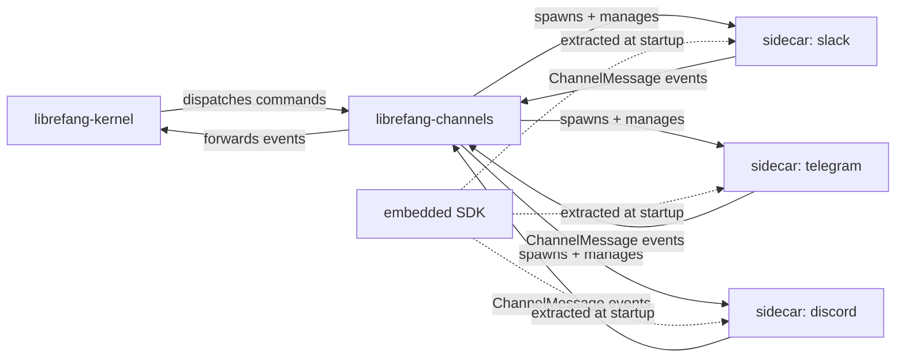

# Other — librefang-channels

# librefang-channels

Channel Bridge Layer for the [LibreFang](https://github.com/librefang/librefang) Agent OS.

This crate provides the **trampoline** that connects the LibreFang kernel to out-of-process channel sidecars, along with the shared bridge types, HTTP client, and message-processing helpers that every adapter uses. It does **not** contain channel adapters themselves — all adapters run as external Python sidecars (`sdk/python/librefang/sidecar/adapters/`).

## Architecture


```mermaid
graph LR
    K[librefang-kernel] -->|dispatches commands| C[librefang-channels]
    C -->|spawns + manages| S1[sidecar: slack]
    C -->|spawns + manages| S2[sidecar: telegram]
    C -->|spawns + manages| S3[sidecar: discord]
    S1 -->|ChannelMessage events| C
    S2 -->|ChannelMessage events| C
    S3 -->|ChannelMessage events| C
    C -->|forwards events| K
    E[embedded SDK] -.->|extracted at startup| S1
    E -.->|extracted at startup| S2
    E -.->|extracted at startup| S3
```

Every messaging platform (Slack, Telegram, Discord, etc.) ships as a Python sidecar adapter under `sdk/python/librefang/sidecar/adapters/`. This crate owns the Rust-side infrastructure:

- **`sidecar.rs`** — the trampoline that launches, communicates with, and supervises sidecar processes.
- **`bridge`** — shared types every adapter speaks over the process boundary.
- **`embedded_sdk`** — embeds the Python SDK into the daemon binary so a fresh installation with only `python3` on `PATH` can run sidecars without `pip install`.
- Shared helpers (HTTP client, message formatting, rate limiting, sanitization, etc.).

## Module Map

All modules compile unconditionally — there are no cargo feature gates. Modules declared in `src/lib.rs`:

| Module | Purpose |
|---|---|
| `attachment_enrich` | Processes and enriches message attachments |
| `bridge` | Shared types for kernel ↔ sidecar communication |
| `commands` | Channel-related command definitions |
| `embedded_sdk` | Embeds `sdk/python/librefang/` into the binary; extracts at runtime and injects `PYTHONPATH` |
| `formatter` | Message formatting utilities |
| `group_history` | Group/channel conversation history management |
| `http_client` | Shared HTTP client with TLS configuration (rustls) |
| `message_journal` | Message journaling/logging |
| `message_truncator` | UTF-16 aware message truncation for platform limits |
| `rate_limiter` | Rate limiting for outbound messages |
| `roster` | Contact/participant roster management |
| `router` | Message routing across channels |
| `sanitizer` | Input sanitization |
| **`sidecar`** | Trampoline: spawns, communicates with, and supervises sidecar processes |
| `thread_ownership` | Thread/conversation ownership tracking |
| `types` | Shared channel types (`ChannelMessage`, session IDs, etc.) |

### Re-exports

The crate re-exports commonly used truncation helpers:
- `split_to_utf16_chunks`
- `truncate_to_utf16_limit`
- `utf16_len`
- `DISCORD_MESSAGE_LIMIT`
- `TELEGRAM_CAPTION_LIMIT`
- `TELEGRAM_MESSAGE_LIMIT`

## Sidecar Trampoline (`sidecar.rs`)

The trampoline is the core of this crate. It:

1. **Discovers** available sidecar adapters from the embedded SDK extraction directory.
2. **Spawns** sidecar processes as the kernel requests channels.
3. **Communicates** with sidecars over the bridge protocol (serialized via `serde_json` over stdin/stdout pipes — managed through `librefang-subprocess`).
4. **Supervises** sidecar lifecycles, restarting on failure.
5. **Translates** between kernel events and `ChannelMessage` / adapter-specific types via the bridge layer.

## Embedded SDK (`embedded_sdk.rs`)

Uses the `include_dir` crate to compile `sdk/python/librefang/` into the daemon binary at build time. At startup:

1. Computes a SHA-256 content hash of the embedded SDK tree.
2. Extracts to `<home>/sidecar-python/<hash>/`.
3. Sets `PYTHONPATH` for spawned sidecar processes to point at the extracted directory.

This means a new user needs only `python3` on `PATH` — no prior `pip install librefang-sdk`. A daemon upgrade produces a fresh hash and extracts to a new subdirectory, avoiding conflicts with older versions.

## Sidecar-Only Policy

**Adding a new channel does NOT mean adding a Rust module to this crate.** New channels are out-of-process Python sidecar adapters.

This is enforced by tooling:

- **Pre-commit hook** (`scripts/hooks/pre-commit`) rejects any file under `crates/librefang-channels/src/{<name>.rs, <name>/*.rs}` containing `ChannelAdapter for` whose basename is not in `src/channels-allowlist.txt`.
- **CI check** (`cargo xtask channel-policy`) performs the same validation.

The allowlist (`channels-allowlist.txt`) currently contains only `sidecar` and is documented to only ever shrink. Adding a name back requires an explicit maintainer decision in a separate reviewed commit.

To onboard a new channel, see `docs/architecture/sidecar-channels.md` and existing adapters under `sdk/python/librefang/sidecar/adapters/`.

## Dependencies

Key workspace dependencies:

- `librefang-types` — shared type definitions across the monorepo
- `librefang-subprocess` — subprocess management for sidecar communication
- `axum` — HTTP routing (for webhook endpoints the trampoline exposes)
- `reqwest` + `rustls` — shared HTTP client with native TLS roots
- `tokio` — async runtime
- `include_dir` — compile-time directory embedding for the Python SDK
- `sha2` — content hashing for the embedded SDK extraction path
- `image` — attachment processing (JPEG, PNG, WebP)
- `pdf-extract` — PDF text extraction from attachments

### Removed Dependencies

Historical in-process channel dependencies have been removed since all adapters moved to sidecars. These now run inside the Python sidecars using Python stdlib or SDK-specific libraries:

- `hmac` / `sha2` / `sha1` — webhook HMAC signature verification
- `aes` / `cbc` — AES-CBC envelope decryption (WeCom, Feishu payloads)
- `tokio-tungstenite` — WebSocket connections (Socket Mode, gateway)
- `lettre` / `imap` / `mailparse` — email adapter
- `rsa` — Google Chat service account JWT signing
- `hex` / `html-escape` / `urlencoding` / `zeroize` — utility deps with no remaining callers

## Benchmarks

A Criterion benchmark suite exists at `benches/dispatch.rs`, runnable via:

```sh
cargo bench -p librefang-channels
```

## Cross-Cutting Concerns

The following are documented in the top-level `CLAUDE.md` and live sidecar adapter sources (not duplicated here to avoid drift):

- **Webhook HMAC verification** — runs inside each Python sidecar
- **SSRF guards** on `WEBHOOK_CALLBACK_URL`
- **`SessionId::for_channel`** contract — channel-derived session identity
- **Boundary contracts** with `librefang-kernel` and `librefang-runtime`