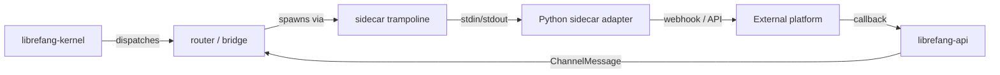

# Other — librefang-channels

# librefang-channels

Channel Bridge Layer for the LibreFang Agent OS. This crate provides the infrastructure that connects the LibreFang kernel to out-of-process channel adapters (sidecars), along with shared types and helpers that every adapter uses.

## Architecture

Every channel adapter runs as a separate process — a Python sidecar located under `sdk/python/librefang/sidecar/adapters/`. This crate does **not** contain channel-specific logic. Instead, it owns the trampoline (`sidecar.rs`) that launches and communicates with those sidecars, the bridge types that define the communication contract, and a set of shared utilities.

```mermaid
graph LR
    K[librefang-kernel] -->|dispatches| R[router / bridge]
    R -->|spawns via| S[sidecar trampoline]
    S -->|stdin/stdout| P[Python sidecar adapter]
    P -->|webhook / API| EXT[External platform]
    EXT -->|callback| A[librefang-api]
    A -->|ChannelMessage| R
```

The kernel sends messages through the router and bridge layer. The sidecar trampoline (`sidecar.rs`) spawns the appropriate Python adapter as a subprocess and communicates over stdin/stdout using the shared bridge types. Outbound messages go to external platforms; inbound webhooks arrive through `librefang-api` and are converted back into `ChannelMessage` events.

## Sidecar-Only Policy

New channels are implemented as out-of-process sidecar adapters, **not** as new Rust modules in this crate. This is enforced by tooling:

- `scripts/hooks/pre-commit` rejects any file under `crates/librefang-channels/src/` that implements `ChannelAdapter for` unless its basename appears in `src/channels-allowlist.txt`.
- `cargo xtask channel-policy` performs the same check in CI.
- The allowlist currently contains only `sidecar` and is documented to only ever shrink.

To add a new channel, create a new adapter under `sdk/python/librefang/sidecar/adapters/`. See `docs/architecture/sidecar-channels.md` for the canonical onboarding flow.

## Modules

All modules compile unconditionally — there are no feature gates. The complete list as declared in `src/lib.rs`:

| Module | Responsibility |
|---|---|
| `sidecar` | Trampoline that spawns and talks to Python sidecar adapters |
| `bridge` | Shared types defining the contract between this crate and sidecars |
| `types` | Core channel-related types (`ChannelMessage`, etc.) |
| `router` | Routes messages to the correct channel adapter |
| `http_client` | Shared HTTP client with TLS configuration (rustls) |
| `attachment_enrich` | Processing and enrichment of message attachments |
| `commands` | Channel command handling |
| `embedded_sdk` | Embeds the Python SDK into the daemon binary; extracts at runtime and injects `PYTHONPATH` |
| `formatter` | Message formatting across channel constraints |
| `group_history` | Group conversation history management |
| `message_journal` | Message persistence/journaling |
| `message_truncator` | Splits messages to fit platform-specific limits |
| `rate_limiter` | Per-channel rate limiting |
| `roster` | Contact/participant roster management |
| `sanitizer` | Input sanitization for inbound messages |
| `thread_ownership` | Thread/conversation ownership tracking |

### Re-exports

The crate exposes utility functions for message truncation:
- `split_to_utf16_chunks`
- `truncate_to_utf16_limit`
- `utf16_len`
- `DISCORD_MESSAGE_LIMIT`
- `TELEGRAM_CAPTION_LIMIT`
- `TELEGRAM_MESSAGE_LIMIT`

## Embedded SDK

The `embedded_sdk` module uses the `include_dir` crate to embed `sdk/python/librefang/` directly into the daemon binary. At runtime, it:

1. Computes a content hash of the embedded SDK tree (using `sha2`).
2. Extracts the SDK to `<home>/sidecar-python/<hash>/`.
3. Injects the extraction path into `PYTHONPATH` before spawning sidecars.

This means a new user only needs `python3` on `PATH` — no separate `pip install` step is required to start using sidecar channels. The hash-based directory ensures that a daemon upgrade extracts to a fresh location without conflicting with a previous version.

## Shared HTTP Client

`http_client` provides a pre-configured `reqwest` client shared across all infrastructure. TLS is handled via rustls using the `aws_lc_rs` crypto backend (rustls' default). No additional provider feature is needed — the previous `ring` backend was removed as unused.

## Dependencies

### Workspace siblings
- `librefang-types` — shared type definitions
- `librefang-subprocess` — subprocess management for sidecar spawning

### Notable crates
- `axum` — used for inbound webhook handling types
- `reqwest` + `rustls` — shared HTTP client
- `image` — attachment processing (JPEG, PNG, WebP)
- `pdf-extract` — PDF attachment text extraction
- `include_dir` + `sha2` — embedded SDK with content-addressed extraction
- `dashmap` — concurrent maps for rate limiting and roster

### Removed dependencies

The following were removed when channel adapters migrated to out-of-process sidecars. These responsibilities now live in the Python sidecars:

- `hmac` / `sha1` — webhook HMAC signature verification
- `aes` / `cbc` — AES-CBC envelope decryption (WeCom, Feishu payloads)
- `tokio-tungstenite` — Socket Mode / gateway websockets
- `lettre` / `imap` / `mailparse` — email adapter
- `rsa` — Google Chat service-account JWT signing
- `hex` / `html-escape` / `urlencoding` / `zeroize` — no remaining in-crate callers

## Cross-Cutting Concerns

The following are documented elsewhere and should not be duplicated here to avoid drift:

| Concern | Canonical source |
|---|---|
| Webhook HMAC verification | Sidecar adapter docstrings, `docs/architecture/sidecar-channels.md` |
| SSRF guards on `WEBHOOK_CALLBACK_URL` | Top-level `CLAUDE.md`, sidecar adapter sources |
| `SessionId::for_channel` contract | Top-level `CLAUDE.md` |
| Kernel / runtime boundary | Top-level `CLAUDE.md`, `CONTRIBUTING.md` |
| Sidecar onboarding flow | `docs/architecture/sidecar-channels.md` |

## Benchmarks

The crate includes a Criterion benchmark (`dispatch`) enabled via `[[bench]]` in `Cargo.toml`. Run with `cargo bench -p librefang-channels`.