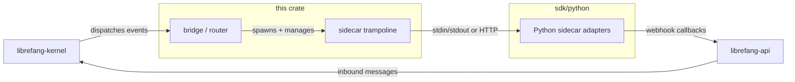

# Other — librefang-channels

# librefang-channels

Channel Bridge Layer for LibreFang — provides the trampoline, shared bridge types, and infrastructure that connect the kernel to out-of-process channel sidecar adapters.

## Overview

This crate does **not** contain channel adapters. Every channel integration (Telegram, Discord, Slack, Matrix, ntfy, etc.) runs as an out-of-process Python sidecar under `sdk/python/librefang/sidecar/adapters/`. This crate owns:

- **The sidecar trampoline** (`sidecar.rs`) — the mechanism by which the kernel spawns, communicates with, and manages sidecar processes.
- **Shared bridge types** — the serialized message protocol every sidecar adapter speaks.
- **Shared infrastructure** — HTTP client, rate limiter, message formatting, sanitization, and other utilities common to all channels.

## Architecture

```mermaid
graph LR
    K[librefang-kernel] -->|dispatches events| BR[bridge / router]
    BR -->|spawns + manages| SC[sidecar trampoline]
    SC -->|stdin/stdout or HTTP| PY[Python sidecar adapters]
    PY -->|webhook callbacks| API[librefang-api]
    API -->|inbound messages| K
    subgraph "this crate"
        BR
        SC
    end
    subgraph "sdk/python"
        PY
    end
```

All channel adapters live in the Python SDK. The kernel sends outbound messages through the bridge and router into the sidecar trampoline, which relays them to the appropriate adapter process. Inbound messages arrive via webhook callbacks into `librefang-api`, which converts them into kernel events.

## Module Reference

Every module compiles unconditionally — there are no feature gates. Verify against `src/lib.rs` for the canonical list.

| Module | Purpose |
|---|---|
| `sidecar` | Trampoline that spawns and communicates with out-of-process sidecar adapters |
| `bridge` | Bridge types defining the serialized protocol between kernel and sidecars |
| `router` | Routes outbound messages to the correct sidecar adapter |
| `types` | Shared type definitions used across all channel infrastructure |
| `http_client` | Shared HTTP client with TLS configuration (rustls, system cert roots) |
| `embedded_sdk` | Embeds `sdk/python/librefang/` into the daemon binary; extracts at runtime and injects `PYTHONPATH` so sidecars work without a prior `pip install` |
| `rate_limiter` | Per-channel or global rate limiting |
| `message_truncator` | UTF-16-aware message splitting and truncation for platform limits |
| `formatter` | Message formatting shared across channels |
| `sanitizer` | Input sanitization |
| `attachment_enrich` | Attachment processing and enrichment (image thumbnailing via `image`, PDF text extraction via `pdf-extract`) |
| `commands` | Channel command handling |
| `group_history` | Group conversation history management |
| `message_journal` | Message journaling/logging |
| `roster` | Channel participant roster management |
| `thread_ownership` | Thread/conversation ownership tracking |

## Public Re-exports

The crate exposes message-truncation utilities used by sidecar adapters and the kernel:

- `split_to_utf16_chunks`
- `truncate_to_utf16_limit`
- `utf16_len`
- `DISCORD_MESSAGE_LIMIT`
- `TELEGRAM_CAPTION_LIMIT`
- `TELEGRAM_MESSAGE_LIMIT`

## Embedded SDK

The `embedded_sdk` module uses the `include_dir` crate to bake `sdk/python/librefang/` into the daemon binary. At runtime it:

1. Computes a SHA-256 content hash of the embedded SDK tree.
2. Extracts to `<home>/sidecar-python/<hash>/`.
3. Injects that directory into `PYTHONPATH` when spawning sidecar processes.

This means a new installation with only `python3` on `PATH` can run sidecar channels without first installing the SDK via pip. A daemon upgrade with a changed SDK produces a new hash, so it extracts to a fresh subdirectory without conflicting with the previous version.

## Shared HTTP Client

`http_client` builds a `reqwest` client configured with rustls (using the `aws_lc_rs` crypto backend) and loads certificate roots from both `webpki-roots` and `rustls-native-certs`. All sidecars and in-crate HTTP consumers share this client.

## Sidecar-Only Policy

**Adding a new channel adapter as a Rust module in this crate is rejected by CI.** Two enforcement points:

1. **Pre-commit hook** (`scripts/hooks/pre-commit`) — scans files under `crates/librefang-channels/src/` for `ChannelAdapter for` implementations.
2. **CI check** (`cargo xtask channel-policy`) — same scan in CI.

Both reject any file whose basename is not listed in `src/channels-allowlist.txt`. That allowlist currently contains only `sidecar` and is documented to only ever shrink. Adding a name back requires an explicit maintainer decision in a separate reviewed commit.

To add a new channel, create a Python sidecar adapter under `sdk/python/librefang/sidecar/adapters/`. See `docs/architecture/sidecar-channels.md` for the canonical onboarding flow.

## Cross-cutting Concerns

These are documented in detail elsewhere — this crate's sources consume them but do not define the contracts:

- **Webhook HMAC verification** — runs inside each Python sidecar, not in this crate.
- **SSRF guards on `WEBHOOK_CALLBACK_URL`** — enforced at the API boundary.
- **`SessionId::for_channel` contract** — defined in `librefang-types`.
- **Boundary with `librefang-kernel` / `librefang-runtime`** — documented in the top-level `CLAUDE.md`.

## Dependencies

Key dependencies and why they're here:

| Dependency | Consumer |
|---|---|
| `librefang-types` | Shared domain types |
| `reqwest` + `rustls` + `webpki-roots` + `rustls-native-certs` | Shared HTTP client |
| `axum` | Sidecar communication endpoints |
| `image` (jpeg, png, webp) | `attachment_enrich` thumbnailing |
| `pdf-extract` | `attachment_enrich` PDF text extraction |
| `include_dir` + `sha2` | `embedded_sdk` bundling and content hashing |
| `dashmap` | Concurrent maps in rate limiter, roster |
| `tokio` + `tokio-stream` + `futures` | Async runtime |
| `subtle` | Constant-time comparison |

## Historical Context

Previous versions of this crate contained in-process channel adapters gated behind cargo features (`channel-webhook`, `channel-email`, `channel-telegram`, etc.) with an `all-channels` aggregate flag. These were progressively migrated to Python sidecars. The `Cargo.toml` no longer declares any features (`default = []`), and dependencies that only served in-process adapters (`hmac`, `sha1`, `aes`, `cbc`, `tokio-tungstenite`, `lettre`, `imap`, `rsa`, `hex`, `html-escape`, `urlencoding`, `zeroize`) have been removed.