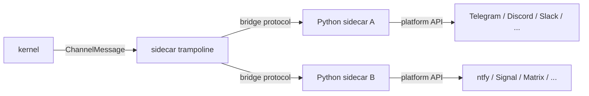

# Other — librefang-channels

# librefang-channels

Channel Bridge Layer for the LibreFang Agent OS. This crate provides the shared infrastructure that connects the LibreFang kernel to pluggable messaging channel adapters, each of which runs out-of-process as a Python sidecar.

## Purpose

`librefang-channels` converts platform-specific messages into unified `ChannelMessage` events for the kernel and routes agent replies back out through the appropriate channel. It does **not** contain any channel adapter implementations itself — every adapter lives in the Python SDK under `sdk/python/librefang/sidecar/adapters/`. Instead, this crate owns the trampoline that launches and communicates with those sidecars, the shared bridge types every adapter speaks, and common utilities like the HTTP client, message formatting, and rate limiting.

## Architecture

All channel adapters follow the sidecar pattern. The kernel never speaks a platform protocol directly — it talks to a sidecar process over the bridge, and the sidecar handles the platform-specific details.

```mermaid
graph LR
    K[kernel] -->|ChannelMessage| T[sidecar trampoline]
    T -->|bridge protocol| S1[Python sidecar A]
    T -->|bridge protocol| S2[Python sidecar B]
    S1 -->|platform API| P1[Telegram / Discord / Slack / ...]
    S2 -->|platform API| P2[ntfy / Signal / Matrix / ...]
```

The trampoline (`sidecar.rs`) manages sidecar subprocess lifecycles, serialises messages over the bridge protocol, and deserialises responses back into types the kernel understands. The Python sidecars are embedded in the daemon binary (see [Embedded SDK](#embedded-sdk)) and extracted at runtime.

## Module Map

Every module compiles unconditionally — there are no cargo feature gates. Modules declared in `src/lib.rs`:

| Module | Purpose |
|---|---|
| `sidecar` | Trampoline: launches sidecar processes, manages the bridge connection between kernel and adapters |
| `bridge` | Shared bridge types that define the wire protocol between the Rust trampoline and Python sidecars |
| `types` | Core channel types (`ChannelMessage`, etc.) shared across the crate |
| `router` | Routes incoming messages to the correct handler and outbound replies to the correct sidecar |
| `http_client` | Shared HTTP client with TLS configuration (rustls), used by the trampoline and any in-crate HTTP needs |
| `formatter` | Message formatting utilities |
| `message_truncator` | UTF-16 aware message truncation (see re-exports below) |
| `message_journal` | Message journaling/persistence |
| `attachment_enrich` | Attachment processing and enrichment |
| `rate_limiter` | Per-channel rate limiting |
| `sanitizer` | Input sanitization |
| `roster` | Channel roster/contact management |
| `group_history` | Group chat history handling |
| `commands` | Channel command definitions |
| `thread_ownership` | Thread/conversation ownership tracking |
| `embedded_sdk` | Embeds the Python SDK into the binary and extracts it at runtime |

### Public re-exports

The crate re-exports message truncation utilities and platform limits:

- `split_to_utf16_chunks`
- `truncate_to_utf16_limit`
- `utf16_len`
- `DISCORD_MESSAGE_LIMIT`
- `TELEGRAM_CAPTION_LIMIT`
- `TELEGRAM_MESSAGE_LIMIT`

## Embedded SDK

The `embedded_sdk` module uses `include_dir` to bundle `sdk/python/librefang/` into the daemon binary at compile time. At runtime, it:

1. Computes a SHA-256 content hash of the embedded SDK tree.
2. Extracts the SDK into `<home>/sidecar-python/<hash>/`.
3. Injects that directory into `PYTHONPATH` when launching sidecar processes.

This means a new user with only `python3` on `PATH` can enable a sidecar channel without first running `pip install librefang-sdk`. A daemon upgrade produces a new hash and extracts to a fresh subdirectory, avoiding stale-file conflicts.

## HTTP Client

`http_client.rs` provides a shared HTTP client built on `reqwest` with rustls TLS. It uses `rustls::crypto::aws_lc_rs` (rustls' default backend). The client is shared across the crate and configured with both `webpki-roots` and `rustls-native-certs` for certificate verification.

## Sidecar-Only Policy

New channels are always out-of-process sidecar adapters — never new modules in this crate. This is enforced at two levels:

- **Pre-commit hook** (`scripts/hooks/pre-commit`): rejects any file under `crates/librefang-channels/src/{<name>.rs, <name>/*.rs}` that contains `ChannelAdapter for` unless the basename appears in `src/channels-allowlist.txt`.
- **CI check** (`cargo xtask channel-policy`): same rule, enforced in CI.

The allowlist (`channels-allowlist.txt`) currently contains only `sidecar` and is documented to only ever shrink. Adding a name back requires an explicit maintainer decision in a separate reviewed commit.

To create a new channel adapter, see `docs/architecture/sidecar-channels.md` and the existing adapters under `sdk/python/librefang/sidecar/adapters/`.

## Dependencies

Key internal dependencies:

- `librefang-types` — shared type definitions across the workspace
- `librefang-subprocess` — subprocess management for sidecar processes

Notable external dependencies:

- `tokio` / `futures` / `async-trait` — async runtime and traits
- `reqwest` / `rustls` / `webpki-roots` / `rustls-native-certs` — HTTP client with TLS
- `axum` — used in the bridge layer
- `dashmap` — concurrent maps for sidecar state
- `include_dir` / `sha2` — embedded SDK extraction
- `image` / `pdf-extract` — attachment enrichment (JPEG, PNG, WebP, PDF)
- `serde` / `serde_json` — bridge protocol serialisation

### Removed dependencies

The following were removed when in-process channel adapters migrated to sidecars. They are **not** coming back:

`hmac`, `sha1`, `aes`, `cbc`, `tokio-tungstenite`, `hex`, `html-escape`, `urlencoding`, `zeroize`, `lettre`, `imap`, `rustls-connector`, `rustls-pemfile`, `mailparse`, `rsa`. Webhook HMAC verification, AES-CBC envelope decryption, and websocket connections now run inside the Python sidecars.

## Cross-cutting concerns

Webhook HMAC verification, SSRF guards on `WEBHOOK_CALLBACK_URL`, the channel-derived `SessionId::for_channel` contract, and the boundary against `librefang-kernel` / `librefang-runtime` are documented in the top-level `CLAUDE.md` and in the live sidecar adapter sources (`sdk/python/librefang/sidecar/adapters/`).