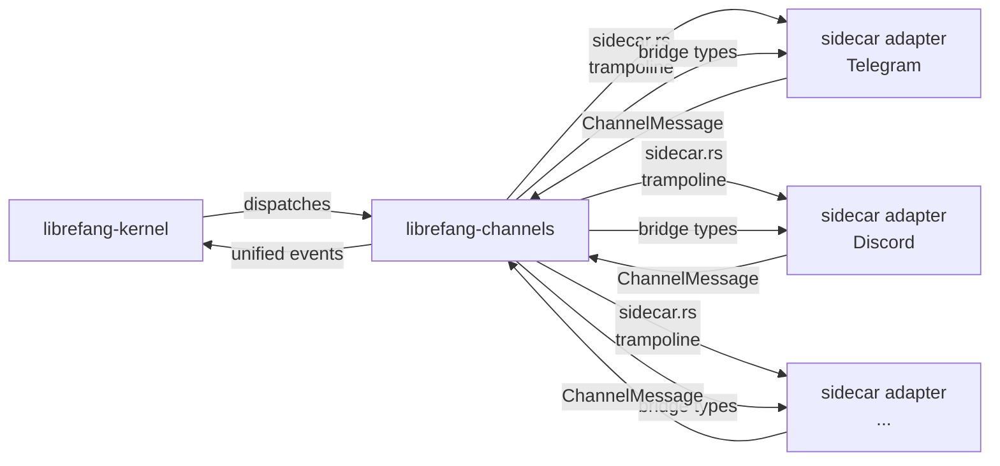

# Other — librefang-channels

# librefang-channels

Channel Bridge Layer for LibreFang — the infrastructure crate that connects the kernel to out-of-process channel adapters (sidecars) and provides shared messaging utilities.

## Purpose

This crate does **not** contain channel adapters. Every channel adapter (Telegram, Discord, Slack, Matrix, ntfy, Signal, etc.) runs as an out-of-process Python sidecar located at `sdk/python/librefang/sidecar/adapters/`. This crate owns:

- **The sidecar trampoline** (`sidecar.rs`) — spawns, communicates with, and manages the lifecycle of sidecar processes.
- **Bridge types** (`bridge`, `types`) — the shared protocol every adapter speaks over the sidecar boundary.
- **Shared infrastructure** — HTTP client, rate limiter, message formatting, sanitization, attachment handling, and other utilities the kernel and sidecars both need.

## Architecture

```mermaid
graph LR
    K[librefang-kernel] -->|dispatches| C[librefang-channels]
    C -->|"sidecar.rs<br>trampoline"| S1[sidecar adapter<br>Telegram]
    C -->|"sidecar.rs<br>trampoline"| S2[sidecar adapter<br>Discord]
    C -->|"sidecar.rs<br>trampoline"| SN[sidecar adapter<br>...]
    C -->|bridge types| S1
    C -->|bridge types| S2
    C -->|bridge types| SN
    S1 -->|ChannelMessage| C
    S2 -->|ChannelMessage| C
    SN -->|ChannelMessage| C
    C -->|unified events| K
```

The kernel sends outgoing messages to `librefang-channels`, which routes them through the sidecar trampoline to the appropriate Python adapter. Inbound messages from external platforms flow back through the same bridge in reverse, arriving at the kernel as unified `ChannelMessage` events.

## Modules

All modules compile unconditionally — there are no feature gates. The full list declared in `src/lib.rs`:

### Core sidecar infrastructure

| Module | Role |
|--------|------|
| `sidecar` | Trampoline that launches and communicates with out-of-process Python sidecar adapters |
| `bridge` | Shared protocol types exchanged across the sidecar boundary |
| `types` | Channel-related type definitions |
| `embedded_sdk` | Embeds `sdk/python/librefang/` into the daemon binary and extracts it at runtime |

### Message processing

| Module | Role |
|--------|------|
| `router` | Routes outgoing messages to the correct sidecar adapter |
| `formatter` | Formats agent replies for channel-specific constraints |
| `message_truncator` | Splits/truncates messages to platform limits (UTF-16 aware) |
| `message_journal` | Journals message history for auditing and replay |
| `sanitizer` | Sanitizes inbound/outbound message content |
| `attachment_enrich` | Enriches attachment metadata (image dimensions, PDF extraction) |
| `commands` | Channel-specific command parsing and handling |

### Session and conversation management

| Module | Role |
|--------|------|
| `thread_ownership` | Tracks which thread/conversation belongs to which channel session |
| `group_history` | Manages group chat history context |
| `roster` | Maintains the roster of known contacts/participants across channels |

### Shared utilities

| Module | Role |
|--------|------|
| `http_client` | Shared HTTP client with TLS configuration (rustls, aws_lc_rs backend) |
| `rate_limiter` | Per-channel rate limiting |
| `group_history` | Group chat history retrieval |

## Embedded SDK

The `embedded_sdk` module uses the `include_dir` crate to bundle the entire Python SDK (`sdk/python/librefang/`) into the daemon binary. At runtime, it:

1. Computes a content hash of the embedded SDK tree (using `sha2`).
2. Extracts the SDK to `<home>/sidecar-python/<hash>/`.
3. Injects that directory into `PYTHONPATH` when spawning sidecar processes.

This means a new user needs only `python3` on `PATH` to enable a sidecar channel — no `pip install` required. When the daemon upgrades and the SDK changes, the new hash causes extraction to a fresh subdirectory.

## Sidecar-Only Policy

This crate enforces a strict policy: **all channel adapters must be out-of-process sidecars**. Adding a new `ChannelAdapter` implementation directly in this crate is rejected by:

- `scripts/hooks/pre-commit` (local)
- `cargo xtask channel-policy` (CI)

Both check that any file under `crates/librefang-channels/src/` containing `ChannelAdapter for` has a basename present in `channels-allowlist.txt`. That allowlist currently contains only `sidecar` and is documented to only ever shrink. Re-adding a name requires an explicit maintainer decision in a separate reviewed commit.

**To add a new channel:** create a new adapter under `sdk/python/librefang/sidecar/adapters/`. See `docs/architecture/sidecar-channels.md` for the canonical onboarding flow.

## Key Re-exports

Message truncation utilities used across the codebase:

- `split_to_utf16_chunks`
- `truncate_to_utf16_limit`
- `utf16_len`
- `DISCORD_MESSAGE_LIMIT` (2000)
- `TELEGRAM_CAPTION_LIMIT` (1024)
- `TELEGRAM_MESSAGE_LIMIT` (4096)

## Dependencies

The crate depends on `librefang-types` for shared domain types and a standard async runtime stack (`tokio`, `futures`, `async-trait`). Notable dependencies:

- **rustls** — TLS provider for the shared HTTP client, using the default `aws_lc_rs` backend (no extra feature flags).
- **reqwest** — the HTTP client itself.
- **axum** — used for inbound webhook receiver endpoints in the sidecar trampoline.
- **image** — JPEG/PNG/WebP processing for attachment enrichment (no default features, only needed decoders).
- **pdf-extract** — text extraction from PDF attachments.
- **subtle** — constant-time comparison for HMAC-style operations at the bridge boundary.

Dependencies that were **removed** during the sidecar migration (their consumers moved to Python sidecars):

- `hmac`, `sha1` — webhook signature verification (now in sidecars)
- `aes`, `cbc` — AES-CBC envelope decryption for WeCom/Feishu payloads
- `tokio-tungstenite` — WebSocket gateway connections (Socket Mode, etc.)
- `lettre`, `imap`, `mailparse` — email adapter
- `rsa` — Google Chat service account JWT signing
- `hex`, `html-escape`, `urlencoding`, `zeroize` — no remaining in-crate callers

## Cross-Cutting Concerns

The following topics are documented in the top-level `CLAUDE.md` and in the live sidecar adapter sources rather than here, to avoid duplication drift:

- Webhook HMAC verification (runs inside each Python sidecar)
- SSRF guards on `WEBHOOK_CALLBACK_URL`
- `SessionId::for_channel` contract
- Boundary contracts with `librefang-kernel` and `librefang-runtime`

Refer to `docs/architecture/sidecar-channels.md` and `CONTRIBUTING.md` for authoritative details.