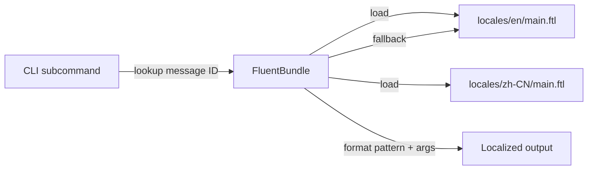

# Other — librefang-cli-locales

# librefang-cli-locales

Localization resource module for the LibreFang CLI. Contains all user-facing translatable strings in [Fluent](https://projectfluent.org/) (`.ftl`) format, currently shipping with **English** (`en`) and **Simplified Chinese** (`zh-CN`) translations.

## Purpose

This module holds no executable code. It is a pure resource bundle that the CLI binary loads at runtime via the `fluent` / `fluent-bundle` ecosystem to render locale-aware output. Every `println`, `eprintln`, or formatted status line in `librefang-cli` should resolve its text through these files rather than embedding string literals.

```
librefang-cli/locales/
├── en/main.ftl       # Primary locale (source of truth)
└── zh-CN/main.ftl    # Simplified Chinese translation
```

## How It Works

### Fluent message format

Each entry is a Fluent message with an identifier and a value. Placeholders use `{$name}` syntax:

```fluent
daemon-error = Daemon error: { $error }
models-available = { $count } models available
```

The CLI code looks up a message by its identifier and passes a map of variables. If a variable is missing or a message ID doesn't exist in the active locale, Fluent falls back to the parent locale (`en`), then to the raw identifier.

### Message ID conventions

IDs are lowercase, hyphen-separated, and follow a `domain-suffix` naming pattern. This makes it straightforward to locate the source string and the CLI subcommand that emits it:

| Prefix | CLI area |
|---|---|
| `daemon-*` | `start`, `stop`, `restart` lifecycle commands |
| `label-*` | Table/field labels in `status`, `info` |
| `hint-*` | Contextual user guidance appended after operations |
| `error-*` | Error conditions (with `-fix` companion for remediation) |
| `agent-*` | `agent spawn`, `agent kill`, `agent set` subcommands |
| `vault-*` | `vault init`, `vault store`, `vault rotate` |
| `config-*` | `config set`, `config edit`, `config set-key` |
| `channel-*` | Channel setup wizards (telegram, discord, slack, …) |
| `cron-*`, `approval-*`, `memory-*`, `webhook-*`, `device-*` | Their respective subcommands |
| `section-*` | Section headers for rich terminal output |
| `doctor-*` | `doctor` diagnostic checks |
| `uninstall-*` | `uninstall` cleanup |
| `reset-*` | `reset` operations |
| `log-*` | `logs` / log tailing |

### Error + fix pairs

Many error messages come in pairs — the diagnostic string and a remediation hint:

```fluent
error-connect-refused = Cannot connect to daemon
error-connect-refused-fix = Is the daemon running? Start it with: librefang start
```

The CLI typically prints the error line, then the `-fix` line on the next line or as a dimmed hint. When adding a new error, always add a corresponding `-fix` companion so the user has an actionable next step.

### Section headers

`section-*` messages are headings used by the `cli-table` / `comfy-table` rendering logic. They are not sentences — they serve as locale-aware column titles or group dividers:

```fluent
section-active-agents = Active Agents
section-security-status = Security Status
section-recent-errors = Recent errors (daemon.log)
```

## Locale Coverage

Both `en/main.ftl` and `zh-CN/main.ftl` must expose **every** message ID used by the CLI. The English file is the source of truth; the Chinese file mirrors its structure exactly. A mismatch (missing ID, extra ID, or different placeholder name) will surface at runtime as a Fluent resolution error or fallback string.

### Adding a new string

1. Add the message to `en/main.ftl` under the appropriate section comment.
2. Copy the same message ID to `zh-CN/main.ftl` with the translated value, preserving all `{$variable}` placeholders verbatim.
3. In the Rust code, call the message by its ID with the required variables.

### Adding a new locale

1. Create a new directory under `locales/` using the appropriate [BCP 47](https://tools.ietf.org/html/bcp47) tag (e.g. `ja/`, `fr/`, `pt-BR/`).
2. Copy `en/main.ftl` as the starting template and translate every value.
3. Register the new locale in the CLI's locale negotiation / fallback chain (in the crate that initializes `fluent-bundle`).

## Content Areas

### Daemon lifecycle

Messages for `start`, `stop`, `restart`, and background daemon health. Includes the special `shutdown-401-*` series (Issue #4693) that handles the case where an in-place binary upgrade leaves a running daemon with a mismatched API key, automatically falling back to PID-based shutdown.

### Setup and initialization

The `init-*` and `guide-*` messages support the first-run wizard (`librefang init`) including provider selection, API key paste, and key verification.

### Status and diagnostics

`section-daemon-status`, `section-status-inprocess`, and `doctor-*` cover the rich status table output and the diagnostic doctor command. The `label-*` entries provide localized column headers.

### Security

`section-security-status` and related labels describe audit trail, taint tracking, WASM sandboxing, wire protocol, key management, and manifest signing in user-facing terms.

### Channel integration

Setup wizards for messaging platforms (Telegram, Discord, Slack, WhatsApp, Email, Signal, Matrix). Each channel has a `section-setup-<channel>` header and `channel-*` flow messages.

### Vault

Credential vault operations including initialization, storage, retrieval, and the master key rotation flow (`vault-rotate-*`). Rotation messages are notably verbose because the process has several failure modes that require precise user guidance.

### Config

Configuration read/write errors and success confirmations, including the `config set-key` flow for persisting provider API keys to `~/.librefang/.env`.

## Integration with the CLI

This module is a passive resource. The consuming crate (typically `librefang-cli`) initializes a `fluent::FluentBundle` at startup, loads the appropriate `.ftl` file based on the user's locale preference (environment variable, config setting, or OS locale), and then calls `bundle.get_message()` + `bundle.format_pattern()` to resolve strings at display time.



No Rust code lives in this module. All logic for locale negotiation, bundle construction, and message formatting resides in the CLI crate itself.