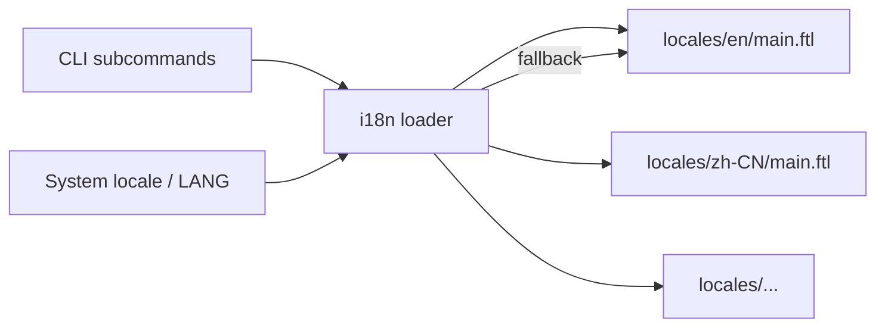

# Other — librefang-cli-locales

# librefang-cli-locales

Localization data for the LibreFang CLI, using [Project Fluent](https://projectfluent.org/) (`.ftl`) message files. This is a pure-data module — it contains no executable code, only translated strings consumed by the CLI's i18n layer at runtime.

## Structure

```
locales/
├── en/
│   └── main.ftl       # English (primary / fallback)
└── zh-CN/
    └── main.ftl       # Simplified Chinese
```

Each locale directory holds a single `main.ftl` file containing all translatable messages for that language. The CLI loads the appropriate file based on the user's system locale (or `LANG`/`LC_ALL` environment variable), falling back to `en` when no match is found.

## Message Organization

Messages in each `.ftl` file are grouped into logical sections by comment headers. The sections are consistent across all locales:

| Section | Purpose | Typical consumers |
|---|---|---|
| **Daemon lifecycle** | Startup, shutdown, background launch, restart, health states | `start`, `stop`, `restart`, `status` subcommands |
| **Labels** | One- or two-word field labels (API, PID, Model, etc.) | Table rendering, status display |
| **Hints** | Contextual guidance shown after commands | Terminal output footers, post-action tips |
| **Init** | First-run setup messages | `init` subcommand |
| **Error messages** | Filesystem, config, communication, and boot errors | Error handlers across all subcommands |
| **Provider detection** | LLM provider auto-discovery feedback | Provider detection logic |
| **Desktop app** | LibreFang Desktop launch messages | `desktop` subcommand |
| **Dashboard** | Dashboard URL display | `dashboard` subcommand |
| **Agent commands** | Spawn, kill, model set, template listing | `agent` subcommands |
| **Manifest errors** | Agent manifest read/parse failures | Agent loading |
| **Status** | Section headers for status display | `status` subcommand |
| **Doctor** | Diagnostic check results | `doctor` subcommand |
| **Security** | Security feature labels and values | `status --security`, audit display |
| **Health** | Simple health check responses | Health probes |
| **Channel setup** | Messaging channel configuration (Telegram, Discord, etc.) | `channel` subcommand |
| **Vault** | Credential vault operations | `vault` subcommand |
| **Cron** | Scheduled job management | `cron` subcommand |
| **Approvals** | Approval workflow responses | Approval handling |
| **Memory** | Agent memory key-value operations | `memory` subcommand |
| **Devices** | Mobile device pairing | `device` subcommand |
| **Webhooks** | Webhook CRUD and testing | `webhook` subcommand |
| **Models** | Model catalog selection | `model` subcommand |
| **Config** | Configuration read/write/set-key operations | `config` subcommand |
| **Hand commands** | Hand dependency install, pause, resume | `hand` subcommand |
| **Daemon notify** | Post-config-change restart reminders | Various mutators |
| **System info** | System information section header | `info` subcommand |
| **Uninstall** | Full uninstall workflow messages | `uninstall` subcommand |
| **Reset** | Data directory reset messages | `reset` subcommand |
| **Logs** | Log tailing status | `logs` subcommand |

## Fluent Message Patterns

### Simple messages

A message identifier mapped to a literal string:

```fluent
daemon-starting = Starting daemon...
health-ok = Daemon is healthy
```

Referenced in code as `fl!("daemon-starting")` or equivalent.

### Messages with variables

Curly-brace placeholders for runtime values. These are **not** printf-style format strings — they are named parameters:

```fluent
kernel-booted = Kernel booted ({ $provider }/{ $model })
daemon-error = Daemon error: { $error }
models-available = { $count } models available
```

The caller must supply a map of variable names to values. A missing variable will render as a blank or raise a lookup error depending on the Fluent implementation.

### Error–fix pairing convention

Many error messages have a corresponding `-fix` message that provides actionable remediation steps. The convention is a shared name prefix:

```fluent
error-boot-config = Failed to parse configuration
error-boot-config-fix = Check your config.toml syntax: librefang config show
```

```fluent
error-daemon-returned = Daemon returned error ({ $status })
error-daemon-returned-fix = Check daemon logs with: librefang logs --follow
```

When adding a new error message, always add a `-fix` variant. The CLI error handler typically prints both in sequence.

### Pluralization-aware messages

Some messages use Fluent's implicit plural awareness through variable interpolation:

```fluent
agents-loaded = { $count } agent(s) loaded
```

Currently these use inline parentheticals rather than Fluent `CLDR` plural selectors. If stricter pluralization is needed, convert to:

```fluent
agents-loaded = { $count ->
    [one] { $count } agent loaded
   *[other] { $count } agents loaded
}
```

## Adding a New Locale

1. Create a new directory under `locales/` using a [BCP 47](https://tools.ietf.org/html/bcp47) tag (e.g. `ja`, `pt-BR`, `fr`).

2. Copy `locales/en/main.ftl` into the new directory as a starting point. The English file is the authoritative source for all message identifiers.

3. Translate every message value. **Do not modify message identifiers** — they are the lookup keys. Keep all variable references (`{ $variable }`) intact.

4. Ensure every message present in `en/main.ftl` has a corresponding entry. Missing messages will fall back to English at runtime, but a complete translation is expected.

5. Register the new locale in the CLI's i18n initialization code so the loader knows to probe for it.

### Translation checklist

For each message:

- [ ] Identifier is **unchanged** from the English source
- [ ] All `{ $variable }` references are preserved with the same names
- [ ] Command names in hints (e.g., `` `librefang start` ``) are **not** translated — they are CLI keywords
- [ ] URLs remain untranslated
- [ ] Technical terms (Merkle, Ed25519, WASM, HMAC-SHA256, etc.) are kept as-is
- [ ] The `-fix` paired message is also translated

## Adding New Messages

When introducing a new user-facing string to the CLI:

1. Add the message to **`locales/en/main.ftl` first** under the appropriate section comment. Choose a descriptive, namespaced identifier (e.g. `agent-export-failed`, not `error-42`).

2. If it's an error, add both the base message and a `-fix` variant.

3. Copy the same identifier with the English value as a placeholder into every other locale file. Mark it with a comment if needed:

   ```fluent
   # TODO: translate
   agent-export-failed = Failed to export agent: { $error }
   agent-export-failed-fix = Check file permissions and disk space
   ```

4. Reference the message in code using the Fluent macro/function provided by the CLI's i18n module.

## Architecture Diagram



At startup the i18n loader reads the system locale, attempts to load the matching `.ftl` file, and falls back to English for any missing messages or unsupported locales. Subcommands request messages by identifier and receive the translated string with variables interpolated.