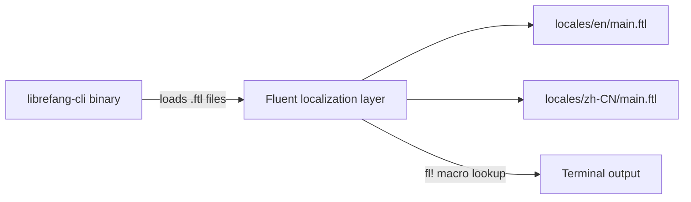

# Other — librefang-cli-locales

# librefang-cli-locales

Localization module for the LibreFang CLI, providing user-facing messages in multiple languages via [Project Fluent](https://projectfluent.org/) (`.ftl`) translation files.

## Purpose

Every string the CLI prints — daemon status, error messages, setup wizard prompts, section headings — lives in these locale files rather than being hardcoded. This ensures the CLI is localizable and that all user-facing text is centralized for easy auditing and maintenance.

## Supported Locales

| Locale | Directory | Language |
|--------|-----------|----------|
| `en` | `locales/en/main.ftl` | English (default) |
| `zh-CN` | `locales/zh-CN/main.ftl` | Simplified Chinese |

The English file is the canonical source of truth. The Chinese file mirrors its structure one-to-one, using identical message identifiers.

## File Format

Files use Fluent's FTL syntax. Each entry is a key-value pair, optionally with variables:

```fluent
# Simple message
daemon-starting = Starting daemon...

# Message with a variable
kernel-booted = Kernel booted ({ $provider }/{ $model })

# Multi-line message (note the leading newline)
shutdown-401-fallback-fix = Stop the daemon manually, then start it again:
    kill { $pid }    # or: kill -9 { $pid } if it does not exit
    librefang start
```

### Variables

Variables are interpolated at runtime by the CLI's localization layer. Common variable names:

- `$error` — error detail string
- `$path` — filesystem path
- `$url` — daemon or dashboard URL
- `$status` — HTTP status code
- `$pid` — process ID
- `$count` — numeric count
- `$id` — resource identifier (agent, cron job, webhook, etc.)
- `$name` — display name
- `$key` — config or vault key
- `$value` — config value
- `$provider` / `$model` — LLM provider and model identifiers
- `$env_var` — environment variable name
- `$command` — CLI subcommand name
- `$action` — past-tense action verb (e.g., "pause", "resume")
- `$field` — field name
- `$max` — upper bound for numeric selection
- `$display` — provider display name

## Message Categories

The locale files are organized into sections by comment headers. The identifiers follow a `category-detail` naming convention.

### Daemon Lifecycle (`daemon-*`, `shutdown-*`)

Messages for `librefang start`, `stop`, and `restart`. Covers startup, health-wait loops, background mode, and the Issue #4693 shutdown-401 fallback flow (where a freshly upgraded CLI can't authenticate against a stale daemon and falls back to PID-based termination).

### Labels (`label-*`, `value-*`, `auth-*`, `warn-*`)

Short field labels used in status tables and info displays — e.g. `label-api`, `label-pid`, `label-status`, `value-audit-trail`.

### Hints and Guidance (`hint-*`, `guide-*`)

Contextual help strings surfaced after commands or during interactive setup. The `guide-*` keys power the first-run quick setup wizard that walks users through picking a free LLM provider and pasting an API key.

### Init (`init-*`)

Output from `librefang init` in both quick (non-interactive) and interactive (wizard) modes.

### Error Messages (`error-*`, `manifest-*`)

Structured error output with two-part patterns: the error itself and a `-fix` companion message suggesting remediation:

```fluent
error-connect-refused = Cannot connect to daemon
error-connect-refused-fix = Is the daemon running? Start it with: librefang start
```

Boot-specific errors (`error-boot-*`) are separated from general daemon communication errors.

### Status and Sections (`section-*`)

Heading labels for grouped output in `librefang status`, `librefang doctor`, and similar display commands.

### Channel Setup (`channel-*`)

Strings for `librefang channel setup <name>`, covering Telegram, Discord, Slack, WhatsApp, Email, Signal, and Matrix.

### Vault (`vault-*`)

Messages for credential vault operations: init, store, remove, and the key rotation flow (`vault-rotate-*`). The rotation messages include detailed validation and failure diagnostics for old/new master key mismatches.

### Agent Commands (`agent-*`)

Output for agent lifecycle: spawn, kill, model assignment, and template discovery.

### Config (`config-*`)

Messages for `librefang config get/set/unset/set-key/edit`, including env-file management via `config-saved-key` and `config-removed-env`.

### Other Categories

- **Cron** (`cron-*`) — scheduled job management
- **Approvals** (`approval-*`) — human-in-the-loop approval responses
- **Memory** (`memory-*`) — agent key-value memory operations
- **Devices** (`device-*`) — mobile device pairing and QR code display
- **Webhooks** (`webhook-*`) — webhook CRUD and testing
- **Models** (`model-*`) — default model selection
- **Hands** (`hand-*`) — hand instance pause/resume and dependency install
- **Security** (`audit-*`) — audit trail integrity verification output
- **Health** (`health-*`) — simple daemon health check responses
- **Uninstall** (`uninstall-*`) — full removal flow including platform-specific autostart cleanup
- **Reset** (`reset-*`) — data directory reset
- **Logs** (`log-*`) — log file tailing

## How to Add a New Locale

1. Create a new directory under `locales/` using the appropriate BCP 47 tag (e.g. `ja` for Japanese).
2. Copy `locales/en/main.ftl` as a starting template.
3. Translate every message value while keeping all identifiers, variables (`{ $var }`), and multiline structure identical.
4. Register the locale in the CLI's localization loader (the mechanism depends on the Fluent integration layer in the parent crate).

## How to Add a New Message

1. Add the identifier and English text to `locales/en/main.ftl` under the appropriate section comment.
2. Add the same identifier to every other locale file (`zh-CN/main.ftl`, etc.) with a translated value. If a translation is not yet available, copy the English string as a placeholder — missing keys will fall back to English at runtime.
3. Reference the identifier in the CLI codebase using the Fluent localization API (e.g., `fl!("daemon-starting")`).

## Naming Conventions

| Pattern | Usage | Examples |
|---------|-------|---------|
| `category-detail` | Primary message | `daemon-started`, `vault-rotate-success` |
| `category-detail-fix` | Remediation companion | `error-connect-refused-fix` |
| `section-*` | Display section heading | `section-daemon-status` |
| `label-*` | Table/field label | `label-uptime`, `label-auth` |
| `hint-*` | Contextual help line | `hint-stop-daemon` |
| `warn-*` | Warning indicator | `warn-public-bind` |
| `value-*` | Label value pair | `value-audit-trail` |
| `auth-*` | Auth method display | `auth-api-key` |

## Relationship to the Codebase

This module is a pure resource bundle — it contains no executable code, no Rust modules, and no build logic. The CLI binary loads these `.ftl` files at startup via the Fluent localization framework and looks up messages by identifier when rendering output.



All other CLI submodules (daemon control, agent management, config, vault, etc.) depend on this module for user-facing strings but never hardcode their own.