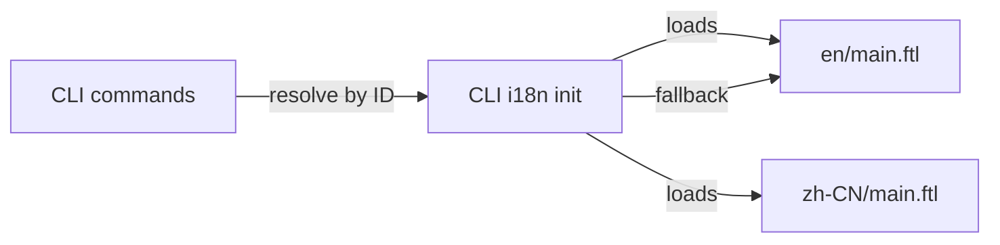

# Other — librefang-cli-locales

# librefang-cli-locales

Fluent (FTL) translation catalogs for the LibreFang CLI. This module holds every user-facing string the CLI prints — labels, status messages, error diagnostics, hints, and setup wizard text — in a format the [Project Fluent](https://projectfluent.org/) runtime can resolve at launch time.

## File Layout

```
librefang-cli/locales/
├── en/          # English — the primary/source locale
│   └── main.ftl
└── zh-CN/       # Simplified Chinese
    └── main.ftl
```

Each locale directory mirrors the same `main.ftl` structure. The CLI loads the file that matches the user's `LANG` / `LC_MESSAGES` setting at startup; `en` acts as the unconditional fallback.

## Why Fluent, Not Plain JSON

Fluent (`.ftl`) supports:

| Feature | Example in this module |
|---|---|
| **Variable interpolation** | `daemon-error = Daemon error: { $error }` |
| **Pluralisation** | `{ $count }` rendered via caller context |
| **Section comments** | `# --- Daemon lifecycle ---` (organisational only) |
| **Separation of concerns** | Message IDs are stable; translators edit only the value |

This lets translators work on a single file per locale without touching code.

## Message Organisation

Messages are grouped into logical sections via comment headers. Both locales follow the same section order:

| Section | Prefix | Purpose |
|---|---|---|
| Daemon lifecycle | `daemon-*` | Start, stop, restart, background launch, health waits |
| Labels | `label-*` | Short field names for tables/status output |
| Hints | `hint-*` | Contextual help text suggesting next commands |
| Init wizard | `init-*`, `guide-*` | First-run setup flow messages |
| Errors (filesystem) | `error-*` | Config/IO/parse errors with `*-fix` companions |
| Errors (daemon comms) | `error-daemon-*`, `error-boot-*` | Network/boot failures |
| Errors (require daemon) | `error-require-daemon-*` | Commands that need a running daemon |
| Provider detection | `detected-*` | Auto-detected LLM backends |
| Desktop app | `desktop-*` | GUI launch messages |
| Dashboard | `dashboard-*` | Web UI open/URL messages |
| Agent commands | `agent-*` | Spawn, kill, template, model set |
| Manifest errors | `manifest-*` | Missing/corrupt template manifests |
| Status display | `section-*`, `warn-*`, `auth-*` | Structured status output sections |
| Doctor | `doctor-*` | Diagnostic pass/fail/repair |
| Security | `value-*`, `audit-*` | Security feature descriptions and audit results |
| Health | `health-*` | Simple up/down checks |
| Channel setup | `channel-*`, `section-setup-*` | Telegram, Discord, Slack, WhatsApp, Email, Signal, Matrix |
| Vault | `vault-*` | Credential store operations |
| Cron | `cron-*` | Scheduled job CRUD |
| Approvals | `approval-*` | Approval workflow responses |
| Memory | `memory-*` | Per-agent key/value store |
| Devices | `device-*` | Mobile pairing QR / removal |
| Webhooks | `webhook-*` | Webhook CRUD and test |
| Models | `model-*` | Default model selection |
| Config | `config-*` | Get/set/unset, key management, `.env` interactions |
| Hand commands | `hand-*` | Hand instance pause/resume/deps |
| Uninstall | `uninstall-*` | Platform-specific cleanup (Windows/macOS/Linux) |
| Reset | `reset-*` | Data directory removal |
| Logs | `log-*` | Tail/follow hints |

## Conventions

### Message IDs

- **Kebab-case**: `daemon-still-starting`, `channel-bot-token-saved`
- **Hierarchical by domain**: All agent messages start with `agent-`, all config messages with `config-`
- **`-fix` suffix**: Companion messages that suggest remediation steps (e.g. `error-boot-auth-fix`)

### Error + Fix Pairing

Most error messages come in pairs. The base message describes the failure; the `-fix` variant tells the user what to do:

```ftl
error-connect-refused = Cannot connect to daemon
error-connect-refused-fix = Is the daemon running? Start it with: librefang start
```

The calling code retrieves both and renders them together, ensuring users always see actionable guidance.

### Interpolated Variables

Variables are wrapped in `{ $name }`. Common variable names across the module:

| Variable | Typical source |
|---|---|
| `$error` | Underlying error message from the runtime |
| `$path` | Filesystem path (logs, config, data) |
| `$url` | Daemon or dashboard URL |
| `$status` | HTTP-style status code or exit code |
| `$command` | CLI subcommand name |
| `$name` | Entity name (agent, channel, provider) |
| `$id` | Unique identifier (agent, webhook, cron, device) |
| `$key` | Config key or vault key |
| `$value` | New value being set |
| `$provider` / `$model` | LLM provider or model identifier |
| `$count` | Numeric count (agents, models, keys) |
| `$action` | Past-tense verb like "pause", "resume", "approve" |
| `$env_var` | Environment variable name |
| `$display` | Human-readable provider name |

## Adding a New Locale

1. Create `librefang-cli/locales/<locale-code>/main.ftl`.
2. Copy `en/main.ftl` as the starting point.
3. Translate every message value — **do not change message IDs or variable names**.
4. Keep section comments for readability.
5. Register the new locale in the CLI's Fluent loader (see the i18n initialization module).

### Checklist for Translators

- [ ] Every message ID from `en/main.ftl` is present
- [ ] All `{ $variable }` references are preserved exactly
- [ ] No message IDs are renamed or removed
- [ ] Command names in backticks (`` `librefang start` ``) remain untranslated
- [ ] URLs remain unchanged
- [ ] Section comments are kept for future maintenance

## Adding New Messages

When introducing a new user-facing string:

1. Add the message to `en/main.ftl` under the correct section (or create a new section).
2. Follow the naming convention: `<domain>-<description>`.
3. If it's an error, add a matching `-fix` variant.
4. Immediately add the same message ID to all other locale files — use the English text as a placeholder with a `TODO` comment so translators can find it:

```ftl
# TODO: translate
daemon-new-feature = Some new English message
```

5. Reference the message from code via `fluent_bundle.get_message("daemon-new-feature")`.

## Relationship to the CLI Codebase

This module is a **pure data** dependency. The CLI's i18n layer loads these `.ftl` files at startup and resolves messages by ID. No code in this module imports or calls anything else, and nothing imports code from it — only the Fluent runtime reads the files.



The CLI commands (`start`, `stop`, `agent`, `config`, `doctor`, etc.) request messages by their Fluent ID. The i18n layer returns the resolved string for the active locale, interpolating any variables the command provides. If a message ID is missing in the active locale, Fluent falls back to English automatically.