# Other — librefang-cli-src

# TUI Screens (`librefang-cli::tui::screens`)

## Overview

This module is the **screen registry** for the librefang TUI (Terminal User Interface). It aggregates every screen module into a single namespace, establishing the navigable surface area of the application. The file itself contains no logic — it re-exports submodules, each of which implements an individual screen.

## Architecture

The TUI follows a **one-module-per-screen** convention. Each submodule under `screens/` corresponds to a distinct view the user can navigate to. Application routing logic (outside this module) refers to screens by their module name.

```mermaid
graph TD
    Router["TUI Router / Navigation"]
    Router --> dashboard
    Router --> welcome
    Router --> init_wizard
    Router --> wizard
    Router --> chat
    Router --> sessions
    Router --> agents
    Router --> comms
    Router --> channels
    Router --> peers
    Router --> workflows
    Router --> skills
    Router --> triggers
    Router --> templates
    Router --> extensions
    Router --> memory
    Router --> hands
    Router --> logs
    Router --> audit
    Router --> usage
    Router --> settings
    Router --> security
    Router --> free_provider_guide
```

## Screen Modules

### Core Navigation

| Module | Purpose |
|---|---|
| `welcome` | Landing screen shown at startup |
| `dashboard` | Primary overview / home screen |
| `settings` | Application-wide configuration |

### Onboarding & Setup

| Module | Purpose |
|---|---|
| `init_wizard` | First-run initialization wizard |
| `wizard` | General-purpose step-by-step wizard flow |
| `free_provider_guide` | Guide for setting up free-tier LLM providers |

### Conversational Interfaces

| Module | Purpose |
|---|---|
| `chat` | Interactive chat with an agent |
| `sessions` | Manage conversation sessions |
| `comms` | Communication layer / messaging view |
| `channels` | Channel configuration and management |

### Agent & Peer Management

| Module | Purpose |
|---|---|
| `agents` | View and manage registered agents |
| `peers` | Peer-to-peer connection management |
| `hands` | Active hand-off / delegation management |

### Automation

| Module | Purpose |
|---|---|
| `workflows` | Define and monitor workflows |
| `skills` | Manage agent skill sets |
| `triggers` | Configure event-based triggers |
| `templates` | Reusable prompt and task templates |
| `extensions` | Extension/plugin management |

### Data & Monitoring

| Module | Purpose |
|---|---|
| `memory` | Agent memory / context inspection |
| `logs` | Raw application log viewer |
| `audit` | Audit trail for security-relevant events |
| `usage` | Token usage and consumption metrics |

### Security

| Module | Purpose |
|---|---|
| `security` | Security policies, keys, and access control |

## Conventions

When adding a new screen to the TUI:

1. Create a new file under `librefang-cli/src/tui/screens/` (e.g., `my_screen.rs`).
2. Implement the screen's view and event-handling logic inside that file.
3. Add `pub mod my_screen;` to this `mod.rs` file.
4. Wire the screen into the application's router (located outside this module).

Each screen module is expected to expose whatever the application's UI framework requires (typically a render function and an event/update handler), but the exact interface contract is defined by the TUI framework layer, not by this registry.

## Relationships to the Rest of the Codebase

This module sits **at the edge** of the TUI layer. It has no incoming or outgoing call dependencies within its own scope — it is a structural module. The actual wiring happens upstream in the TUI routing and state-management code, which imports individual screen modules from here and invokes their render and event handlers based on the current application state.