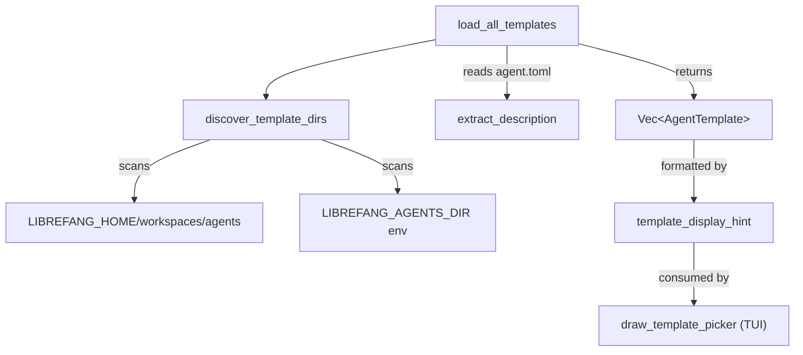

# Other — librefang-cli-src

# librefang-cli/templates — Agent Template Discovery & Loading

## Purpose

This module discovers, loads, and presents agent templates from the filesystem. It provides the data pipeline that feeds the TUI's template picker when a user creates or configures a new agent.

## Architecture

## Key Components

### `AgentTemplate`

A lightweight struct representing a single discovered template:

| Field | Type | Description |
|---|---|---|
| `name` | `String` | The directory name under the agents root |
| `description` | `String` | Extracted from `agent.toml`'s top-level `description` key |
| `content` | `String` | Raw TOML content of the manifest file, preserved for later parsing |

### `discover_template_dirs() -> Vec<PathBuf>`

Searches for agent template directories in a priority order. Each candidate is checked for existence and deduplicated:

1. **`LIBREFANG_HOME/workspaces/agents/`** — The installed templates location. `LIBREFANG_HOME` defaults to `~/.librefang`, falling back to `$TMPDIR/.librefang` if no home directory is available.
2. **`LIBREFANG_AGENTS_DIR`** — An environment variable override pointing directly at an agents directory.

Only directories that actually exist on disk are included in the result.

### `load_all_templates() -> Vec<AgentTemplate>`

The primary entry point for template loading. It:

1. Calls `discover_template_dirs()` to get candidate directories.
2. Iterates each directory's children, looking for subdirectories containing an `agent.toml` manifest.
3. **Deduplicates** by template name using a `HashSet` — the first occurrence wins.
4. **Skips** any template named `"custom"` (reserved for user-created agents).
5. Extracts the description via `extract_description()`.
6. Returns templates sorted alphabetically by name.

### `extract_description(toml_str: &str) -> String`

A lightweight line-scanner that pulls the `description` value from raw TOML **without** invoking a full TOML parser. This avoids pulling in a dependency for a single-field extraction.

**Behavior:**
- Matches lines where the first non-whitespace token is `description` followed by `=`.
- Strips surrounding double-quotes from the value.
- Returns the first match; if no `description` key is found, returns an empty string.

**Caveat:** This is not a general-purpose TOML parser. It does not handle multi-line strings, escape sequences, or inline tables. It is intentionally simple for performance and dependency reasons.

### `template_display_hint(t: &AgentTemplate) -> String`

Formats a template's description for display in a `cliclack` select prompt. Rules:

| Condition | Output |
|---|---|
| Description is empty | `""` |
| Description ≤ 60 characters (Unicode-aware) | The description verbatim |
| Description > 60 characters | First 57 characters + `"..."` |

The truncation is **character-count based**, not byte-based, so multi-byte Unicode (e.g., CJK characters) is handled correctly.

## Default Model Resolution

Templates are expected to defer model selection to the user's configured default. The bundled example (`examples/custom-agent/agent.toml`) must set `provider` and `model` to either empty strings or `"default"`, rather than hardcoding a specific vendor. The kernel's spawn/execute pipeline then overlays the `DefaultModelConfig` from the user's `config.toml`.

This design prevents the regression tracked in openfang #967, where a template hardcoding `"groq"` / `"llama-3.3-70b-versatile"` would silently ignore the user's configured default model.

## Integration Points

- **Consumer:** `draw_template_picker` in `tui/screens/agents.rs` calls `template_display_hint()` to format each template for the interactive selection screen.
- **Dependencies:** Reads `AgentManifest` and `DefaultModelConfig` from `librefang_types`.
- **Filesystem convention:** Each template lives in its own subdirectory containing an `agent.toml` manifest at the root.

## Testing Notes

Tests that mutate `LIBREFANG_HOME` or `LIBREFANG_AGENTS_DIR` are serialized via a process-wide `Mutex` guard (`env_lock()`) because environment variables are global state and Cargo runs test functions in parallel. The guard is poison-resistant — if a previous test panicked while holding the lock, the mutex is recovered rather than causing a cascade failure.