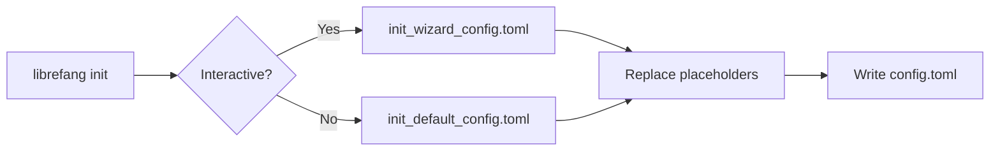

# Other — librefang-cli-templates

# librefang-cli-templates

TOML configuration templates shipped with the LibreFang CLI. These files are processed during project initialization (`librefang init`) and written to disk as the starting `config.toml` for a new LibreFang Agent OS instance.

## Templates

### `init_default_config.toml`

The full reference configuration. Every configurable section of LibreFang is present—most commented out—with inline comments explaining purpose, valid values, security implications, and cross-references to documentation.

Used when the user chooses a non-interactive or "advanced" init path and wants to see every option at a glance.

**Template placeholders:**

| Placeholder | Replaced with |
|---|---|
| `{{provider}}` | LLM provider name (e.g. `openai`, `anthropic`, `ollama`) |
| `{{model}}` | Default model identifier (e.g. `gpt-4o`, `claude-sonnet-4-20250514`) |
| `{{api_key_env}}` | Environment variable name holding the API key (e.g. `OPENAI_API_KEY`) |

### `init_wizard_config.toml`

A minimal configuration generated by the interactive setup wizard. Only the sections the user actually configured are emitted; everything else is left at daemon defaults.

**Template placeholders:**

| Placeholder | Replaced with |
|---|---|
| `{{provider}}` | LLM provider name |
| `{{model}}` | Default model identifier |
| `{{api_key_line}}` | A full `api_key_env = "..."` line, or empty string if the provider doesn't need one (e.g. Ollama) |
| `{{routing_section}}` | Optional TOML section block for agent routing rules, or empty string |

## How Templates Are Processed

The CLI init command reads one of these templates, substitutes placeholders with values collected from the user (or from sane defaults), and writes the result to the project's configuration file. The templates themselves are never executed or parsed by the running daemon—they are purely a scaffolding concern.

## Configuration Sections Reference

The sections below appear in `init_default_config.toml`. Sections marked *commented out* are disabled by default and must be explicitly uncommented to activate.

### Server

| Key | Default | Description |
|---|---|---|
| `api_listen` | `127.0.0.1:4545` | Bind address and port. Loopback-only by default. |
| `log_level` | `info` | Verbosity: `trace`, `debug`, `info`, `warn`, `error` |
| `mode` | `default` | Runtime mode: `stable`, `default`, `dev` |
| `update_channel` | `stable` | Update track: `stable`, `beta`, `rc` |

**Security constraint:** The daemon refuses to bind to a non-loopback address unless authentication is configured (`api_key`, dashboard credentials, or `[[users]]` entries). Override with `LIBREFANG_ALLOW_NO_AUTH=1` at your own risk.

### Dashboard Login

Default credentials (`librefang` / `librefang`) must be changed after first login. For production, store the password via LibreFang Vault (`vault:dashboard_password`) or the `LIBREFANG_DASHBOARD_PASS` environment variable instead of plaintext.

### Terminal Access Control

Controls remote shell access behavior:
- `allow_remote` — permit non-local terminal connections (requires auth)
- `allow_unauthenticated_remote` — hard safety guard; must be explicitly enabled
- `require_proxy_headers` — trust `X-Forwarded-For` / `X-Real-IP` (only behind a reverse proxy)

### Performance

| Key | Default | Description |
|---|---|---|
| `prompt_caching` | `true` | Enable LLM prompt caching (Anthropic/OpenAI) |
| `stable_prefix_mode` | `true` | Improve cache hit rate with stable prefixes |
| `usage_footer` | `full` | Token/cost display in responses: `off`, `tokens`, `cost`, `full` |

### `default_model`

The primary LLM used when no agent-specific model is configured. Populated from template placeholders during init.

### `memory` and `proactive_memory`

Configures the memory subsystem: confidence decay rate, auto-extraction of facts from conversations, auto-retrieval of relevant memories, and limits on retrieval volume and storage.

### `web` and `web.fetch`

Web search and fetch tool configuration. `search_provider = "auto"` attempts providers in order: Tavily → Brave → Jina → Perplexity → DuckDuckGo. The fetch block controls page extraction limits, timeouts, and readability mode. Cloud metadata endpoints are always blocked regardless of `ssrf_allowed_hosts`.

### `queue.concurrency`

Controls parallelism across four lanes: `main_lane` (user messages), `cron_lane` (scheduled jobs), `subagent_lane` (child agents), and `trigger_lane` (event dispatches). `default_per_agent` sets the fallback per-agent concurrency when the agent manifest doesn't specify `max_concurrent_invocations`.

### `exec_policy`

Shell execution sandbox. `mode = "deny"` blocks all shell commands by default. Alternatives are `allowlist` (only approved commands) and `full` (unrestricted). Enforces output size limits and timeouts.

### `reload`

Hot-reload behavior for configuration changes. `hybrid` mode attempts in-process hot-reload for supported keys and falls back to restart for others. `debounce_ms` prevents rapid successive reloads during file saves.

### Commented-out Sections

These sections are fully documented in the template but inactive by default. Uncomment to enable:

- **`provider_regions`** / **`provider_urls`** — regional endpoints and URL overrides for providers like Qwen, MiniMax, Ollama, vLLM
- **`[[fallback_providers]]`** — LLM failover chain when the default model is unavailable
- **`rate_limit`** — GCRA-based request limiting, WebSocket throttling, idle timeouts
- **`registry`** — agent registry cache TTL
- **`compaction`** — LLM-based session history summarization thresholds
- **`triggers`** — event trigger cooldowns, recursion depth limits, workflow timeouts
- **`budget`** — hourly/daily/monthly cost caps with per-provider overrides
- **`thinking`** — extended thinking budget for Claude models
- **`channels`** (Telegram, Discord, Slack, WeChat) — external messaging channel integrations
- **`[[mcp_servers]]`** — Model Context Protocol tool servers (stdio transport)
- **`browser`** — headless browser automation settings
- **`docker`** — containerized execution sandbox
- **`inbox`** — file-based async command ingestion
- **`network`** — P2P federation between LibreFang nodes

## Relationship to the Codebase

This module has no runtime code, imports, or call graph. It is consumed exclusively by the `librefang-cli` init command at project creation time. The generated `config.toml` is later read and parsed by the LibreFang Agent OS daemon at startup.