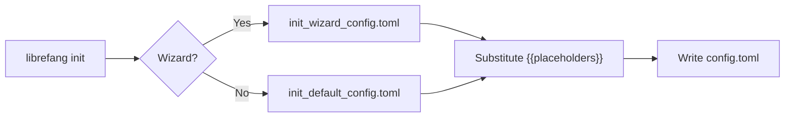

# Other — librefang-cli-templates

# librefang-cli-templates

Configuration templates used by the `librefang init` command to generate a working `config.toml` for LibreFang Agent OS.

## Purpose

This module contains two static TOML template files that serve as the basis for a new installation's configuration. They are not executed directly — the CLI reads them at init time, substitutes placeholder values, and writes the result to the user's config directory.

| File | When Used |
|------|-----------|
| `init_default_config.toml` | Full reference config with every section commented out except the essentials. Written when the user chooses the "default" setup path or wants a complete starting point. |
| `init_wizard_config.toml` | Minimal skeleton written by the interactive setup wizard. Contains only the fields the wizard collected (provider, model, API key) plus a few sensible defaults. |

## Template Placeholders

Both files use Mustache-style `{{variable}}` tokens that the CLI replaces before writing:

| Placeholder | Source | Example Substitution |
|-------------|--------|----------------------|
| `{{provider}}` | Wizard selection / CLI flag | `openai` |
| `{{model}}` | Wizard selection / CLI flag | `gpt-4o` |
| `{{api_key_env}}` | Environment variable name chosen by user | `OPENAI_API_KEY` |
| `{{api_key_line}}` | Pre-formatted line (wizard only) | `api_key_env = "OPENAI_API_KEY"` |
| `{{routing_section}}` | Optional routing block (wizard only) | Empty string or a `[routing]` table |

## Configuration Sections

The following sections appear in `init_default_config.toml`. Sections marked *active* are uncommented by default; *opt-in* sections are commented out and must be explicitly enabled.

### Active by Default

#### Server Settings
```toml
api_listen = "127.0.0.1:4545"
log_level = "info"             # trace | debug | info | warn | error
mode = "default"               # stable | default | dev
update_channel = "stable"      # stable | beta | rc
```
- **`api_listen`** — Bind address for the HTTP/WebSocket server. `"127.0.0.1:4545"` for local-only; `"0.0.0.0:4545"` to expose on LAN.
- **`mode`** — Controls feature gating. `stable` hides experimental features; `dev` enables everything.
- **`update_channel`** — Determines which release track to pull updates from.

#### Dashboard Credentials
```toml
dashboard_user = "librefang"
dashboard_pass = "librefang"
```
Default credentials for the web dashboard. The template includes a comment directing users to change these immediately, and documents three secure alternatives:
1. **Vault** — `librefang vault set dashboard_password` then reference as `dashboard_pass = "vault:dashboard_password"`
2. **Environment variable** — Set `LIBREFANG_DASHBOARD_PASS`
3. **Direct string** — Replace the value inline (least secure)

#### Default LLM
```toml
[default_model]
provider = "{{provider}}"
model = "{{model}}"
api_key_env = "{{api_key_env}}"
```
The primary model used when no agent-specific override is set. `api_key_env` names the environment variable holding the API key rather than embedding the key itself.

#### Memory
```toml
[memory]
decay_rate = 0.05

[proactive_memory]
enabled = true
auto_memorize = true
auto_retrieve = true
max_retrieve = 10
```
- **`decay_rate`** — Confidence reduction per cycle for stored memories.
- **`proactive_memory`** — Controls automatic fact extraction from conversations and context retrieval. Sub-options like `extraction_threshold`, `session_ttl_hours`, `duplicate_threshold`, and `max_memories_per_agent` are available but commented out.

#### Performance
```toml
prompt_caching = true
stable_prefix_mode = true
usage_footer = "full"          # off | tokens | cost | full
```
- **`prompt_caching`** — Reduces LLM costs by reusing cached prompts (Anthropic/OpenAI).
- **`stable_prefix_mode`** — Improves cache hit rate by maintaining a consistent prompt prefix.
- **`usage_footer`** — Controls what token/cost information is displayed in responses.

#### Web Tools
```toml
[web]
search_provider = "auto"       # Tavily → Brave → Jina → Perplexity → DuckDuckGo

[web.fetch]
max_chars = 50000
timeout_secs = 30
readability = true
```
- **`search_provider`** — `"auto"` tries providers in priority order based on which API keys are present in the environment.
- **`web.fetch`** — Controls web page extraction. Cloud metadata IPs (169.254.x.x, 100.64.x.x) are always blocked; internal CIDRs can be allowlisted via `ssrf_allowed_hosts`.

#### Task Queue Concurrency
```toml
[queue.concurrency]
main_lane = 3
cron_lane = 2
subagent_lane = 3
```
Separate concurrency lanes prevent scheduled jobs or child agents from starving user-facing message processing.

#### Shell Execution Policy
```toml
[exec_policy]
mode = "deny"                  # deny | allowlist | full
timeout_secs = 30
max_output_bytes = 102400
```
- **`deny`** — No shell commands allowed (safest default).
- **`allowlist`** — Only pre-approved commands execute.
- **`full`** — Unrestricted (use with caution).

#### Config Hot-Reload
```toml
[reload]
mode = "hybrid"                # off | restart | hot | hybrid
debounce_ms = 500
```
- **`hybrid`** — Hot-reloads what it can, restarts the process for structural changes.
- **`debounce_ms`** — Prevents rapid reloads during batched file saves.

### Opt-In Sections (Commented Out)

These sections are fully documented in the template but must be explicitly uncommented:

| Section | Purpose |
|---------|---------|
| `[[fallback_providers]]` | LLM failover chain — define backup providers tried in order on failure |
| `[rate_limit]` | GCRA-based rate limiting for API requests and WebSocket connections |
| `[compaction]` | LLM-based session history summarization when message count grows |
| `[triggers]` | Event-driven automation with recursion guards |
| `[budget]` | Cost caps (hourly/daily/monthly) with per-provider overrides |
| `[thinking]` | Extended thinking budget for Claude models |
| `[channels.telegram]` | Telegram bot integration |
| `[channels.discord]` | Discord bot integration |
| `[channels.slack]` | Slack bot integration |
| `[channels.wechat]` | Personal WeChat via iLink protocol |
| `[[mcp_servers]]` | Model Context Protocol server connections for external tools |
| `[browser]` | Headless browser automation (Playwright) |
| `[docker]` | Docker sandbox for isolated code execution |
| `[inbox]` | File-based async command interface — drop text files to trigger agents |
| `[network]` | P2P federation between LibreFang instances |
| `[registry]` | Agent registry sync cache TTL |
| `[provider_regions]` | Regional endpoint selection for multi-region providers (e.g., `qwen = "intl"`) |
| `[provider_urls]` | Override provider API endpoints (for local proxies, vLLM, Ollama) |
| `[terminal]` | Remote terminal access control with authentication guards |

## How the Templates Connect to the CLI



1. The user runs `librefang init`.
2. If the interactive wizard is selected, the CLI collects provider, model, and API key preferences, then loads `init_wizard_config.toml` and fills in the placeholders.
3. If the default path is selected (or `--default` flag is used), the CLI loads `init_default_config.toml` with minimal substitutions.
4. The CLI replaces all `{{…}}` tokens with the gathered values and writes the final `config.toml`.

## Adding a New Configuration Section

To add a new top-level or nested section:

1. Add the section to `init_default_config.toml` in its appropriate topical position, commented out if it should be opt-in.
2. If the wizard should configure it, add the corresponding template placeholder to `init_wizard_config.toml`.
3. Update the wizard flow in the CLI code to collect the new values and perform substitution.

Keep sections grouped by concern (server, LLM, tools, integrations) and follow the existing comment style: a `# ── Section Name ─────` separator line followed by inline comments explaining each key.