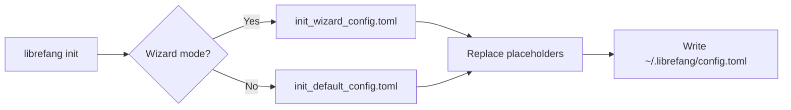

# Other — librefang-cli-templates

# librefang-cli-templates

Configuration template files used by the LibreFang CLI during project initialization. These TOML templates contain placeholder variables that are rendered with user-provided values and written to disk as the agent's runtime configuration.

## Overview

The module contains two template files that serve different initialization paths:

| File | Purpose |
|---|---|
| `init_default_config.toml` | Full reference configuration with every available section and inline documentation |
| `init_wizard_config.toml` | Minimal configuration produced by the interactive setup wizard |

Both files use `{{mustache}}` placeholder syntax that the CLI replaces at init time.

## Template Variables

Variables shared across both templates:

| Variable | Description | Example Rendered Value |
|---|---|---|
| `{{provider}}` | LLM provider identifier | `"openai"` |
| `{{model}}` | Default model name | `"gpt-4o"` |
| `{{api_key_env}}` | Environment variable holding the API key | `"OPENAI_API_KEY"` |

Variables specific to the wizard template:

| Variable | Description |
|---|---|
| `{{api_key_line}}` | Pre-formatted `api_key_env = "..."` line (or empty if using a provider that doesn't need a key) |
| `{{routing_section}}` | Optional agent routing block generated based on wizard answers |

## Template Details

### init_default_config.toml

A complete, heavily commented reference configuration. Every configurable section of LibreFang Agent OS is present, with most advanced features commented out. This template serves as both:

- **A working default** — the uncommented values form a valid local-only configuration out of the box.
- **Inline documentation** — each section explains its purpose, valid values, and caveats directly in the comments.

Key sections included (in order):

1. **Server** — bind address, log level, mode, update channel
2. **Dashboard Login** — default credentials with vault/env-var alternatives noted
3. **Terminal Access Control** — remote shell access and proxy header trust
4. **Performance** — prompt caching, stable prefix mode, usage display
5. **Default LLM** (`[default_model]`) — provider, model, API key source
6. **Memory** (`[memory]`) — decay rate, optional embedding model
7. **Proactive Memory** (`[proactive_memory]`) — auto-memorize, auto-retrieve, thresholds
8. **Web Tools** (`[web]`, `[web.fetch]`) — search provider auto-detection, fetch limits, SSRF protection
9. **Task Queue** (`[queue.concurrency]`) — lane concurrency limits
10. **Shell Execution Policy** (`[exec_policy]`) — deny/allowlist/full mode, timeout, output cap
11. **Config Hot-Reload** (`[reload]`) — off/restart/hot/hybrid reload strategies
12. **Provider Regions / URLs** — endpoint overrides for multi-region or local providers
13. **Fallback Providers** (`[[fallback_providers]]`) — LLM failover chain
14. **Rate Limiting** (`[rate_limit]`) — GCRA API limits, WebSocket throttling
15. **Registry Sync** (`[registry]`) — agent registry cache TTL
16. **Session Compaction** (`[compaction]`) — LLM-based history summarization
17. **Event Triggers** (`[triggers]`) — cooldown, recursion depth, workflow timeout
18. **Budget & Cost Control** (`[budget]`) — global and per-provider spending caps
19. **Extended Thinking** (`[thinking]`) — Claude extended thinking budget
20. **Channels** (`[channels.telegram/discord/slack/wechat]`) — messaging platform integrations
21. **MCP Servers** (`[[mcp_servers]]`) — external tool protocol servers
22. **Browser Automation** (`[browser]`) — headless browser settings
23. **Docker Sandbox** (`[docker]`) — containerized code execution
24. **File Inbox** (`[inbox]`) — async file-based agent commands
25. **Network** — P2P federation settings

### init_wizard_config.toml

A minimal skeleton produced after the user completes the interactive `librefang init` wizard. It contains only the essential fields needed to start the agent:

- Server bind address
- Default model configuration (rendered from wizard answers)
- Memory configuration with decay rate
- Any routing section the wizard generated

All other sections are omitted entirely — the runtime falls back to compiled-in defaults for anything not present in the file. Users who need advanced features can add sections manually or re-run init with the full template.

## How Templates Are Used

The CLI's init command selects a template, substitutes the `{{variables}}` with values collected from the user (or from CLI flags), and writes the result to the project configuration directory.

## Connecting to the Codebase

This module is a pure resource bundle — it contains no executable code, no imports, and no runtime dependencies. Other modules consume it by reading the template files at init time:

- **librefang-cli** — the init command reads these files and performs placeholder substitution before writing the final config.
- **Agent runtime** — reads the *rendered* `config.toml` (not the templates) at startup. All TOML section names, field names, and value formats must stay in sync with the runtime's configuration parser.

When adding a new configuration section to the agent runtime, update `init_default_config.toml` to include it (commented out with documentation) so that users discover it in their generated config. If the wizard should configure it interactively, also add the rendered output to `init_wizard_config.toml`.