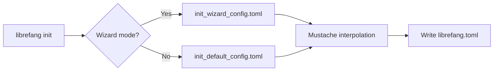

# Other — librefang-cli-templates

# librefang-cli-templates

Configuration template files used by the LibreFang CLI during project initialization. These are static TOML templates containing Mustache-style placeholders that get interpolated at `librefang init` time to produce a ready-to-edit `librefang.toml`.

## Templates

### `init_default_config.toml`

The full reference configuration. It ships with every option documented inline — including commented-out sections for channels, MCP servers, browser automation, Docker sandbox, budget controls, and rate limiting. Its purpose is twofold:

1. **Serve as a working starter config** after placeholder substitution, with sensible loopback-only defaults.
2. **Act as a self-documenting reference** that developers can browse to discover available settings.

**Placeholders:**

| Placeholder | Replaced With |
|---|---|
| `{{provider}}` | LLM provider selected during init (e.g. `openai`, `anthropic`) |
| `{{model}}` | Default model identifier (e.g. `gpt-4o`, `claude-sonnet-4-20250514`) |
| `{{api_key_env}}` | Environment variable name holding the API key (e.g. `OPENAI_API_KEY`) |

### `init_wizard_config.toml`

A minimal template produced by the interactive setup wizard. It contains only the essential settings needed to start the daemon — server listen address, default model, and memory configuration — keeping the file uncluttered for new users.

**Placeholders:**

| Placeholder | Replaced With |
|---|---|
| `{{provider}}` | LLM provider selected in wizard |
| `{{model}}` | Model identifier chosen in wizard |
| `{{api_key_line}}` | Rendered `api_key_env = "..."` line, or empty string if the provider doesn't require a key |
| `{{routing_section}}` | Optional agent routing block generated from wizard choices |

## How Templates Are Consumed

The CLI reads the appropriate template, substitutes placeholders with values collected from the user (or from sensible defaults), and writes the result as `librefang.toml` in the project directory.

## Security Defaults

Both templates ship with **loopback-only** binding (`api_listen = "127.0.0.1:4545"`) and the shell execution policy set to `deny`. The full template includes inline warnings about the requirement to configure authentication before changing to a non-loopback address.

## Adding New Configuration Options

When adding a new setting to the LibreFang daemon:

1. Add the option to `init_default_config.toml` in its appropriate section, commented out if it's optional, with a brief inline description.
2. If the option is essential for first-run, add it to `init_wizard_config.toml` as well (potentially behind a new placeholder).
3. Ensure placeholder naming follows the `snake_case` convention and matches the variable names used in the CLI's template rendering code.