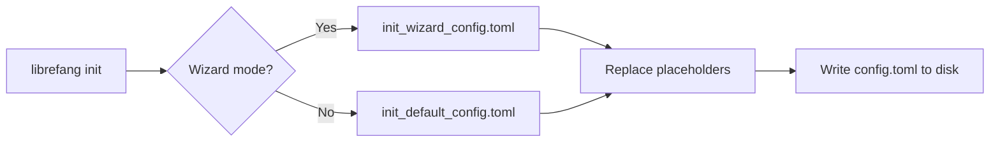

# Other — librefang-cli-templates

# librefang-cli-templates

Configuration templates shipped with the LibreFang CLI. These TOML files are processed during `librefang init` and written to disk as the agent's runtime configuration.

## Templates

### `init_default_config.toml`

The full reference configuration. Every supported option is present—most commented out with inline explanations. This template is used when the user selects the "default" or "advanced" init path and wants to see all knobs.

**Template variables** (Mustache-style `{{…}}` delimiters):

| Variable | Replaced with |
|---|---|
| `{{provider}}` | LLM provider name chosen during init (e.g. `openai`, `anthropic`) |
| `{{model}}` | Default model identifier (e.g. `gpt-4o`, `claude-sonnet-4-20250514`) |
| `{{api_key_env}}` | Environment variable name holding the API key (e.g. `OPENAI_API_KEY`) |

### `init_wizard_config.toml`

A minimal skeleton generated by the interactive setup wizard. Only the sections the user actually configured are written.

**Template variables:**

| Variable | Replaced with |
|---|---|
| `{{provider}}` | LLM provider name |
| `{{model}}` | Default model identifier |
| `{{api_key_line}}` | A pre-formatted `api_key_env = "…"` line, or empty string if using a provider that doesn't require a key (e.g. Ollama) |
| `{{routing_section}}` | Optional agent routing TOML block injected by the wizard, or an empty string |

## How Templates Are Consumed

The CLI reads the appropriate template at init time, substitutes the `{{…}}` variables with user-supplied values, and writes the result to the project's configuration file.

## Configuration Sections Reference

The full template exposes these sections. In the wizard template, only `api_listen`, `default_model`, and `memory` are emitted by default.

### Server

| Key | Default | Description |
|---|---|---|
| `api_listen` | `127.0.0.1:4545` | Bind address. Use `0.0.0.0:4545` for LAN access. |
| `log_level` | `info` | One of `trace`, `debug`, `info`, `warn`, `error`. |
| `mode` | `default` | `stable`, `default`, or `dev`. |
| `update_channel` | `stable` | Release track: `stable`, `beta`, `rc`. |

### Dashboard Login

`dashboard_user` and `dashboard_pass` provide initial credentials. **Change after first login.** For production, store the password via `librefang vault set dashboard_password` and reference it as `dashboard_pass = "vault:dashboard_password"`, or use the `LIBREFANG_DASHBOARD_PASS` environment variable.

### Terminal Access Control

Commented out by default. Key guards:

- `allow_remote` — requires authentication when enabled.
- `allow_unauthenticated_remote` — intentional foot-gun guard; must be explicitly set to `true`.
- `require_proxy_headers` — enable only behind a reverse proxy that sets `X-Forwarded-For` / `X-Real-IP`.

### Default LLM (`[default_model]`)

The primary model configuration. Supports a `base_url` override for local proxies or self-hosted endpoints.

### Memory (`[memory]`)

Controls the agent's long-term memory confidence decay. `decay_rate = 0.05` means 5% confidence loss per cycle.

### Proactive Memory (`[proactive_memory]`)

Auto-extraction and auto-retrieval of facts from conversations. `max_retrieve` caps how many memories are injected per retrieval. Tunable thresholds (`extraction_threshold`, `duplicate_threshold`) are commented out with sensible defaults.

### Web Tools (`[web]`)

`search_provider = "auto"` probes providers in order: Tavily → Brave → Jina → Perplexity → DuckDuckGo, using whichever has credentials configured.

`[web.fetch]` controls page extraction with a `max_chars` cap, timeout, and readability mode. SSRF protection blocks cloud metadata IPs (`169.254.x.x`, `100.64.x.x`) by default; `ssrf_allowed_hosts` is for self-hosted/K8s environments only.

### Task Queue (`[queue.concurrency]`)

Lane-based concurrency limits:

| Lane | Default | Purpose |
|---|---|---|
| `main_lane` | 3 | Concurrent user messages |
| `cron_lane` | 2 | Scheduled jobs |
| `subagent_lane` | 3 | Child agents |
| `trigger_lane` | 8 | In-flight trigger dispatches |
| `default_per_agent` | 1 | Per-agent fallback (serial behavior) |

### Shell Execution (`[exec_policy]`)

- `mode = "deny"` blocks all shell access by default. Change to `"allowlist"` or `"full"` to open up.
- `timeout_secs` and `max_output_bytes` prevent runaway commands.

### Hot-Reload (`[reload]`)

- `mode = "hybrid"` — watches the config file; some changes apply immediately, others trigger a restart.
- `debounce_ms = 500` — coalesces rapid file saves.

### Fallback Providers (`[[fallback_providers]]`)

An array of TOML tables defining the LLM failover chain. If the default model fails, each entry is tried in order.

### Rate Limiting (`[rate_limit]`)

GCRA-based per-IP rate limiting for the HTTP API and WebSocket connections. Controls request budgets, concurrent connections, idle timeouts, and text delta debouncing.

### Session Compaction (`[compaction]`)

LLM-based history summarization. Compacts when message count exceeds `threshold_messages`, preserving the most recent `keep_recent` messages verbatim.

### Event Triggers (`[triggers]`)

Global guards for the trigger system: cooldown between firings, max triggers per event, recursion depth limit, and maximum workflow execution time.

### Budget & Cost Control (`[budget]`)

Global and per-provider spending caps with alert thresholds. Supports hourly, daily, and monthly limits in USD. Per-provider sections allow throttling paid providers while leaving local ones uncapped.

### Extended Thinking (`[thinking]`)

For Claude models that support extended thinking. `budget_tokens` controls the thinking allowance; `stream_thinking` forwards thinking tokens to the client.

### Channels

Pre-configured but commented-out integrations for Telegram, Discord, Slack, and WeChat (via iLink protocol). Each requires a bot token environment variable and a default agent assignment.

### MCP Servers (`[[mcp_servers]]`)

External tool integration via the Model Context Protocol. Each server entry specifies a transport (currently `stdio`) with command and arguments.

### Browser Automation (`[browser]`)

Headless browser settings for web automation tasks.

### Docker Sandbox (`[docker]`)

Isolated code execution within a Docker container with memory limits and timeouts.

### File Inbox (`[inbox]`)

Async external command interface. Drop text files into a directory; the agent polls and processes them. Supports `agent:<name>` directives for targeting specific agents.

### Network / P2P Federation

`network_enabled = false` by default. Requires a `shared_secret` for peer-to-peer authentication when enabled.

## Adding a New Configuration Option

1. Add the option to `init_default_config.toml` with inline comments explaining the default and valid values. Keep it commented out if it's opt-in.
2. If the wizard should offer the option, add the corresponding placeholder and section to `init_wizard_config.toml`.
3. Ensure the CLI's init command substitutes any new `{{…}}` variables.