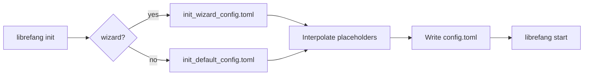

# Other — librefang-cli-templates

# librefang-cli-templates

TOML configuration templates shipped with the LibreFang CLI. These files are the source material for `librefang init` — they contain placeholder variables that get interpolated at project creation time, producing a ready-to-run `config.toml`.

## Files

| File | Purpose |
|---|---|
| `init_default_config.toml` | Full reference configuration. Every available section is present, most advanced options commented out with inline explanations. |
| `init_wizard_config.toml` | Minimal scaffold produced by the interactive `init --wizard` flow. Only the sections the user actually configured are emitted. |

## Template Variables

Both files use `{{mustache}}` placeholders replaced at generation time:

| Variable | Example replacement | Used in |
|---|---|---|
| `{{provider}}` | `"openai"` | `default_model.provider` |
| `{{model}}` | `"gpt-4o"` | `default_model.model` |
| `{{api_key_env}}` | `"OPENAI_API_KEY"` | `default_model.api_key_env` (default template) |
| `{{api_key_line}}` | `api_key_env = "OPENAI_API_KEY"` | Inline key line (wizard template) |
| `{{routing_section}}` | Agent routing TOML block | Agent definitions (wizard template) |

## Design intent

- **`init_default_config.toml`** doubles as runnable config *and* reference documentation. Every section is either active with sensible defaults or commented out with a one-line description. A developer who reads this file top-to-bottom knows every knob the system exposes.

- **`init_wizard_config.toml`** is deliberately short. The wizard only writes what the user answered; everything else inherits from compiled-in defaults at runtime. This avoids a wall of commented TOML that obscures the user's actual choices.

## Configuration sections (default template)

### Core server

```toml
api_listen = "127.0.0.1:4545"
log_level = "info"
mode = "default"              # stable | default | dev
update_channel = "stable"     # stable | beta | rc
```

- `mode` controls feature-flag gating; `dev` enables experimental APIs.
- `api_listen` is localhost-only by default. Change to `"0.0.0.0:4545"` for LAN/remote access.

### Default model

```toml
[default_model]
provider = "{{provider}}"
model = "{{model}}"
api_key_env = "{{api_key_env}}"
# base_url = ""               # Override for local proxies
```

The single LLM the system falls back to when no agent-specific model is configured. `api_key_env` names an environment variable — the key itself is never written to the file.

### Memory & proactive memory

```toml
[memory]
decay_rate = 0.05

[proactive_memory]
enabled = true
auto_memorize = true
auto_retrieve = true
max_retrieve = 10
```

Controls the agent's long-term memory store. `proactive_memory` enables automatic fact extraction from conversations and context injection during retrieval without explicit tool calls.

### Web tools

```toml
[web]
search_provider = "auto"     # Tavily → Brave → Jina → Perplexity → DuckDuckGo

[web.fetch]
max_chars = 50000
timeout_secs = 30
readability = true
```

Auto-detection probes for provider API keys in order. The `ssrf_allowed_hosts` option (commented out) exists for self-hosted deployments only; cloud metadata addresses are always blocked.

### Task queue concurrency

```toml
[queue.concurrency]
main_lane = 3
cron_lane = 2
subagent_lane = 3
```

Separate concurrency pools for user messages, scheduled jobs, and child agents so a burst of cron work can't starve interactive traffic.

### Shell execution policy

```toml
[exec_policy]
mode = "deny"                # deny | allowlist | full
timeout_secs = 30
max_output_bytes = 102400
```

Defaults to `deny` — the agent cannot run shell commands at all. Operators must explicitly relax this.

### Hot-reload

```toml
[reload]
mode = "hybrid"              # off | restart | hot | hybrid
debounce_ms = 500
```

- `hot` — config changes apply without restart (where supported).
- `restart` — changes trigger a graceful restart.
- `hybrid` — hot-reload what's possible, restart for the rest.

### Optional integrations (commented out)

The default template includes commented blocks for:

- **Fallback providers** (`[[fallback_providers]]`) — LLM failover chain.
- **Rate limiting** (`[rate_limit]`) — GCRA-based API and WebSocket throttling.
- **Session compaction** (`[compaction]`) — LLM-based history summarization.
- **Event triggers** (`[triggers]`) — recursion-limited event system.
- **Budget & cost control** (`[budget]`) — per-provider caps and global spend limits.
- **Extended thinking** (`[thinking]`) — Claude extended thinking budget.
- **Channels** — Telegram, Discord, Slack, WeChat bot integrations.
- **MCP servers** (`[[mcp_servers]]`) — external tool protocol servers.
- **Browser automation** (`[browser]`) — headless browser sessions.
- **Docker sandbox** (`[docker]`) — isolated code execution containers.
- **File inbox** (`[inbox]`) — async agent messages via filesystem drops.
- **P2P federation** (`[network]`) — inter-node communication.

Each commented block includes inline documentation so operators can enable features by uncommenting rather than consulting external docs.

## Relationship to the rest of the CLI



1. `librefang init` (or `init --wizard`) selects the appropriate template.
2. Placeholder variables are replaced with user-provided values.
3. The resulting `config.toml` is written to the project directory.
4. `librefang start` reads `config.toml` at launch and applies hot-reload settings.

## Adding a new configuration section

1. Add the section to `init_default_config.toml` — commented out if it's optional, active if it should be on by default. Include inline comments explaining every field.
2. If the wizard should configure it, add the corresponding minimal block to `init_wizard_config.toml` with a new `{{placeholder}}` variable, and update the wizard prompts in the CLI crate.
3. Ensure runtime defaults in the main `librefang` config parser match the commented-out values so behavior is identical whether the section is absent or explicitly set.