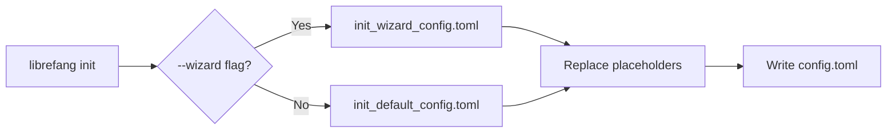

# Other — librefang-cli-templates

# LibreFang CLI Templates

## Overview

This module provides the TOML configuration templates used by `librefang init` to generate a working `config.toml` for a LibreFang Agent OS installation. It contains no executable code — only two template files that serve as the source-of-truth for every configurable option the platform supports.

| Template | Purpose |
|---|---|
| `init_default_config.toml` | Full reference config with every section documented and most advanced options commented out |
| `init_wizard_config.toml` | Minimal skeleton emitted by the interactive `librefang init --wizard` flow |

Both files are processed by the CLI at initialization time, where Jinja-style `{{placeholders}}` are replaced with user-supplied or detected values.

---

## Template Variables

The templates use `{{...}}` delimiters that the CLI replaces during project scaffolding:

| Variable | Used In | Description |
|---|---|---|
| `{{provider}}` | Both files | LLM provider identifier (e.g. `openai`, `anthropic`, `ollama`) |
| `{{model}}` | Both files | Default model name (e.g. `gpt-4o`, `claude-sonnet-4-20250514`) |
| `{{api_key_env}}` | `init_default_config.toml` | Environment variable name holding the API key |
| `{{api_key_line}}` | `init_wizard_config.toml` | Entire pre-formatted `api_key_env = "..."` line (or empty for keyless providers) |
| `{{routing_section}}` | `init_wizard_config.toml` | Optional generated routing section block |

---

## init_default_config.toml

The **full reference template**. Every LibreFang configuration section is present, with advanced or optional features commented out and annotated. This file serves two purposes:

1. **Generated config** — when the user runs `librefang init` without `--wizard`, this template is rendered with the user's provider/model/key and written directly to disk as a ready-to-edit starting point.
2. **Living documentation** — because every section is present with inline comments, users can discover and uncomment features without consulting external docs.

### Configuration Sections

#### Core server settings

Top-level keys controlling the runtime:

- **`api_listen`** — bind address. Defaults to `127.0.0.1:4545` (local only). Change to `0.0.0.0:4545` to expose on LAN.
- **`log_level`** — verbosity: `trace | debug | info | warn | error`.
- **`mode`** — runtime profile: `stable | default | dev`.
- **`update_channel`** — release track: `stable | beta | rc`.

#### Dashboard authentication

`dashboard_user` / `dashboard_pass` default to `librefang`/`librefang`. The template comments strongly advise changing these and point to three secure alternatives:

1. **Vault** — `librefang vault set dashboard_password`, then reference as `vault:dashboard_password`.
2. **Environment variable** — set `LIBREFANG_DASHBOARD_PASS`.
3. **Direct value** — for local development only.

#### Terminal access control

The commented `[terminal]` section governs remote shell access:

| Key | Default | Purpose |
|---|---|---|
| `allow_remote` | `false` | Permit remote terminal connections (still requires auth) |
| `allow_unauthenticated_remote` | `false` | Hard guard: must be explicitly true to expose unauthenticated shell |
| `require_proxy_headers` | `false` | Enable only behind a reverse proxy setting `X-Forwarded-For` / `X-Real-IP` |

#### Performance tuning

- **`prompt_caching`** — enable Anthropic/OpenAI prompt caching to reduce costs.
- **`stable_prefix_mode`** — optimize prompt structure for higher cache hit rates.
- **`usage_footer`** — dashboard footer detail: `off | tokens | cost | full`.

#### Default model (`[default_model]`)

The primary LLM the agent uses. Rendered from template variables. An optional `base_url` allows pointing to a local proxy or compatible endpoint.

#### Memory (`[memory]`)

Controls the long-term memory subsystem:

- **`decay_rate`** — how fast memory confidence decreases per cycle (default `0.05`).
- **`embedding_model`** — optional override for the embedding model used for memory indexing.

#### Proactive memory (`[proactive_memory]`)

Auto-extraction and auto-recall of facts from conversations:

| Key | Default | Purpose |
|---|---|---|
| `enabled` | `true` | Master switch |
| `auto_memorize` | `true` | Extract facts automatically |
| `auto_retrieve` | `true` | Inject relevant memories automatically |
| `max_retrieve` | `10` | Cap on memories injected per retrieval |
| `extraction_threshold` | `0.7` | Minimum confidence to persist a memory |
| `session_ttl_hours` | `24` | Session lifetime |
| `duplicate_threshold` | `0.5` | Similarity threshold for deduplication |
| `max_memories_per_agent` | `1000` | Per-agent memory cap |

#### Web tools (`[web]`)

Web search and fetch configuration:

- **`search_provider`** — `auto` walks the priority chain: Tavily → Brave → Jina → Perplexity → DuckDuckGo, using whichever has credentials configured.
- **`[web.fetch]`** — controls page extraction: `max_chars`, `timeout_secs`, `readability` (HTML-to-text cleaning).
- **`ssrf_allowed_hosts`** — allowlist for internal CIDRs/hostnames. Cloud metadata addresses (`169.254.x.x`, `100.64.x.x`) are always blocked.

#### Task queue (`[queue.concurrency]`)

Lane-based concurrency limits:

| Lane | Default | Purpose |
|---|---|---|
| `main_lane` | `3` | Concurrent user messages |
| `cron_lane` | `2` | Concurrent scheduled jobs |
| `subagent_lane` | `3` | Concurrent child agents |

#### Shell execution policy (`[exec_policy]`)

Security boundary for shell commands:

- **`mode`** — `deny` (no commands), `allowlist` (only listed commands), or `full` (unrestricted).
- **`timeout_secs`** — hard kill after 30s by default.
- **`max_output_bytes`** — truncated at 100 KB.

#### Hot-reload (`[reload]`)

Configuration file change detection:

- **`mode`** — `off | restart | hot | hybrid` (hybrid attempts hot-reload, falls back to restart on structural changes).
- **`debounce_ms`** — coalesces rapid edits (500 ms).

#### Provider regions (`[provider_regions]`)

Selects regional endpoints for multi-region providers (e.g., `qwen = "intl"`, `minimax = "china"`).

#### Provider URL overrides (`[provider_urls]`)

Custom endpoints for local/self-hosted providers like Ollama or vLLM.

#### Fallback providers (`[[fallback_providers]]`)

TOML array-of-tables defining an ordered LLM failover chain. Each entry mirrors `[default_model]` structure.

#### Rate limiting (`[rate_limit]`)

GCRA-based rate limiting for API and WebSocket traffic:

- `api_requests_per_minute` — per-IP token budget.
- `max_ws_per_ip` / `ws_messages_per_minute` / `ws_idle_timeout_secs` — WebSocket controls.
- `ws_debounce_ms` / `ws_debounce_chars` — streaming text delta batching.

#### Registry sync (`[registry]`)

- **`cache_ttl_secs`** — how often to re-download the agent registry (default 24 hours).

#### Session compaction (`[compaction]`)

LLM-based conversation history summarization to stay within context windows:

| Key | Default | Purpose |
|---|---|---|
| `threshold_messages` | `30` | Trigger compaction above this count |
| `keep_recent` | `10` | Messages preserved verbatim |
| `max_summary_tokens` | `1024` | Token budget for the summary |
| `token_threshold_ratio` | `0.7` | Also trigger at 70% of context window |
| `max_chunk_chars` | `80000` | Per-chunk size limit |
| `max_retries` | `3` | Retry limit for summarization LLM calls |

#### Event triggers (`[triggers]`)

Workflow automation controls:

- **`cooldown_secs`** — minimum interval between firings of the same trigger.
- **`max_per_event`** — cap on triggers per event.
- **`max_depth`** — recursion guard.
- **`max_workflow_secs`** — hard timeout (1 hour default).

#### Budget and cost control (`[budget]`)

Hierarchical cost management:

- Global caps: `max_hourly_usd`, `max_daily_usd`, `max_monthly_usd`.
- `alert_threshold` — warn at a percentage of the limit.
- Per-provider caps under `[budget.providers.<name>]` allow throttling paid providers (e.g., `moonshot`, `openai`) while leaving local providers (`ollama`, `litellm`) uncapped.

#### Extended thinking (`[thinking]`)

For Claude models supporting chain-of-thought:

- **`budget_tokens`** — token allocation for internal reasoning.
- **`stream_thinking`** — whether to surface thinking tokens to the client.

#### Channels

Pre-configured integration blocks for external messaging platforms:

- **`[channels.telegram]`** — Telegram bot with user allowlisting.
- **`[channels.discord]`** — Discord bot.
- **`[channels.slack]`** — Slack bot (requires both bot and app tokens).
- **`[channels.wechat]`** — Personal WeChat via iLink protocol with `hash@im.wechat` user format.

#### MCP servers (`[[mcp_servers]]`)

Model Context Protocol server integrations. Each entry specifies a `name`, `timeout_secs`, and a `[mcp_servers.transport]` sub-table (currently `stdio` with `command` and `args`).

#### Browser automation (`[browser]`)

Headless browser settings: `headless` mode, viewport dimensions, session limit.

#### Docker sandbox (`[docker]`)

Isolated code execution: enable/disable, base image, memory limit, timeout.

#### File inbox (`[inbox]`)

Async command input via filesystem: drop `.txt` files into a directory with an optional `agent:<name>` first-line directive. The system polls at `poll_interval_secs`.

#### P2P federation

- **`network_enabled`** — master switch.
- **`[network]`** — `shared_secret` required for peer authentication.

---

## init_wizard_config.toml

The **minimal wizard template**. It contains only the settings that the interactive wizard prompts for:

```toml
api_listen = "127.0.0.1:4545"

[default_model]
provider = "{{provider}}"
model = "{{model}}"
{{api_key_line}}

[memory]
decay_rate = 0.05
{{routing_section}}
```

Key differences from the full template:

- **No commented sections.** The user gets only what they configured, keeping the file short and scannable.
- **`{{api_key_line}}** is either rendered as `api_key_env = "OPENAI_API_KEY"` or omitted entirely for keyless providers like Ollama.
- **`{{routing_section}}`** injects a `[routing]` block only when the wizard configures multi-model routing.

Users who need advanced options can either:
- Run `librefang init` without `--wizard` to get the full annotated config, or
- Consult the full template and copy sections into their existing config.

---

## Integration with the CLI



The CLI's init command reads the appropriate template, performs variable substitution on `{{...}}` tokens, and writes the result to the project's `config.toml`. The full template doubles as in-file documentation — every section is present with explanatory comments, so users can uncomment features as needed.

### Adding new configuration sections

When a new feature requires a config option:

1. Add the section to **`init_default_config.toml`** — commented out with inline documentation.
2. If the wizard should prompt for it, add the minimal render to **`init_wizard_config.toml`** with an appropriate placeholder.
3. Ensure the CLI's init logic handles the new placeholder substitution.

Keeping both templates in sync is critical: the full template is the authoritative reference for every option the system recognizes.