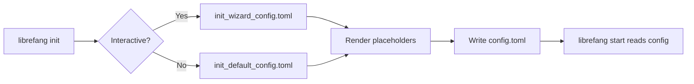

# Other — librefang-cli-templates

# librefang-cli-templates

Template files used by the LibreFang CLI `init` command to generate initial agent configuration. These are [TOML](https://toml.io/) files containing [Handlebars-style](https://handlebarsjs.com/) placeholders that the CLI engine resolves at scaffold time.

## Files

| File | Purpose |
|---|---|
| `init_default_config.toml` | Full reference configuration. Generated when the user runs `librefang init` non-interactively (or selects a "full" preset). Contains every available section, heavily commented. |
| `init_wizard_config.toml` | Minimal configuration. Generated by the interactive `librefang init` wizard. Produces only the sections the user actually configured. |

## Template Placeholders

The CLI rendering engine replaces these tokens when writing the final `config.toml` to disk.

| Placeholder | Replaced With | Appears In |
|---|---|---|
| `{{provider}}` | LLM provider name (e.g. `openai`, `anthropic`, `ollama`) | Both |
| `{{model}}` | Model identifier (e.g. `gpt-4o`, `claude-sonnet-4-20250514`) | Both |
| `{{api_key_env}}` | Environment variable name holding the API key (e.g. `OPENAI_API_KEY`) | Default only |
| `{{api_key_line}}` | Pre-formatted `api_key_env = "..."` line (or empty string for provider-free setups like Ollama) | Wizard only |
| `{{routing_section}}` | Agent routing block if the wizard configured multiple agents, otherwise empty | Wizard only |

## Design Rationale

### Why two templates?

- **`init_default_config.toml`** is a *reference document*. Every configurable knob is present, commented out where optional, with inline guidance on security implications (e.g., the non-loopback bind guard). Developers who prefer reading a config file over visiting docs get a complete map of the system.

- **`init_wizard_config.toml`** is a *minimal bootstrap*. After the wizard asks targeted questions, the output contains only what the user needs — no noise, no commented-out sections to wade through.

### How they connect to the codebase

Both templates are pure static resources. They have no imports, no runtime calls, and no logic beyond the placeholder syntax. The CLI `init` command reads the appropriate file, performs substitution, and writes the result.

## Configuration Sections (Reference)

The sections below are documented in `init_default_config.toml`. This list summarizes their roles for developers adding new options.

### Core Server

| Key | Default | Notes |
|---|---|---|
| `api_listen` | `127.0.0.1:4545` | Loopback-only by default. Daemon refuses non-loopback bind without authentication configured. |
| `log_level` | `info` | `trace \| debug \| info \| warn \| error` |
| `mode` | `default` | `stable \| default \| dev` — controls feature flag surface |
| `update_channel` | `stable` | `stable \| beta \| rc` |

### Authentication (inline comments in template)

The template enforces a safe-by-default posture:
- Dashboard credentials default to `librefang`/`librefang` with a prominent warning to change them.
- Terminal access is local-only unless authentication is configured.
- The `LIBREFANG_ALLOW_NO_AUTH` escape hatch is documented but discouraged.

### `[default_model]`

Resolved from wizard answers. The `api_key_env` pattern (referencing an environment variable rather than embedding the key) is the recommended approach. The wizard template uses `{{api_key_line}}` which may produce an empty line for keyless providers.

### `[memory]` / `[proactive_memory]`

Controls the agent's long-term memory subsystem. `proactive_memory` governs automatic fact extraction and retrieval during conversations.

### `[web]` / `[web.fetch]`

Web search and page fetching configuration. `search_provider = "auto"` cascades through Tavily → Brave → Jina → Perplexity → DuckDuckGo based on which API key is detected.

### `[queue.concurrency]`

Controls the multi-lane task scheduler. Each lane (`main_lane`, `cron_lane`, `subagent_lane`, `trigger_lane`) is independently configurable. `default_per_agent` acts as a per-agent fallback.

### `[exec_policy]`

Shell execution sandbox. `mode = "deny"` by default — agents cannot run shell commands until explicitly allowed.

### `[reload]`

Hot-reload behavior for config changes. `hybrid` mode attempts in-memory hot-reload for supported keys and falls back to process restart for structural changes.

### `[budget]`

Cost controls with per-provider caps. The template shows how to throttle paid providers (e.g., OpenAI) while leaving local providers (Ollama, LiteLLM) unlimited.

### Channels (`[channels.telegram]`, etc.)

Messaging platform integrations. All are commented out in the default template. Each requires a bot token via environment variable.

### `[[mcp_servers]]`

Model Context Protocol server definitions. Uses TOML array-of-tables syntax to allow multiple servers. Each server has its own `[mcp_servers.transport]` sub-table.

### `[browser]`, `[docker]`, `[inbox]`, `[network]`

Optional subsystems, all disabled by default. Each has its own section in the default template with inline documentation.

## Adding a New Configuration Option

1. **Add the key** to `init_default_config.toml` in the appropriate section (or create a new section). Comment it out if optional. Include inline comments explaining valid values and defaults.

2. **If the wizard should set it**, add the corresponding placeholder or conditional block to `init_wizard_config.toml`, and update the wizard prompting logic in `librefang-cli`.

3. **Follow the existing conventions:**
   - Use `snake_case` for keys.
   - Duration keys use `_secs` or `_ms` suffixes.
   - Size limits use `_bytes` or `_chars` suffixes.
   - Boolean guards for dangerous features should default to `false`.
   - Environment variable references use `_env` suffixes (never embed secrets directly).

4. **Cross-reference** any new security-sensitive option with the authentication guard pattern already documented in the `api_listen` comment block.