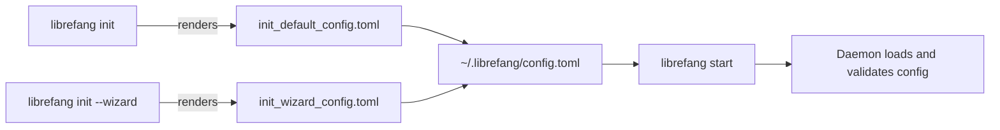

# Other — librefang-cli-templates

# librefang-cli-templates

TOML configuration templates used by `librefang init` and `librefang init --wizard` to scaffold a new LibreFang Agent OS installation.

## Overview

This module contains no executable code. It provides two Mustache-templated TOML files that the CLI copies (with placeholder substitution) into the user's config directory during first-time setup. The templates serve as the single source of truth for all available configuration keys, their defaults, and inline documentation.

## Templates

### `init_default_config.toml`

Full reference configuration emitted by `librefang init`. Every section and key the daemon recognizes is present — most commented out, with explanations. Active defaults represent a safe localhost-only setup.

### `init_wizard_config.toml`

Minimal configuration emitted by `librefang init --wizard`. Only the keys the user actually configured during the interactive prompts are included, keeping the resulting file short and scannable.

## Template Placeholders

Both files contain Mustache-style `{{…}}` tokens that the CLI replaces at generation time:

| Placeholder | Used In | Description |
|---|---|---|
| `{{provider}}` | Both | LLM provider name (e.g. `openai`, `anthropic`, `ollama`) |
| `{{model}}` | Both | Default model identifier (e.g. `gpt-4o`, `claude-sonnet-4-20250514`) |
| `{{api_key_env}}` | `init_default_config.toml` | Environment variable name holding the API key |
| `{{api_key_line}}` | `init_wizard_config.toml` | Entire `api_key_env = "…"` line (omitted entirely for providerless setups) |
| `{{routing_section}}` | `init_wizard_config.toml` | Optional `[routing]` block injected when the wizard configures agent routing rules |

## Configuration Sections Reference

The full template documents every daemon subsystem. Below is a structural summary grouped by concern.

### Core Server

| Section / Key | Default | Purpose |
|---|---|---|
| `api_listen` | `127.0.0.1:4545` | Bind address. Non-loopback requires configured auth. |
| `log_level` | `info` | Verbosity: `trace` → `error` |
| `mode` | `default` | Runtime profile: `stable`, `default`, `dev` |
| `update_channel` | `stable` | Release track: `stable`, `beta`, `rc` |
| `dashboard_user` / `dashboard_pass` | `librefang` / `librefang` | Web UI credentials. Store via vault or env var in production. |

### Security Constraints

The daemon **refuses to start** on a non-loopback bind address without authentication configured (`api_key`, `dashboard_user`/`dashboard_pass`, or `[[users]]` with `api_key_hash`). Override with `LIBREFANG_ALLOW_NO_AUTH=1` at your own risk.

Terminal access control (`[terminal]`) adds a second layer: `allow_remote` gates remote shell sessions, and `allow_unauthenticated_remote` is a hard guard that must be explicitly enabled even when `allow_remote` is true.

### LLM Configuration

```
[default_model]
provider = "{{provider}}"
model = "{{model}}"
api_key_env = "{{api_key_env}}"
```

Fallback chains are defined via `[[fallback_providers]]` TOML array-of-tables — the daemon tries each entry in order on failure.

### Memory & Proactive Memory

- **`[memory]`** — controls decay rate and optional embedding model selection.
- **`[proactive_memory]`** — enables auto-extraction of facts from conversations and auto-retrieval of relevant memories. Key tuning knobs: `max_retrieve`, `extraction_threshold`, `duplicate_threshold`.

### Web Tools (`[web]`)

Search provider auto-detection cascades through Tavily → Brave → Jina → Perplexity → DuckDuckGo. The `[web.fetch]` sub-table controls page extraction limits, SSRF protection, and readability mode.

### Task Queue (`[queue.concurrency]`)

Separate concurrency lanes for user messages (`main_lane`), cron jobs (`cron_lane`), sub-agents (`subagent_lane`), and trigger dispatches (`trigger_lane`). Per-agent overrides available via agent manifest `max_concurrent_invocations`.

### Execution Policy (`[exec_policy]`)

Shell execution modes: `deny` (default — no shell access), `allowlist` (only approved commands), `full` (unrestricted). Enforces timeout and output size limits.

### Hot-Reload (`[reload]`)

Modes: `off`, `restart` (full daemon restart), `hot` (in-place), `hybrid` (hot for safe keys, restart for structural changes). Debounce prevents rapid reload cycles.

### Sidecar Channels

All channel adapters (Slack, Discord, Telegram, Teams, WhatsApp, etc.) run as **out-of-process Python sidecars** communicating via newline-delimited JSON-RPC over stdio. Each is a `[[sidecar_channels]]` array-of-tables entry specifying:

```
[[sidecar_channels]]
name = "slack"
command = "python3"
args = ["-m", "librefang.sidecar.adapters.slack"]
channel_type = "slack"
[sidecar_channels.env]
SLACK_APP_TOKEN = "..."
SLACK_BOT_TOKEN = "..."
```

**Prerequisite**: `pip install librefang-sdk` must be available to the same `python3` the `command` field resolves to. Verify with:
```
python3 -c 'import librefang.sidecar; print(librefang.__file__)'
```

Available adapters: Bluesky, DingTalk, Discord, Email (IMAP+SMTP), Feishu/Lark, Google Chat, Gotify, LINE, Mastodon, Matrix, Mattermost, Nextcloud Talk, ntfy, QQ Bot, Reddit, Rocket.Chat, Signal, Slack, Microsoft Teams, Telegram, Twitch, Webex, Webhook (generic HMAC), WeChat, WeCom, WhatsApp, Zulip.

Old in-process `[channels.<name>]` blocks are **not recognized** — all channels must use the sidecar format.

### MCP Servers (`[[mcp_servers]]`)

External tool integration via Model Context Protocol. Each entry defines a name, timeout, and transport (currently `stdio`). Example:

```toml
[[mcp_servers]]
name = "filesystem"
timeout_secs = 30
[mcp_servers.transport]
type = "stdio"
command = "npx"
args = ["-y", "@modelcontextprotocol/server-filesystem", "/tmp"]
```

### Optional Subsystems

All disabled by default, uncomment to enable:

- **`[browser]`** — Playwright-based browser automation with configurable viewport and session limits.
- **`[docker]`** — Sandboxed code execution in containers with memory/timeout constraints.
- **`[inbox]`** — File-system message ingestion; drop text files into a directory to send to agents.
- **`[network]`** — P2P federation between LibreFang instances via shared secret.
- **ACP** — Agent Client Protocol server for editor integration (Zed, VS Code, JetBrains). Zero config; editors spawn `librefang acp` as a child process. Auto-selects daemon-attached mode (via `~/.librefang/acp.sock`) when available, falls back to in-process.

### Cost Control (`[budget]`)

Hierarchical budget caps: global hourly/daily/monthly limits, with per-provider overrides. Alert threshold triggers notifications at a configurable fraction of the limit.

## Relationship to the Codebase


```mermaid
flowchart LR
    A[librefang init] -->|renders| B[init_default_config.toml]
    C[librefang init --wizard] -->|renders| D[init_wizard_config.toml]
    B --> E[~/.librefang/config.toml]
    D --> E
    E --> F[librefang start]
    F --> G[Daemon loads and validates config]
```

The CLI's init commands locate these templates via the Rust `include_str!` macro or a known relative path at compile time, perform Mustache substitution on the placeholders, and write the result to the user's config directory. The daemon (`librefang start`) then reads the generated `config.toml` at startup, validates all keys, and applies defaults for any commented-out sections.

## Adding New Configuration Keys

1. Add the key to `init_default_config.toml` in the appropriate section, commented out with a description.
2. If the wizard should prompt for it, add the corresponding template logic to `init_wizard_config.toml`.
3. Implement parsing and validation in the daemon's config loader.
4. Update the sidecar sample block regeneration by running `scripts/gen_sidecar_samples.py` from `sdk/python/` if the change affects channel adapter configuration.