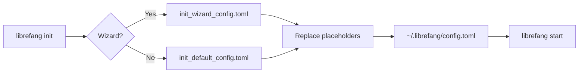

# Other — librefang-cli-templates

# librefang-cli-templates

TOML configuration templates shipped with the LibreFang CLI. These files are rendered by `librefang init` (or the interactive wizard) to produce the daemon's runtime configuration at `~/.librefang/config.toml`.

## Templates

### `init_default_config.toml`

Full reference configuration. Every supported key is present — most are commented out so the generated file doubles as in-place documentation. Keys that the CLI can pre-fill use Mustache-style placeholders:

| Placeholder | Replaced with |
|---|---|
| `{{provider}}` | LLM provider name (e.g. `openai`, `anthropic`) |
| `{{model}}` | Default model identifier (e.g. `gpt-4o`, `claude-sonnet-4-20250514`) |
| `{{api_key_env}}` | Environment variable holding the API key (e.g. `OPENAI_API_KEY`) |

Used when the user runs `librefang init` non-interactively or selects the "full" template during setup.

### `init_wizard_config.toml`

Minimal configuration emitted by the interactive setup wizard. Only the keys strictly required to start the daemon are included:

| Placeholder | Replaced with |
|---|---|
| `{{provider}}` | LLM provider name |
| `{{model}}` | Default model identifier |
| `{{api_key_line}}` | A complete `api_key_env = "..."` line, or omitted if not needed |
| `{{routing_section}}` | Optional agent-routing TOML block generated by the wizard |

## Configuration Sections

The full template is organized into these sections, roughly in dependency order:

### Server & Networking

```toml
api_listen = "127.0.0.1:4545"
log_level = "info"           # trace | debug | info | warn | error
mode = "default"             # stable | default | dev
```

The daemon binds to loopback only by default. Binding to a non-loopback address requires authentication to be configured first (`api_key`, `dashboard_user`/`dashboard_pass`, or `[[users]]` with `api_key_hash`). The daemon will refuse to start otherwise unless `LIBREFANG_ALLOW_NO_AUTH=1` is set.

**Terminal access control** (`[terminal]`) governs remote shell access, with `allow_unauthenticated_remote` as a hard guard against accidental exposure.

### Default LLM

```toml
[default_model]
provider = "{{provider}}"
model = "{{model}}"
api_key_env = "{{api_key_env}}"
```

The primary LLM used when no agent-specific model override is set. `api_key_env` names an environment variable — the key itself is never written to the config file.

Fallback providers (`[[fallback_providers]]`) form a failover chain consulted when the primary provider returns an error.

### Memory & Proactive Memory

```toml
[memory]
decay_rate = 0.05

[proactive_memory]
enabled = true
auto_memorize = true
auto_retrieve = true
max_retrieve = 10
```

`[memory]` controls confidence decay across cycles. `[proactive_memory]` enables automatic fact extraction from conversations and context-aware retrieval of previously stored facts.

### Web Tools

```toml
[web]
search_provider = "auto"     # Tavily → Brave → Jina → Perplexity → DuckDuckGo

[web.fetch]
max_chars = 50000
readability = true
```

Search provider auto-detection checks for available API keys at startup. The fetch subsystem converts HTML to readable text and blocks cloud metadata IPs (169.254.x.x, 100.64.x.x) by default; `ssrf_allowed_hosts` can selectively open internal hosts.

### Task Queue Concurrency

```toml
[queue.concurrency]
main_lane = 3
cron_lane = 2
subagent_lane = 3
trigger_lane = 8
default_per_agent = 1
```

Four named lanes cap concurrent work. `default_per_agent` provides a per-agent fallback when the agent manifest doesn't specify `max_concurrent_invocations`.

### Shell Execution Policy

```toml
[exec_policy]
mode = "deny"                # deny | allowlist | full
timeout_secs = 30
max_output_bytes = 102400
```

Defaults to `deny` — agents cannot execute shell commands unless explicitly enabled.

### Sidecar Channel Adapters

All messaging integrations run as out-of-process Python sidecars communicating over newline-delimited JSON-RPC via stdio. The template ships with commented blocks for every supported adapter:

```
Bluesky · DingTalk · Discord · Email · Feishu/Lark · Google Chat ·
Gotify · LINE · Mastodon · Matrix · Mattermost · Nextcloud Talk ·
ntfy · QQ · Reddit · Rocket.Chat · Signal · Slack · Teams ·
Telegram · Twitch · Webex · Webhook · WeChat · WeCom · WhatsApp · Zulip
```

Each block follows the same structure:

```toml
[[sidecar_channels]]
name = "slack"
command = "python3"
args = ["-m", "librefang.sidecar.adapters.slack"]
channel_type = "slack"
[sidecar_channels.env]
SLACK_APP_TOKEN = "..."
SLACK_BOT_TOKEN = "..."
```

**Prerequisites:** The `librefang-sdk` Python package must be installed in the same interpreter that `python3` resolves to. Verify with:

```bash
python3 -c 'import librefang.sidecar; print(librefang.__file__)'
```

Secrets should be stored in `~/.librefang/secrets.env`, not in the config file. To discover all environment variables an adapter accepts:

```bash
python3 -m librefang.sidecar.adapters.<name> --describe
```

Old in-process `[channels.<name>]` blocks are no longer recognized — all adapters have been migrated to the sidecar architecture.

### Other Optional Sections

| Section | Purpose |
|---|---|
| `[reload]` | Config hot-reload mode: `off`, `restart`, `hot`, or `hybrid` |
| `[rate_limit]` | GCRA-based API rate limiting and WebSocket throttling |
| `[budget]` | Per-provider and global cost caps with alert thresholds |
| `[compaction]` | LLM-based session history summarization |
| `[triggers]` | Event-driven automation with recursion and time limits |
| `[thinking]` | Extended thinking for Claude models (`budget_tokens`) |
| `[[mcp_servers]]` | External tool integration via Model Context Protocol |
| `[browser]` | Headless browser automation settings |
| `[docker]` | Containerized code execution sandbox |
| `[inbox]` | File-based async message ingestion |
| `[network]` | P2P federation between LibreFang nodes |
| `[registry]` | Agent registry cache TTL |
| `[provider_regions]` | Regional endpoint selection for multi-region providers |
| `[provider_urls]` | Custom endpoints for self-hosted LLM servers |

## Template Rendering

The CLI replaces placeholders at init time and writes the result to the user's config directory. No runtime template engine is involved — the daemon reads plain TOML.


```mermaid
flowchart LR
    A[librefang init] --> B{Wizard?}
    B -- Yes --> C[init_wizard_config.toml]
    B -- No --> D[init_default_config.toml]
    C --> E[Replace placeholders]
    D --> E
    E --> F["~/.librefang/config.toml"]
    F --> G[librefang start]
```

## Guidelines for Contributors

- **Adding a new config key:** Add it (commented out) to `init_default_config.toml` with a descriptive comment. If the wizard should set it, add the corresponding line to `init_wizard_config.toml`.
- **Adding a new sidecar adapter:** Add a commented `[[sidecar_channels]]` block to `init_default_config.toml`. Include a migration note referencing the PR that moved it from in-process. Regenerate the listing from the adapter's SCHEMA using `cd sdk/python && python3 ../../scripts/gen_sidecar_samples.py`.
- **Never put actual secrets in these templates.** Always reference environment variables or the vault.
- **Placeholder syntax:** Use `{{key}}` — the CLI performs simple string substitution, not a full template engine.