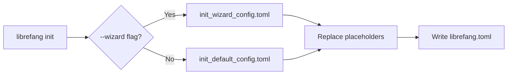

# Other — librefang-cli-templates

# librefang-cli-templates

Configuration template files used by the LibreFang CLI during project initialization. These TOML templates are processed by `librefang init` and `librefang init --wizard` to produce a working `librefang.toml` configuration file.

## Overview

The module contains two template files that serve different initialization paths:

| Template | CLI Command | Purpose |
|---|---|---|
| `init_default_config.toml` | `librefang init` | Full reference configuration with every section commented out and documented |
| `init_wizard_config.toml` | `librefang init --wizard` | Minimal skeleton with only the settings the wizard prompted for |

Both files contain **Hadamard-style placeholders** (e.g., `{{provider}}`, `{{model}}`) that the CLI replaces with user-supplied or auto-detected values at generation time.

## Template Processing Flow


```mermaid
flowchart LR
    A["librefang init"] --> B{"--wizard flag?"}
    B -- Yes --> C[init_wizard_config.toml]
    B -- No --> D[init_default_config.toml]
    C --> E[Replace placeholders]
    D --> E
    E --> F["Write librefang.toml"]
```

## Template Variables

The following placeholders appear in one or both templates and are substituted by the CLI during generation.

### Common variables (both templates)

| Placeholder | Example Value | Description |
|---|---|---|
| `{{provider}}` | `openai`, `anthropic`, `ollama` | LLM provider identifier |
| `{{model}}` | `gpt-4o`, `claude-sonnet-4-20250514` | Default model name |

### Wizard-only variables (`init_wizard_config.toml`)

| Placeholder | Description |
|---|---|
| `{{api_key_line}}` | Full TOML line for API key configuration (e.g., `api_key_env = "OPENAI_API_KEY"`), or empty if using a provider that doesn't require one (e.g., Ollama) |
| `{{routing_section}}` | Agent routing TOML block if the user configured named agents during the wizard, or an empty string |

The wizard template deliberately omits the `api_key_env` key seen in the default template, instead injecting the entire line via `{{api_key_line}}`. This allows the wizard to omit the key entirely for local providers.

## Configuration Sections

### `init_default_config.toml`

This is the **reference template**. Every configurable section of LibreFang Agent OS is present, commented out, with inline documentation. Users are expected to uncomment and modify the sections they need.

#### Top-level server settings

Active by default:
- `api_listen` — bind address (`127.0.0.1:4545` loopback-only)
- `log_level` — `trace` \| `debug` \| `info` \| `warn` \| `error`
- `mode` — `stable` \| `default` \| `dev`
- `update_channel` — `stable` \| `beta` \| `rc`

**Security gate:** The daemon refuses to start on a non-loopback bind address unless authentication is configured. The override `LIBREFANG_ALLOW_NO_AUTH=1` exists but is documented as unsafe.

#### Dashboard credentials

```
dashboard_user = "librefang"
dashboard_pass = "librefang"
```

The template flags the default password with a warning. Three secure storage options are documented inline:
1. LibreFang vault (`vault:dashboard_password` reference)
2. Environment variable (`LIBREFANG_DASHBOARD_PASS`)
3. Inline value (not recommended for production)

#### `[default_model]`

Primary LLM configuration using template placeholders:
```toml
[default_model]
provider = "{{provider}}"
model = "{{model}}"
api_key_env = "{{api_key_env}}"
```

`base_url` is commented out for use with local proxies or alternative endpoints.

#### `[memory]` and `[proactive_memory]`

Controls the agent memory subsystem:
- `decay_rate` — confidence decay per cycle (default `0.05`)
- `auto_memorize` / `auto_retrieve` — automatic fact extraction and recall
- `max_retrieve` — cap on memories per retrieval cycle

#### `[web]` and `[web.fetch]`

Web tool configuration:
- `search_provider = "auto"` — cascades through Tavily → Brave → Jina → Perplexity → DuckDuckGo based on available API keys
- `max_chars`, `timeout_secs`, `readability` for fetch
- `ssrf_allowed_hosts` for self-hosted environments (cloud metadata CIDRs always blocked)

#### `[queue.concurrency]`

Lane-based concurrency limits for the task scheduler:

| Lane | Default | Purpose |
|---|---|---|
| `main_lane` | 3 | Concurrent user messages |
| `cron_lane` | 2 | Scheduled jobs |
| `subagent_lane` | 3 | Child agent invocations |
| `trigger_lane` | 8 | In-flight trigger dispatches |
| `default_per_agent` | 1 | Per-agent fallback |

#### `[exec_policy]`

Shell execution sandbox:
- `mode` — `deny` \| `allowlist` \| `full`
- `timeout_secs` and `max_output_bytes` limits

#### `[reload]`

Hot-reload behavior:
- `mode = "hybrid"` — combines hot reload for safe keys with restart for structural changes
- `debounce_ms = 500`

#### Sidecar channel adapters

All messaging integrations (Slack, Discord, Telegram, Teams, etc.) run as **out-of-process Python sidecars** communicating via newline-delimited JSON-RPC over stdio. Each adapter is declared as a `[[sidecar_channels]]` TOML array entry:

```toml
[[sidecar_channels]]
name = "slack"
command = "python3"
args = ["-m", "librefang.sidecar.adapters.slack"]
channel_type = "slack"
[sidecar_channels.env]
SLACK_APP_TOKEN = "..."
SLACK_BOT_TOKEN = "..."
```

**Prerequisites:** `librefang-sdk` must be installed in the same Python interpreter that `command` resolves to. The template includes a verification command:

```bash
python3 -c 'import librefang.sidecar; print(librefang.__file__)'
```

Each adapter's environment variable schema can be inspected with:
```bash
python3 -m librefang.sidecar.adapters.<name> --describe
```

**Migration note:** Every adapter block includes a comment noting the PR that migrated it from in-process (e.g., `# Migrated from in-process to sidecar in #5241`). Old `[channels.<name>]` blocks are no longer recognized.

Available adapters: Bluesky, DingTalk, Discord, Email, Feishu/Lark, Google Chat, Gotify, LINE, Mastodon, Matrix, Mattermost, Nextcloud Talk, ntfy, QQ Bot, Reddit, Rocket.Chat, Signal, Slack, Microsoft Teams, Telegram, Twitch, Webex, Webhook, WeChat, WeCom, WhatsApp, Zulip.

#### Other commented sections

| Section | Purpose |
|---|---|
| `[[fallback_providers]]` | LLM failover chain |
| `[rate_limit]` | GCRA-based API rate limiting and WebSocket throttling |
| `[compaction]` | LLM-based session history summarization |
| `[triggers]` | Event trigger recursion and cooldown guards |
| `[budget]` / `[budget.providers.*]` | Per-provider cost and token caps |
| `[thinking]` | Extended thinking budget for Claude models |
| `[[mcp_servers]]` | External tool integration via Model Context Protocol |
| `[browser]` | Headless browser automation |
| `[docker]` | Docker sandbox for code execution |
| `[inbox]` | File-based async message ingestion |
| `[network]` | P2P federation |
| `[provider_regions]` / `[provider_urls]` | Regional endpoint overrides |
| `[registry]` | Agent registry cache TTL |

### `init_wizard_config.toml`

A **minimal skeleton** emitted by the interactive wizard. Only contains:
- `api_listen`
- `[default_model]` with placeholders
- `[memory]` with `decay_rate`
- `{{routing_section}}` (conditional agent routing block)

All other sections are omitted. Users can consult the full default template or documentation for additional settings.

## Relationship to the Codebase

The templates are pure static resources — they contain no executable logic and have no import dependencies. They are consumed exclusively by the `librefang init` command in `librefang-cli`:

1. The CLI reads the appropriate template file at runtime
2. Template placeholders are replaced with values collected from command-line flags or the interactive wizard prompts
3. The result is written as `librefang.toml` in the project directory
4. The daemon (`librefang start`) reads and validates `librefang.toml` on startup

Because the templates document every valid configuration key inline, they serve as the **single source of truth** for the configuration schema. Any addition to the daemon's configuration surface should be reflected in `init_default_config.toml` before release.

## Security Considerations Documented in Templates

The templates embed several security-relevant notes that generated config files preserve:

- **Non-loopback bind guard** — prevents accidental exposure without authentication
- **SSRF protection** — cloud metadata addresses (169.254.x.x, 100.64.x.x) are always blocked regardless of `ssrf_allowed_hosts`
- **Secrets placement** — all sidecar channel secrets are documented as belonging in `~/.librefang/secrets.env`, never inline
- **Terminal access** — `allow_unauthenticated_remote` is described as a "hard foot-gun guard"