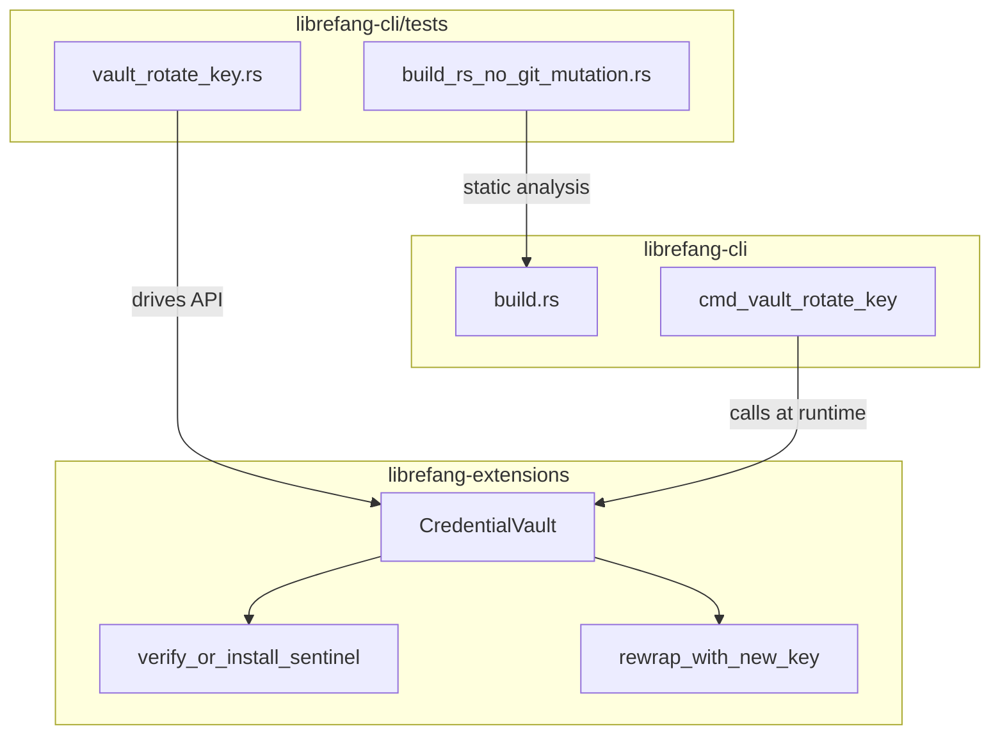

# Other — librefang-cli-tests

# librefang-cli-tests

Integration and regression tests for the `librefang-cli` crate. This module validates two critical invariants that span the CLI and its dependency layer: build-script hygiene (no git config mutations) and vault key rotation correctness (entries and sentinel survive re-encryption under a new master key).

## Test Files

### `build_rs_no_git_mutation.rs` — Static analysis guard on `build.rs`

Regression guard for **issue #3641**. A previous build script silently mutated the user's global git configuration (`core.hooksPath`), which is unacceptable behavior for a build script. These tests perform **static string analysis** on the `build.rs` source at compile-test time to ensure no regression can slip in.

#### How it works

1. `read_build_rs()` reads the contents of `build.rs` from `CARGO_MANIFEST_DIR`.
2. `strip_comments()` removes `//` line comments so that documentation or explanatory notes mentioning the old bug don't trigger false positives.
3. Two test functions then assert the stripped source does not contain forbidden string literals.

#### Test functions

| Test | What it asserts |
|------|----------------|
| `build_rs_does_not_mutate_git_config` | Bans the bare token `"config"` (catches `git config` invocations) and the string `"hooksPath"`. If a future change needs read-only `git config --get`, this test must be updated with an explicit allowance. |
| `build_rs_uses_only_read_only_git_subcommands` | Bans side-effecting subcommands: `"init"`, `"clone"`, `"commit"`, `"push"`, `"pull"`, `"fetch"`, `"checkout"`, `"reset"`, `"add"`, `"rm"`. |

**Design note:** The check uses string-literal matching (`"config"`) rather than substring matching to avoid false positives from unrelated code. This is intentionally conservative — if `build.rs` ever needs a read-only git invocation, the test must be updated with a targeted allowlist, forcing a human review.

---

### `vault_rotate_key.rs` — Key rotation integration tests

Integration tests for the `librefang vault rotate-key` CLI subcommand (**issue #3651**). These tests drive the `CredentialVault` API from `librefang-extensions` directly rather than spawning the CLI binary.

#### Why library-level testing instead of CLI spawning

The actual CLI handler `cmd_vault_rotate_key` has two properties that make subprocess-based testing impractical:

- It calls `std::process::exit` on every error path, making output capture unreliable.
- It reads `LIBREFANG_VAULT_KEY_OLD` and `LIBREFANG_VAULT_KEY_NEW` from the **global** process environment, which causes flaky failures under parallel `cargo test` runs.

Driving the library API directly is deterministic, covers the actual rotation invariants, and avoids these problems. The code path exercised is identical to what the CLI drives.

#### Test helper

```rust
fn key_filled(b: u8) -> Zeroizing<[u8; 32]>
```

Creates a deterministic 32-byte key where every byte is `b`. Determinism makes test failures reproducible without `OsRng` noise. Returns a `Zeroizing` wrapper so key material is wiped from memory on drop.

#### Test functions

**`rotate_key_end_to_end_replaces_master_key_and_preserves_entries`**

Full end-to-end rotation workflow across four phases:

1. **Create** vault under key A (`0x11`), store `API_KEY` and `REFRESH_TOKEN`, verify sentinel is present.
2. **Rotate** from key A to key B (`0x22`): unlock with old key, verify sentinel, confirm exactly the two user entries are visible (sentinel hidden from `list_keys`), then `rewrap_with_new_key`.
3. **Read** with key B: both user entries recover their original plaintext, sentinel verifies, sentinel invisible to `list_keys`.
4. **Reject** key A: `unlock_with_key` with the old key must fail.

**`rewrap_with_identical_key_still_decrypts`**

Verifies that the library-level `rewrap_with_new_key` is idempotent when given the same key. The re-encrypt succeeds because AES-GCM uses a fresh nonce/salt. The CLI layer adds a same-key rejection guard separately (see `vault-rotate-same-key` in `main.ftl`); this test confirms the underlying operation is safe if that guard is bypassed.

**`sentinel_round_trips_through_rotation`**

Verifies the internal sentinel entry (`SENTINEL_KEY` / `SENTINEL_VALUE`) survives rotation exactly. Uses `iter_all_entries` (which includes reserved keys invisible to `list_keys`) to inspect the sentinel directly, then also exercises `verify_or_install_sentinel`. This catches regressions where `rewrap_with_new_key` might skip internal/reserved entries.

---

## Architecture and dependency flow



The vault tests exercise the same `CredentialVault` surface that `cmd_vault_rotate_key` uses at runtime: `init_with_key`, `unlock_with_key`, `set`, `get`, `list_keys`, `iter_all_entries`, `verify_or_install_sentinel`, and `rewrap_with_new_key`.

## Running

```sh
# All tests in this module
cargo test -p librefang-cli --test build_rs_no_git_mutation --test vault_rotate_key

# Just the build.rs guard
cargo test -p librefang-cli --test build_rs_no_git_mutation

# Just the vault rotation tests
cargo test -p librefang-cli --test vault_rotate_key
```

No external services, network access, or environment variables are required. The vault tests use `tempfile::tempdir` for isolated filesystem paths.