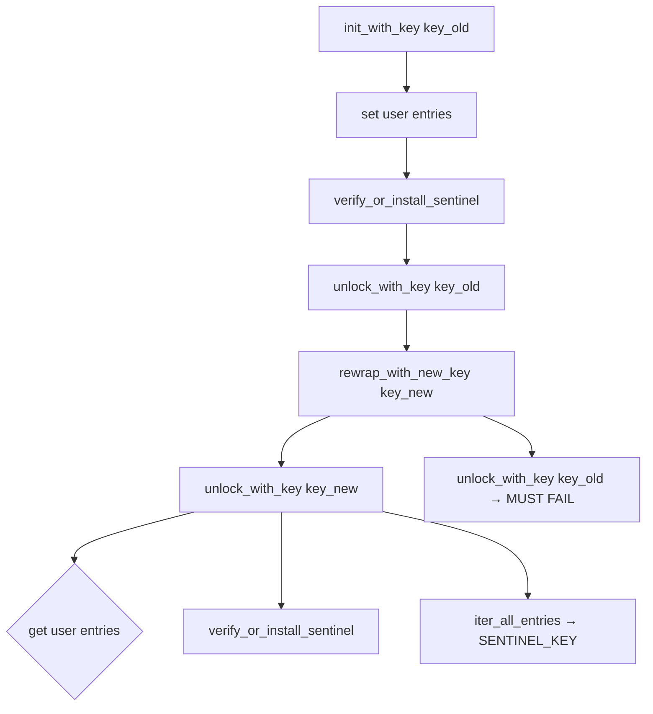

# Other — librefang-cli-tests

# librefang-cli-tests

Integration and regression tests for the `librefang-cli` crate. This module contains two test suites that guard against specific historical regressions: one preventing `build.rs` from mutating user git configuration, and another validating the credential vault key-rotation pipeline end-to-end.

## Test Files

### `build_rs_no_git_mutation.rs`

**Issue:** #3641 — A prior version of `build.rs` silently modified the user's global git config (specifically `core.hooksPath`) during compilation. This is a supply-chain-adjacent hazard: build scripts should be read-only with respect to the developer's environment.

**Strategy:** Static analysis of `build.rs` source at test time. The tests read the file from disk, strip `//` comments to avoid false positives from doc comments mentioning the old bug, and assert that banned string literals do not appear.

#### Tests

| Test | What it asserts |
|------|----------------|
| `build_rs_does_not_mutate_git_config` | The source contains neither `"config"` nor `"hooksPath"` as string literals. The bare `"config"` token is banned outright — if read-only `git config --get` is ever needed, an explicit allowance must be added here. |
| `build_rs_uses_only_read_only_git_subcommands` | The source does not contain any of `"init"`, `"clone"`, `"commit"`, `"push"`, `"pull"`, `"fetch"`, `"checkout"`, `"reset"`, `"add"`, or `"rm"` as string literals. |

#### Helper Functions

- **`read_build_rs()`** — Reads `build.rs` from `CARGO_MANIFEST_DIR`. Panics if the file is unreadable so the failure is unambiguous in CI.
- **`strip_comments(src)`** — Removes `//`-style line comments. This is intentionally simple (not a full Rust lexer) because `build.rs` is straightforward code; it's sufficient to prevent doc comments referencing the old bug from triggering the check.

#### Adding a new forbidden pattern

Append the string literal to the `forbidden` array in `build_rs_uses_only_read_only_git_subcommands`. If a read-only git invocation is legitimately needed, add a targeted allow-list check rather than weakening the blanket ban.

---

### `vault_rotate_key.rs`

**Issue:** #3651 — The `librefang vault rotate-key` CLI subcommand re-encrypts the credential vault under a new master key. This test suite exercises the full rotation pipeline at the library level rather than spawning the CLI binary.

**Why library-level testing instead of CLI spawning:** The actual `cmd_vault_rotate_key` function calls `std::process::exit` on errors and reads `LIBREFANG_VAULT_KEY_OLD` / `LIBREFANG_VAULT_KEY_NEW` from the process environment. Spawning the binary in tests creates environment pollution and makes parallel `cargo test` runs flaky. Driving `librefang_extensions::vault::CredentialVault` directly is deterministic, covers the real invariants, and runs safely in parallel.

#### Test helper

- **`key_filled(b: u8) -> Zeroizing<[u8; 32]>`** — Produces a deterministic 32-byte key where every byte is `b`. Avoids `OsRng` so failures are reproducible.

#### Tests

**`rotate_key_end_to_end_replaces_master_key_and_preserves_entries`**

Full lifecycle across four phases:

1. **Create** — Initialize a vault under key A, store `API_KEY` and `REFRESH_TOKEN`, verify sentinel is present.
2. **Rotate** — Unlock with key A, verify sentinel, confirm user-visible keys match expectations, then call `rewrap_with_new_key(key_b)`.
3. **Verify new key** — Unlock with key B, assert both stored values are recovered as plaintext, verify sentinel survived rotation, confirm sentinel is hidden from `list_keys()`.
4. **Reject old key** — Assert `unlock_with_key(key_a)` fails. This is the core security invariant.

**`rewrap_with_identical_key_still_decrypts`**

The CLI rejects same-key rotation as a user footgun, but at the library level `rewrap_with_new_key` with the same key is idempotent (re-encrypts under a fresh AES-GCM nonce/salt). This test confirms the library doesn't corrupt the vault in that case.

**`sentinel_round_trips_through_rotation`**

Uses `iter_all_entries()` (which includes reserved internal keys invisible to `list_keys()`) to directly inspect the sentinel key/value pair after rotation. Asserts the sentinel value round-trips exactly — without this, the post-rotation vault would fail the boot integrity check.



## Dependencies on Other Crates

| Crate | Usage |
|-------|-------|
| `librefang-extensions` | `CredentialVault`, `SENTINEL_KEY`, `SENTINEL_VALUE` — the vault API under test |
| `tempfile` | Isolated temporary directories for vault files |
| `zeroize` | `Zeroizing` wrappers for key material and plaintext values |

## Running

```sh
# All tests in this module
cargo test -p librefang-cli --test build_rs_no_git_mutation --test vault_rotate_key

# Individual suites
cargo test -p librefang-cli --test build_rs_no_git_mutation
cargo test -p librefang-cli --test vault_rotate_key
```

No environment variables, external services, or network access are required. All tests are hermetic and safe for parallel execution.