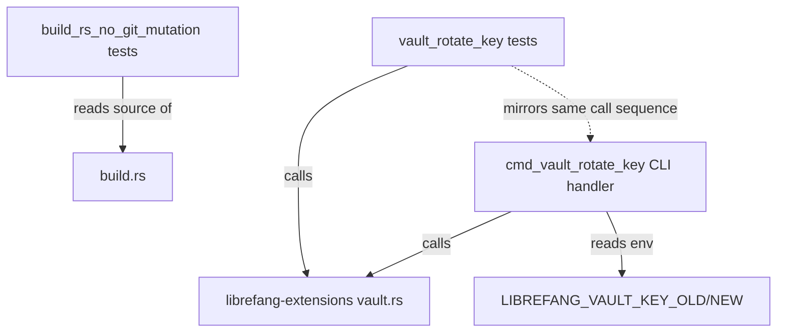

# Other — librefang-cli-tests

# librefang-cli Tests

Integration and regression tests for the `librefang-cli` crate. This module guards against two categories of bugs: **build-script side effects** (issue #3641) and **vault key-rotation correctness** (issue #3651).

## Test Files

### `build_rs_no_git_mutation.rs`

**Purpose:** Prevents `build.rs` from silently mutating the user's git configuration. Issue #3641 documented a regression where the build script modified `core.hooksPath`, which is unacceptable behavior from a build dependency.

**How it works:** The tests read `build.rs` as raw source text, strip `//` line comments (so doc comments mentioning the old bug don't trigger false positives), and assert that forbidden tokens are absent.

Two tests enforce this:

| Test | What it bans |
|------|-------------|
| `build_rs_does_not_mutate_git_config` | The string `"config"` (bare `git config` invocation) and `"hooksPath"` specifically. If a read-only `git config --get` is ever needed, this test must be updated with an explicit allowance. |
| `build_rs_uses_only_read_only_git_subcommands` | A blocklist of side-effecting subcommands: `"init"`, `"clone"`, `"commit"`, `"push"`, `"pull"`, `"fetch"`, `"checkout"`, `"reset"`, `"add"`, `"rm"`. Any new build-script use of git must be read-only. |

**Helper functions:**

- **`read_build_rs()`** — Reads `build.rs` relative to `CARGO_MANIFEST_DIR`. Panics if the file is missing.
- **`strip_comments(src)`** — Removes `//`-style comments line-by-line so documentation mentioning forbidden tokens doesn't cause false failures.

### `vault_rotate_key.rs`

**Purpose:** Integration tests for the `librefang vault rotate-key` CLI workflow. These tests drive the `librefang_extensions::vault::CredentialVault` API directly rather than spawning the CLI binary, because `cmd_vault_rotate_key` calls `std::process::exit` on errors and reads `LIBREFANG_VAULT_KEY_OLD` / `LIBREFANG_VAULT_KEY_NEW` from the process environment — both of which make parallel `cargo test` execution flaky.

**Why library-level testing is sufficient:** The CLI thin-wraps `CredentialVault::unlock_with_key`, `verify_or_install_sentinel`, and `rewrap_with_new_key`. By exercising these calls in the same order the CLI does, the tests cover the actual rotation invariants without the binary-spawning fragility.

**Helper function:**

- **`key_filled(b: u8) -> Zeroizing<[u8; 32]>`** — Produces a deterministic 32-byte key with every byte set to `b`. Avoids `OsRng` so failures are reproducible. Uses `Zeroizing` to match production key hygiene.

#### Test cases

**`rotate_key_end_to_end_replaces_master_key_and_preserves_entries`**

The primary rotation correctness test, organized in four phases:

1. **Create** — Initialize a vault under key A, store `API_KEY` and `REFRESH_TOKEN`, verify the sentinel is present.
2. **Rotate** — Unlock with key A, verify sentinel, confirm user-visible keys match expectations, then call `rewrap_with_new_key` with key B.
3. **Verify new key** — Unlock with key B, confirm both entries decrypt to their original plaintext, confirm sentinel survives, confirm `list_keys` hides the sentinel.
4. **Reject old key** — Attempt to unlock with key A and assert failure. This is the core security invariant: after rotation, the old key must be unusable.

**`rewrap_with_identical_key_still_decrypts`**

Verifies that rewrapping with the same key is technically valid at the library level (it re-encrypts with a fresh AES-GCM nonce/salt). The CLI layer separately blocks this case as an operator footgun — the test documents that the blocking is a CLI-level decision, not a library limitation.

**`sentinel_round_trips_through_rotation`**

Ensures the internal sentinel entry (`SENTINEL_KEY` / `SENTINEL_VALUE`) survives rotation intact. Uses `iter_all_entries` (which includes reserved keys invisible to `list_keys`) to inspect the sentinel directly after rotation. Without sentinel-aware rewrap, the post-rotation vault would be missing the sentinel and the boot path would refuse to start.

## Relationship to the rest of the codebase



The vault tests mirror the call sequence in `cmd_vault_rotate_key` (the CLI handler) but bypass the `std::process::exit` and global-env-read issues. Any regression in `CredentialVault`, `verify_or_install_sentinel`, or `rewrap_with_new_key` will trip these tests before reaching users.

## Running

```sh
# All tests in this module
cargo test -p librefang-cli

# Only build.rs regression guard
cargo test -p librefang-cli -- build_rs

# Only vault rotation tests
cargo test -p librefang-cli -- rotate
```

## Contributing guidelines

- **Adding a new forbidden git subcommand:** Add it to the `forbidden` array in `build_rs_uses_only_read_only_git_subcommands`.
- **Allowing read-only `git config --get`:** Update `build_rs_does_not_mutate_git_config` with an explicit allowance rather than weakening the blanket `"config"` ban.
- **Adding vault rotation scenarios:** Follow the existing pattern — use `key_filled` for deterministic keys, `tempfile::tempdir` for vault storage, and assert both the happy path (new key works, entries recover) and the security property (old key rejected).