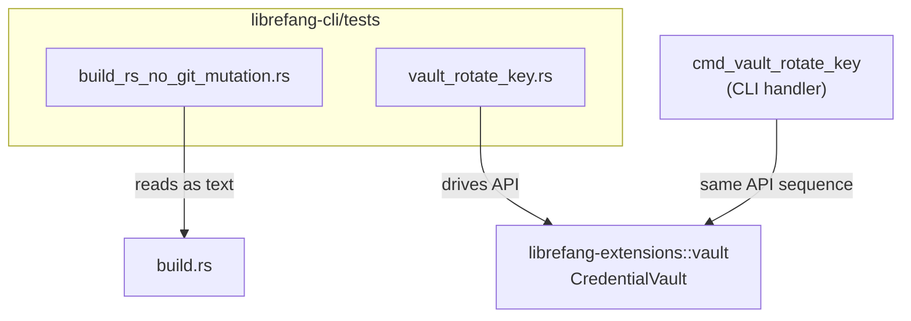

# Other — librefang-cli-tests

# librefang-cli-tests

Integration and regression tests for the `librefang-cli` crate. This module contains two test suites that guard against specific failure modes: one prevents `build.rs` from mutating user git configuration, and the other validates the vault key-rotation workflow end-to-end.

## Test Files

### `build_rs_no_git_mutation.rs`

**Purpose:** Regression guard for [issue #3641](#). Ensures `build.rs` never invokes side-effecting git operations — particularly `git config`, which was previously found to mutate the user's global git configuration during the build phase.

**Why it exists:** A `build.rs` script that calls `git config` can silently alter a developer's git environment. Since `build.rs` runs implicitly on `cargo build`, such mutations are easy to introduce and hard to trace. This test acts as a static analysis gate: it reads `build.rs` as plain text and scans for forbidden tokens.

**How it works:**

1. `read_build_rs()` reads `build.rs` from `CARGO_MANIFEST_DIR`.
2. `strip_comments()` removes all `//`-style line comments so that doc strings or explanatory notes about the old bug don't produce false positives.
3. Two test functions then assert the cleaned source doesn't contain forbidden strings:

| Test | Forbidden patterns | Rationale |
|------|-------------------|-----------|
| `build_rs_does_not_mutate_git_config` | `"config"`, `hooksPath` | The bare `git config` subcommand can mutate state. Even read-only usage (`git config --get`) is banned by default — an explicit allowance must be added to the test if that becomes necessary. |
| `build_rs_uses_only_read_only_git_subcommands` | `"init"`, `"clone"`, `"commit"`, `"push"`, `"pull"`, `"fetch"`, `"checkout"`, `"reset"`, `"add"`, `"rm"` | Side-effecting git subcommands have no legitimate purpose in a build script. |

**Caveat:** This is string-based scanning, not a full AST parse. It works because the git CLI arguments are passed as string literals (e.g., `arg("config")`). The check is conservative: it searches for quoted token forms like `"config"` to avoid flagging variable names or comments that merely mention git.

### `vault_rotate_key.rs`

**Purpose:** Integration tests for the `librefang vault rotate-key` CLI subcommand ([issue #3651](#)). Rather than spawning the CLI binary, these tests drive the `CredentialVault` API from `librefang-extensions` directly.

**Why not spawn the CLI binary:** The `cmd_vault_rotate_key` CLI handler calls `std::process::exit` on every error path and reads `LIBREFANG_VAULT_KEY_OLD` / `LIBREFANG_VAULT_KEY_NEW` from the process environment. This makes parallel `cargo test` runs non-deterministic. Driving the library API directly covers the same invariants — vault re-encryption under a new key, old key rejection, and sentinel preservation — without the flakiness.

**Test helper:**

```
key_filled(b: u8) -> Zeroizing<[u8; 32]>
```

Produces a deterministic 32-byte key where every byte is `b`. Deterministic keys ensure reproducible failures without `OsRng` noise. Keys are wrapped in `Zeroizing` to match the production API's memory-zeroing contract.

**Test cases:**

#### `rotate_key_end_to_end_replaces_master_key_and_preserves_entries`

The main integration test. Exercises the full rotation lifecycle in four phases:

1. **Create** — Initialize a vault under key A, store two entries (`API_KEY`, `REFRESH_TOKEN`), verify the sentinel is present.
2. **Rotate** — Unlock with key A, verify sentinel, call `rewrap_with_new_key(key_b)`.
3. **Verify new key** — Unlock with key B, confirm both entries decrypt to their original plaintext, confirm sentinel verifies, confirm sentinel is invisible to `list_keys()`.
4. **Reject old key** — Unlock with key A must fail.

This mirrors the exact sequence `cmd_vault_rotate_key` performs: `unlock_with_key(old)` → `verify_or_install_sentinel()` → `rewrap_with_new_key(new)`.

#### `rewrap_with_identical_key_still_decrypts`

Guards against data loss if `rewrap_with_new_key` is called with the same key. At the library layer this is allowed (it's an idempotent re-encrypt under a fresh AES-GCM nonce/salt). The CLI prevents the footgun at a higher level — see `vault-rotate-same-key` in `main.ftl` — but this test confirms the library operation itself is safe.

#### `sentinel_round_trips_through_rotation`

Verifies that the internal sentinel entry (key/value constants from `librefang-extensions::vault`) survives key rotation exactly. Uses `iter_all_entries()` (which includes reserved keys) to inspect the sentinel directly, then calls `verify_or_install_sentinel()` for a second validation. This catches regressions where `rewrap_with_new_key` might only re-encrypt user-facing entries while dropping internal ones.

## Relationship to the Codebase



- **`build_rs_no_git_mutation.rs`** has no runtime dependency on any other crate. It performs static text analysis on `build.rs` at test time.
- **`vault_rotate_key.rs`** depends on `librefang-extensions` (for `CredentialVault`, `SENTINEL_KEY`, `SENTINEL_VALUE`) and `tempfile` / `zeroize` as test utilities. It exercises the same code path as the CLI handler `cmd_vault_rotate_key`, but without process spawning or environment variable mutation.
- There are no incoming calls to this module — it is purely a test consumer.