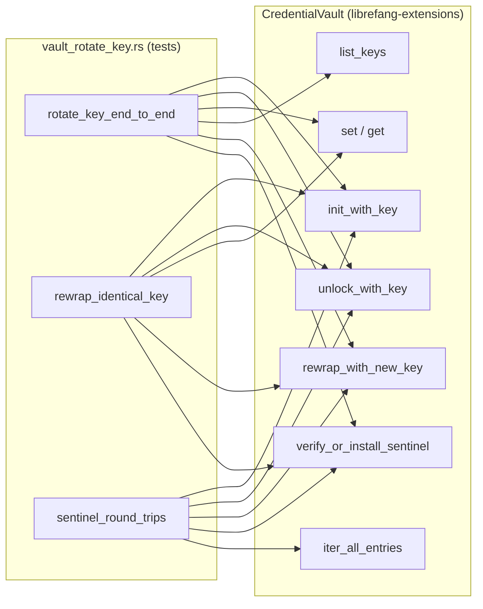

# Other — librefang-cli-tests

# librefang-cli/tests — Integration & Regression Tests

## Overview

This directory contains two standalone test programs that guard against specific regressions in `librefang-cli` and its dependency `librefang-extensions`. They are compiled and run by `cargo test` but live outside the main library crate so they can inspect build-time artifacts and drive library APIs without coupling to the CLI's `std::process::exit` error paths.

| File | What it protects | Issue reference |
|---|---|---|
| `build_rs_no_git_mutation.rs` | Ensures `build.rs` never mutates the user's git config or invokes side-effecting git subcommands | #3641 |
| `vault_rotate_key.rs` | Validates the full vault key-rotation lifecycle (decrypt → rewrap → sentinel preservation → old-key rejection) | #3651 |

---

## build_rs_no_git_mutation.rs

### Purpose

Issue #3641 was caused by `build.rs` writing to the user's global git config (specifically `core.hooksPath`) during compilation — an unacceptable side effect for a build script. This test is a **static analysis guard**: it reads `build.rs` at test time and asserts that forbidden tokens never appear in the source, preventing regressions silently introduced by future edits.

### How it works

1. **`read_build_rs()`** — Resolves `<CARGO_MANIFEST_DIR>/build.rs` and reads the entire file into a `String`. Panics if the file is missing (the test is meaningless without it).

2. **`strip_comments(src)`** — Strips `//` line comments from the source so that doc comments or explanatory notes referencing the old bug (e.g. `// We used to run git config …`) don't trigger false positives. This is intentionally naive — it doesn't handle block comments or string-escaped slashes — which is fine because `build.rs` doesn't use `/* */` comments.

3. Two test functions scan the cleaned source for banned patterns:

   - **`build_rs_does_not_mutate_git_config`** — Bans the literal string token `"config"` (the argument subcommand passed to git) and the string `hooksPath`. If a future change needs read-only `git config --get`, the test must be updated with an explicit allowance rather than silently passing.

   - **`build_rs_uses_only_read_only_git_subcommands`** — Bans a list of side-effecting git subcommands: `init`, `clone`, `commit`, `push`, `pull`, `fetch`, `checkout`, `reset`, `add`, `rm`.

### Design note

The test checks for string literals like `"config"` (with quotes) rather than the bare word `config`. This avoids matching variable names, comments, or other incidental occurrences while catching cases where git is invoked with `arg("config")`.

---

## vault_rotate_key.rs

### Purpose

The CLI subcommand `librefang vault rotate-key` wraps several `CredentialVault` methods from `librefang-extensions`. This test exercises the **exact library-level code path** the CLI drives, verifying that:

- After rotation, the vault decrypts under the **new** key and **rejects** the old key.
- All user entries survive rotation with their original plaintext intact.
- The internal sentinel (`SENTINEL_KEY` / `SENTINEL_VALUE`) survives rotation, is invisible to `list_keys()`, and is inspectable via `iter_all_entries()`.
- Re-wrapping with the **same** key is idempotent (the CLI blocks this as a user-facing guard, but the library tolerates it).

### Why library-level and not CLI-spawned

The real `cmd_vault_rotate_key` has two properties that make it hostile to parallel `cargo test`:

- It calls `std::process::exit` on every error path, which would kill the test runner.
- It reads `LIBREFANG_VAULT_KEY_OLD` / `LIBREFANG_VAULT_KEY_NEW` from the **global** process environment, causing data races under `cargo test --threads > 1`.

Driving `CredentialVault` directly is deterministic, parallel-safe, and covers the actual invariants the CLI depends on.

### Helper

```rust
fn key_filled(b: u8) -> Zeroizing<[u8; 32]>
```

Returns a deterministic 32-byte key with every byte set to `b`. Uses `Zeroizing` to match production key handling. Deterministic keys make failures reproducible without `OsRng` noise.

### Test functions

#### `rotate_key_end_to_end_replaces_master_key_and_preserves_entries`

Four-phase lifecycle test:

```
Phase 1: Create vault under key A → store API_KEY, REFRESH_TOKEN → verify sentinel
Phase 2: Unlock with key A → verify sentinel → rewrap_with_new_key(key B)
Phase 3: Unlock with key B → assert entries match originals → verify sentinel
Phase 4: Unlock with key A → assert failure (old key must be rejected)
```

This mirrors the sequence in `cmd_vault_rotate_key`: `unlock_with_key` → `verify_or_install_sentinel` → `rewrap_with_new_key`.

#### `rewrap_with_identical_key_still_decrypts`

Tests idempotent re-encryption: create a vault, call `rewrap_with_new_key` with the **same** key, then reopen and verify the entry is still readable and the sentinel still validates. The library allows this (it re-encrypts with a fresh AES-GCM nonce/salt); the CLI layer blocks it as a user-facing footgun via the `vault-rotate-same-key` fluent message.

#### `sentinel_round_trips_through_rotation`

Focused test for internal entry preservation. Creates a vault, rotates the key, then uses `iter_all_entries()` (which includes reserved keys hidden from `list_keys()`) to directly inspect the sentinel:

```rust
let (_, sv) = vault2.iter_all_entries().find(|(k, _)| *k == SENTINEL_KEY).expect("...");
assert_eq!(sv, SENTINEL_VALUE);
```

This catches regressions where `rewrap_with_new_key` might only re-encrypt user-visible entries and drop internal slots.

### Relationship to librefang-extensions


```mermaid
graph LR
    subgraph "vault_rotate_key.rs (tests)"
        T1[rotate_key_end_to_end]
        T2[rewrap_identical_key]
        T3[sentinel_round_trips]
    end
    subgraph "CredentialVault (librefang-extensions)"
        init[init_with_key]
        unlock[unlock_with_key]
        set[set / get]
        list[list_keys]
        rewrap[rewrap_with_new_key]
        sentinel[verify_or_install_sentinel]
        iter[iter_all_entries]
    end
    T1 --> init & unlock & set & list & rewrap & sentinel
    T2 --> init & unlock & set & rewrap & sentinel
    T3 --> init & unlock & rewrap & sentinel & iter
```

---

## Running

```sh
# Both test programs
cargo test

# Only build.rs guard
cargo test --test build_rs_no_git_mutation

# Only vault rotation
cargo test --test vault_rotate_key
```

No environment variables, network access, or external state are required. All vault tests use `tempfile::tempdir()` for automatic cleanup.