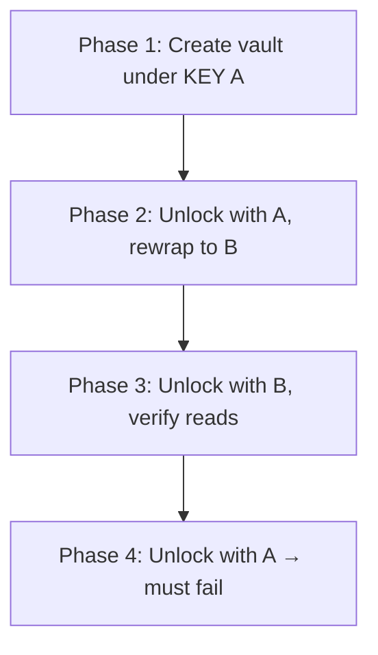

# Other — librefang-cli-tests

# librefang-cli/tests — CLI Integration & Regression Tests

This directory contains integration and regression tests for the `librefang-cli` crate. Tests are split into two concerns: **build-script safety guards** and **vault key rotation correctness**.

## Test Files

### `build_rs_no_git_mutation.rs`

Regression guard enforcing that `build.rs` never mutates the user's git configuration. Introduced to prevent a repeat of [issue #3641], where a build script silently modified the user's `core.hooksPath`.

**How it works:**

The tests read the *source* of `build.rs` at compile time (via `CARGO_MANIFEST_DIR`), strip all `//` comments to avoid false positives from explanatory doc comments, then assert that forbidden string literals are absent from the remaining code.

| Test function | What it forbids |
|---|---|
| `build_rs_does_not_mutate_git_config` | The literal `"config"` (bans all `git config` invocations) and `"hooksPath"` specifically |
| `build_rs_uses_only_read_only_git_subcommands` | Side-effecting subcommands: `init`, `clone`, `commit`, `push`, `pull`, `fetch`, `checkout`, `reset`, `add`, `rm` |

**Helper functions:**

- `read_build_rs()` — Reads `build.rs` from `CARGO_MANIFEST_DIR` into a `String`. Panics if the file is unreadable.
- `strip_comments(src)` — Returns a copy of `src` with every `//`-style comment removed, line by line. This prevents doc comments that *reference* the old bug from tripping the literal-matching checks.

**Design note:** The check intentionally bans the bare token `"config"` rather than trying to allow read-only `git config --get`. If a future change legitimately needs `--get`, the test must be updated with an explicit allowlist — making the policy change visible in code review.

---

### `vault_rotate_key.rs`

Integration tests for the `librefang vault rotate-key` CLI subcommand. Rather than spawning the CLI binary (which calls `std::process::exit` on errors and reads secrets from global env vars — making parallel test runs flaky), these tests drive the underlying `librefang_extensions::vault::CredentialVault` API directly. This covers the same code path with deterministic, parallel-safe execution.

**Helper:**

- `key_filled(b: u8) -> Zeroizing<[u8; 32]>` — Produces a deterministic 32-byte key with every byte set to `b`. Avoids `OsRng` so failures are reproducible.

#### Test: `rotate_key_end_to_end_replaces_master_key_and_preserves_entries`

Full four-phase lifecycle exercising the same call sequence as `cmd_vault_rotate_key`:


```mermaid
flowchart TD
    A["Phase 1: Create vault under KEY A"] --> B["Phase 2: Unlock with A, rewrap to B"]
    B --> C["Phase 3: Unlock with B, verify reads"]
    C --> D["Phase 4: Unlock with A → must fail"]
```

**Phase 1 — Create and populate:** `init_with_key` → `set("API_KEY")` → `set("REFRESH_TOKEN")` → `verify_or_install_sentinel`.

**Phase 2 — Rotate:** `unlock_with_key(A)` → `verify_or_install_sentinel` → assert `list_keys` returns only user keys → `rewrap_with_new_key(B)`.

**Phase 3 — Verify new key:** `unlock_with_key(B)` → assert plaintext values match originals → `verify_or_install_sentinel` → assert sentinel is invisible to `list_keys`.

**Phase 4 — Reject old key:** `unlock_with_key(A)` must return `Err`, confirming the vault no longer accepts the previous master key.

#### Test: `rewrap_with_identical_key_still_decrypts`

Verifies that rewrapping with the *same* key is idempotent at the library level (fresh AES-GCM nonce/salt). The CLI layer rejects same-key rotation as a separate footguard (see `vault-rotate-same-key` in `main.ftl`), but the library correctly handles it.

Flow: `init_with_key` → `set` → `rewrap_with_new_key(same key)` → unlock → `get` → `verify_or_install_sentinel`.

#### Test: `sentinel_round_trips_through_rotation`

Ensures the internal sentinel entry (`SENTINEL_KEY` / `SENTINEL_VALUE`) survives key rotation intact. Without sentinel-aware rewrap logic, the post-rotation vault would be missing the sentinel and would refuse to boot under the new key.

Flow: `init_with_key` → `rewrap_with_new_key` → unlock under new key → `iter_all_entries` finds sentinel → assert value matches `SENTINEL_VALUE` exactly → `verify_or_install_sentinel`.

---

## Dependencies on Other Crates

| Crate | What's used |
|---|---|
| `librefang-extensions` | `CredentialVault`, `SENTINEL_KEY`, `SENTINEL_VALUE` — the vault API and constants |
| `zeroize` | `Zeroizing<T>` wrapper for key material in memory |
| `tempfile` | `tempdir()` for ephemeral vault files |

## Running

```sh
# All integration tests in this directory
cargo test --test build_rs_no_git_mutation --test vault_rotate_key

# Individually
cargo test --test build_rs_no_git_mutation
cargo test --test vault_rotate_key
```