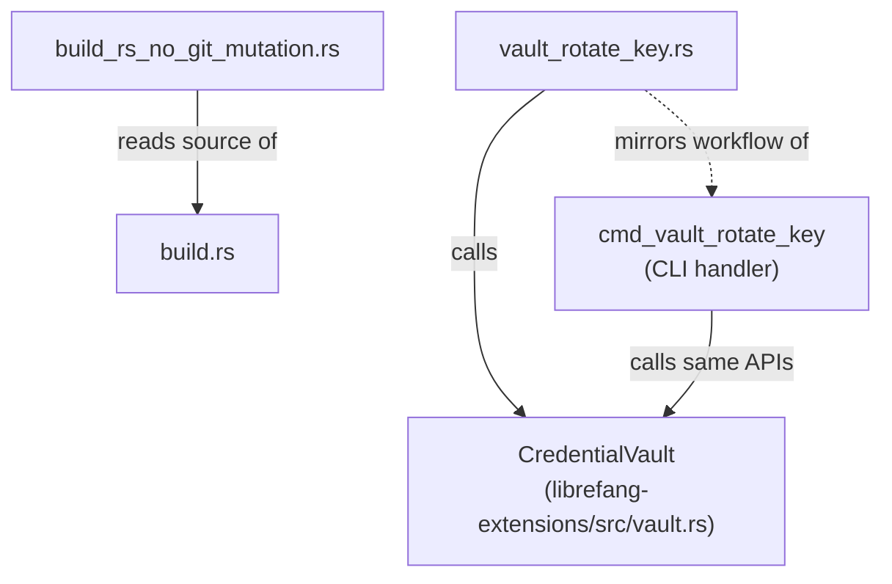

# Other — librefang-cli-tests

# librefang-cli/tests — CLI Integration & Regression Tests

This directory contains integration and regression tests that guard invariants the CLI depends on but that live outside the CLI's own code. The tests fall into two independent categories: build-script policy enforcement and vault key-rotation correctness.

## Test Files

### `build_rs_no_git_mutation.rs`

**Purpose:** Prevents `build.rs` from silently mutating the user's git configuration. Originated from [issue #3641], where a build script was modifying `core.hooksPath`, corrupting the developer's repository settings.

**How it works:** The test reads `build.rs` as plain text at compile time (`CARGO_MANIFEST_DIR`), strips all `//` line comments (so documentation mentioning the old bug doesn't trigger false positives), then asserts the remaining source code contains no forbidden git-related string literals.

#### `strip_comments(src: &str) -> String`

Removes `//`-style line comments from source text. This is intentionally simple — it does not handle block comments or strings containing `//`. This is acceptable because `build.rs` is a controlled file where the only risk is literal command tokens appearing outside comments.

#### `build_rs_does_not_mutate_git_config`

Bans two patterns in the comment-stripped source:

- `"config"` — the bare `git config` subcommand token. If a future change needs read-only `git config --get`, this test must be updated with an explicit allowance rather than silently passing.
- `"hooksPath"` — the specific git config key that caused the original incident.

#### `build_rs_uses_only_read_only_git_subcommands`

Bans a hardcoded list of side-effecting git subcommand tokens: `"init"`, `"clone"`, `"commit"`, `"push"`, `"pull"`, `"fetch"`, `"checkout"`, `"reset"`, `"add"`, `"rm"`. Any build script that invokes `git` at all must be limited to read-only operations.

#### Why text scanning instead of sandboxing

The tests work by string-matching on the source of `build.rs` rather than intercepting process calls at runtime. This is a deliberate tradeoff:

- **Catches the problem at `cargo test` time**, before a bad `build.rs` ever runs.
- **Zero overhead** — no sandbox, no LD_PRELOAD, no process monitoring.
- **Acceptable false-negative surface** — only literal string tokens are caught. Obfuscated or dynamically constructed commands would evade detection, but that would be extraordinary for a build script and easily caught in review.

---

### `vault_rotate_key.rs`

**Purpose:** Validates the full `librefang vault rotate-key` workflow by driving `CredentialVault` from `librefang-extensions` directly, without spawning the CLI binary.

**Why not spawn the CLI:** The actual CLI handler `cmd_vault_rotate_key` calls `std::process::exit` on errors and reads `LIBREFANG_VAULT_KEY_OLD` / `LIBREFANG_VAULT_KEY_NEW` from the process environment. Spawning the binary in `cargo test` would cause flaky failures under parallel test execution. Driving the library API covers the same invariants deterministically.

#### `key_filled(b: u8) -> Zeroizing<[u8; 32]>`

Produces a deterministic 32-byte key where every byte is `b`. Determinism ensures test failures are reproducible without `OsRng` noise. Returns `Zeroizing` to match the production API's memory-safety contract.

#### `rotate_key_end_to_end_replaces_master_key_and_preserves_entries`

The primary test. Exercises four phases matching the real CLI workflow:

```
Phase 1: Create vault under key A → store two entries → verify sentinel
Phase 2: Unlock with key A → verify sentinel → rewrap to key B
Phase 3: Unlock with key B → assert entries readable → verify sentinel survives
Phase 4: Unlock with key A → assert failure (old key must be rejected)
```

This test calls the same methods in the same order as `cmd_vault_rotate_key`: `unlock_with_key` → `verify_or_install_sentinel` → `rewrap_with_new_key`. A regression in any of those building blocks — or in the sentinel preservation contract — will be caught here.

**Key invariants verified:**

| Invariant | Where checked |
|---|---|
| Entries decrypt correctly under new key | Phase 3 `get()` calls |
| Old key is rejected after rotation | Phase 4 `unlock_with_key` returns `Err` |
| Sentinel survives rotation | Phase 3 `verify_or_install_sentinel` |
| Sentinel is hidden from `list_keys` | Phases 2 & 3 sort and compare |
| Exactly the user's entries are present | Phase 2 & 3 key listing |

#### `rewrap_with_identical_key_still_decrypts`

Guards that `rewrap_with_new_key` with the same key is functionally correct (it re-encrypts with a fresh AES-GCM nonce/salt). The CLI layer rejects same-key rotation as an operator footgun, but the library layer allows it. This test confirms the library remains sound when it happens — entries decrypt and the sentinel verifies.

#### `sentinel_round_trips_through_rotation`

Narrowly verifies that the sentinel entry (`SENTINEL_KEY` / `SENTINEL_VALUE`) round-trips through rotation exactly. Uses `iter_all_entries` (which includes reserved/internal keys invisible to `list_keys`) to read the sentinel directly, then asserts both key and value are intact.

---

## Relationship to Other Modules


```mermaid
graph TD
    A["build_rs_no_git_mutation.rs"] -->|"reads source of"| B["build.rs"]
    C["vault_rotate_key.rs"] -->|"calls"| D["CredentialVault<br/>(librefang-extensions/src/vault.rs)"]
    E["cmd_vault_rotate_key<br/>(CLI handler)"] -->|"calls same APIs"| D
    C -.->|"mirrors workflow of"| E
```

- **`build_rs_no_git_mutation.rs`** has no runtime dependency on any other module — it performs static text analysis on `build.rs`.
- **`vault_rotate_key.rs`** depends entirely on `librefang_extensions::vault::CredentialVault` and mirrors the call sequence used by the CLI command handler `cmd_vault_rotate_key`. It also uses `tempfile` for isolated vault storage and `zeroize::Zeroizing` to match production key-handling patterns.