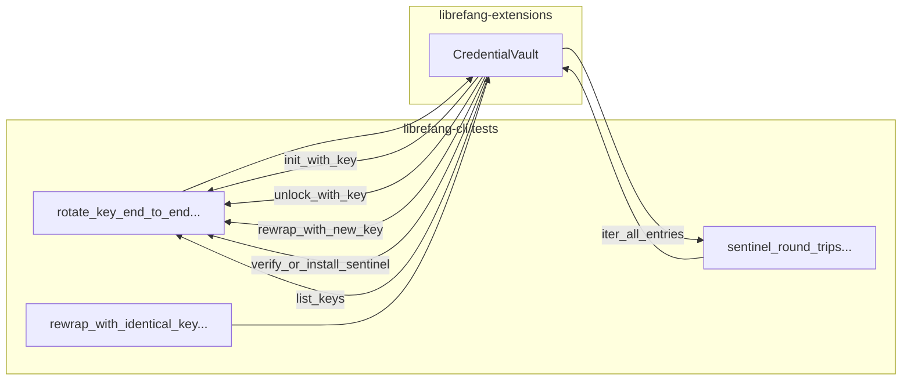

# Other — librefang-cli-tests

# librefang-cli/tests — Integration & Regression Tests

Two standalone test programs live under `librefang-cli/tests/`. They are compiled and run by `cargo test` but are not part of any library or binary crate output.

| File | Purpose | References issue |
|---|---|---|
| `build_rs_no_git_mutation.rs` | Static-analysis guard: `build.rs` must never mutate user git config | #3641 |
| `vault_rotate_key.rs` | End-to-end integration tests for `librefang vault rotate-key` | #3651 |

---

## build_rs_no_git_mutation.rs

### Why it exists

Issue #3641 was caused by `build.rs` silently writing to the user's global git config (specifically `core.hooksPath`). Build scripts run implicitly on every `cargo build`, so any side-effect on the developer's environment is unacceptable. This file is a regression guard: it reads the *source* of `build.rs` at test time and asserts that forbidden tokens never appear.

### How it works

1. **`read_build_rs()`** — reads `build.rs` from `CARGO_MANIFEST_DIR`. Panics if the file is missing so the test fails loudly in any misconfigured workspace layout.
2. **`strip_comments(src)`** — removes `//` line comments. Old doc comments mentioning the original bug would otherwise trigger a false positive on the string `"config"`.
3. Two test functions run against the stripped source:

#### `build_rs_does_not_mutate_git_config`

Asserts that the string literals `"config"` and `"hooksPath"` never appear. The rationale for banning the bare token rather than more specific patterns: if a future change truly needs *read-only* access (e.g. `git config --get`), it must be added as an explicit carve-out so reviewers are forced to acknowledge it.

#### `build_rs_uses_only_read_only_git_subcommands`

Scans for a hardcoded blocklist of side-effecting git subcommands passed as string literals:

```
"init", "clone", "commit", "push", "pull", "fetch",
"checkout", "reset", "add", "rm"
```

Any match is a hard failure with a message pointing to #3641.

### Design note

This is a lightweight textual check, not a full AST analysis. It catches the patterns used in the original bug (argument strings passed to `Command::new("git").arg(...)`). If `build.rs` ever grows obfuscated git invocations, this test would need strengthening, but for the expected patterns it is sufficient and dependency-free.

---

## vault_rotate_key.rs

### Why it exists

The `librefang vault rotate-key` CLI subcommand (implemented in `cmd_vault_rotate_key`) is a sensitive operation: it decrypts the entire credential vault under the old key and re-encrypts it under a new one. A bug here could silently lose entries or break the sentinel verification that gates vault unlocking.

Rather than spawning the CLI binary, these tests drive `CredentialVault` from `librefang-extensions` directly. The CLI binary calls `std::process::exit` on error and reads `LIBREFANG_VAULT_KEY_OLD` / `LIBREFANG_VAULT_KEY_NEW` from the process environment, making parallel `cargo test` execution flaky. The library API is deterministic and covers the same invariants.

### Helper

**`key_filled(b: u8) -> Zeroizing<[u8; 32]>`** — produces a deterministic 32-byte key where every byte is `b`. Deterministic keys make test failures reproducible without `OsRng` noise. `Zeroizing` ensures key material is cleared on drop.

### Test coverage

All three tests create a temporary directory via `tempfile::tempdir()` and operate on a `vault.enc` file scoped to that directory.

#### `rotate_key_end_to_end_replaces_master_key_and_preserves_entries`

Four-phase end-to-end test that mirrors exactly what `cmd_vault_rotate_key` does:

```
Phase 1                Phase 2                  Phase 3                Phase 4
Create vault (key A)   Unlock (A) → rewrap(B)   Unlock (B) → reads     Unlock (A) → fail
Store 2 entries        Verify sentinel           Verify entries         Old key rejected
Verify sentinel        Confirm user entries      Verify sentinel
```

Key invariants asserted:
- Both user entries (`API_KEY`, `REFRESH_TOKEN`) decrypt to their original plaintext under key B.
- The sentinel is present and verifies under key B.
- The sentinel is invisible to `list_keys` (only user keys appear).
- Key A is categorically rejected by `unlock_with_key` after rotation.

#### `rewrap_with_identical_key_still_decrypts`

At the library layer, re-encrypting with the same key is allowed (it produces a fresh AES-GCM nonce/salt, making it an idempotent but safe operation). The CLI rejects same-key rotation as an operator footguard — that guard lives in `vault-rotate-same-key` in `main.ftl`. This test confirms the library handles it gracefully: entries survive, sentinel verifies.

#### `sentinel_round_trips_through_rotation`

Focused test for the sentinel preservation contract. Creates a vault, rotates the key, then uses `iter_all_entries` (which includes reserved/internal keys hidden from `list_keys`) to directly inspect the sentinel:

- Asserts `SENTINEL_KEY` is present after rotation.
- Asserts the value exactly equals `SENTINEL_VALUE`.
- Confirms `verify_or_install_sentinel` succeeds.

This catches regressions in `rewrap_with_new_key` that might skip internal entries during the decrypt-re-encrypt cycle.

### Relationship to librefang-extensions


```mermaid
flowchart LR
    subgraph "librefang-cli/tests"
        T1[rotate_key_end_to_end...]
        T2[rewrap_with_identical_key...]
        T3[sentinel_round_trips...]
    end
    subgraph "librefang-extensions"
        CV[CredentialVault]
    end
    T1 --> CV
    T2 --> CV
    T3 --> CV
    CV -->|init_with_key| T1
    CV -->|unlock_with_key| T1
    CV -->|rewrap_with_new_key| T1
    CV -->|verify_or_install_sentinel| T1
    CV -->|list_keys| T1
    CV -->|iter_all_entries| T3
```

Every public method on `CredentialVault` involved in the rotation workflow is exercised. A regression in any of these building blocks — `init_with_key`, `unlock_with_key`, `set`, `get`, `rewrap_with_new_key`, `verify_or_install_sentinel`, `list_keys`, `iter_all_entries` — will cause one of these tests to fail.

---

## Running

```sh
# From the workspace root — runs both test files
cargo test -p librefang-cli

# Run only the vault rotation tests
cargo test -p librefang-cli --test vault_rotate_key

# Run only the build.rs guard
cargo test -p librefang-cli --test build_rs_no_git_mutation
```

No environment variables, external services, or network access are required. The vault tests depend on the `tempfile` and `zeroize` crates; the build.rs guard uses only `std::fs`.