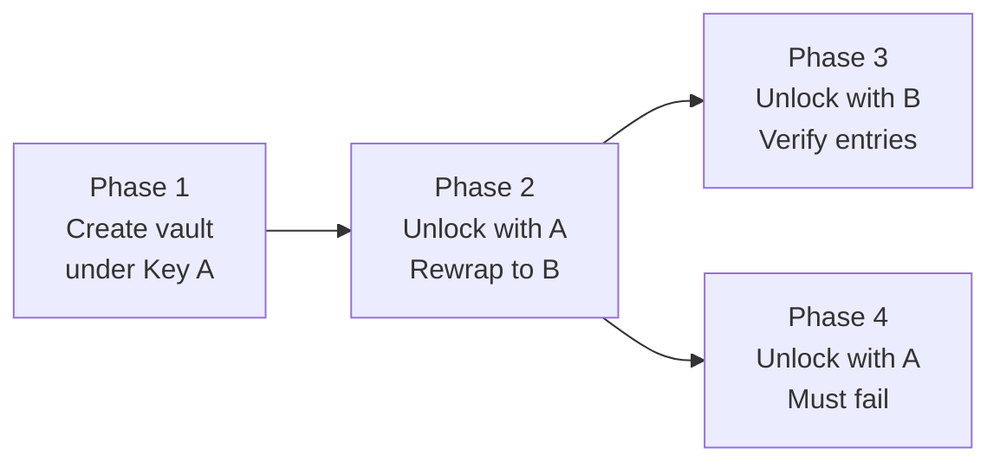

# Other — librefang-cli-tests

# librefang-cli/tests — Integration & Regression Tests

This directory contains integration tests and regression guards that protect two critical invariants: **build scripts must never mutate the user's git configuration**, and **vault key rotation must preserve all entries (including internal sentinel values) while atomically replacing the master encryption key**.

These tests execute as part of `cargo test` in the `librefang-cli` crate. They depend on `librefang-extensions` (for vault operations) and `tempfile` (for isolated filesystem scratch space).

---

## Test Files

### build_rs_no_git_mutation.rs

**Purpose:** Prevent regression of [issue #3641](https://github.com/librefang/librefang/issues/3641), where the build script was silently mutating the user's global git configuration. This test statically analyses the `build.rs` source at test time, banning the presence of side-effecting git subcommands and configuration mutations.

**How it works:**

1. `read_build_rs()` reads `build.rs` from `CARGO_MANIFEST_DIR` at compile time via `env!()`, then loads the file contents at test runtime.
2. `strip_comments()` removes `//` line comments so that documentation or historical notes mentioning the old bug don't trigger false positives.
3. Two test functions then assert that the cleaned source does not contain forbidden string literals.

**Tests:**

| Test | What it bans | Rationale |
|------|-------------|-----------|
| `build_rs_does_not_mutate_git_config` | `"config"` and `"hooksPath"` | The bare `git config` token is rejected outright. If a future change legitimately needs read-only access (e.g. `git config --get`), an explicit allowance must be added to this test. `core.hooksPath` is independently banned. |
| `build_rs_uses_only_read_only_git_subcommands` | `"init"`, `"clone"`, `"commit"`, `"push"`, `"pull"`, `"fetch"`, `"checkout"`, `"reset"`, `"add"`, `"rm"` | Any side-effecting git subcommand has no legitimate role in a build script. |

**Design note:** This is a string-matching static analysis, not a runtime sandbox. It catches the common case of `Command::new("git").arg("config")` patterns. If `build.rs` ever obfuscates these strings (e.g. via runtime concatenation), the test would need to be strengthened.

---

### vault_rotate_key.rs

**Purpose:** Integration test for the `librefang vault rotate-key` CLI subcommand, exercising the full rotation lifecycle through the `CredentialVault` library API from `librefang-extensions`.

**Why not spawn the CLI binary directly?** The actual `cmd_vault_rotate_key` function calls `std::process::exit` on errors and reads `LIBREFANG_VAULT_KEY_OLD` / `LIBREFANG_VAULT_KEY_NEW` from the process environment. Spawning the binary in tests would cause flaky failures under parallel `cargo test` due to environment variable races. Driving the library API directly is deterministic, avoids process exits, and still covers the real rotation invariants.

**Helper:**

```rust
fn key_filled(b: u8) -> Zeroizing<[u8; 32]>
```

Creates a deterministic 32-byte key where every byte is `b`. Uses `Zeroizing` from the `zeroize` crate to ensure key material is scrubbed from memory on drop. Determinism makes failures reproducible without `OsRng` noise.

**Tests:**

#### `rotate_key_end_to_end_replaces_master_key_and_preserves_entries`

The primary end-to-end test. Executes four phases:


```mermaid
flowchart LR
    A["Phase 1<br/>Create vault<br/>under Key A"] --> B["Phase 2<br/>Unlock with A<br/>Rewrap to B"]
    B --> C["Phase 3<br/>Unlock with B<br/>Verify entries"]
    B --> D["Phase 4<br/>Unlock with A<br/>Must fail"]
```

- **Phase 1 — Create:** Initialises the vault with `key_a` (0x11), stores `API_KEY` and `REFRESH_TOKEN`, confirms the sentinel is present after `init_with_key`.
- **Phase 2 — Rotate:** Unlocks with `key_a`, verifies the sentinel, confirms `list_keys()` returns exactly the two user entries (sentinel is hidden), then calls `rewrap_with_new_key` with `key_b` (0x22).
- **Phase 3 — New key reads:** Unlocks with `key_b`, asserts both stored values are recovered as original plaintext, verifies the sentinel survived rotation, and confirms the sentinel remains invisible to `list_keys()`.
- **Phase 4 — Old key rejection:** Asserts that `unlock_with_key(key_a)` now returns an error. This is the core security invariant — rotation must irreversibly replace the master key.

This test exercises the same call sequence as `cmd_vault_rotate_key`: `unlock_with_key` → `verify_or_install_sentinel` → `rewrap_with_new_key`.

#### `rewrap_with_identical_key_still_decrypts`

Tests idempotent re-encryption. At the library level, `rewrap_with_new_key` with the same key succeeds (it re-encrypts under a fresh AES-GCM nonce/salt). The test confirms the vault remains readable. The CLI layer adds a same-key guard to prevent this operator footgun — this test validates that the library handles it gracefully should the CLI guard ever be bypassed.

#### `sentinel_round_trips_through_rotation`

Verifies that the internal sentinel entry (`SENTINEL_KEY` / `SENTINEL_VALUE`) survives a key rotation intact. Uses `iter_all_entries()` — which includes reserved keys hidden from `list_keys()` — to directly inspect the sentinel value and confirm it matches exactly. Without sentinel-aware rewrap, the post-rotation vault would be missing the sentinel and the boot path would refuse to start under the new key.

---

## Dependencies and Integration Points

```
vault_rotate_key.rs
  ├── librefang_extensions::vault
  │     ├── CredentialVault::{new, init_with_key, unlock_with_key, set, get,
  │     │                       list_keys, iter_all_entries, rewrap_with_new_key,
  │     │                       verify_or_install_sentinel}
  │     ├── SENTINEL_KEY
  │     └── SENTINEL_VALUE
  ├── zeroize::Zeroizing
  └── tempfile::tempdir

build_rs_no_git_mutation.rs
  ├── std::fs::read_to_string
  └── CARGO_MANIFEST_DIR (compile-time env)
```

The vault tests are the primary regression surface for the `librefang vault rotate-key` command. A bug in `CredentialVault::rewrap_with_new_key`, a sentinel-handling regression, or a key derivation change in `librefang-extensions` will cause one of these tests to fail before reaching users.