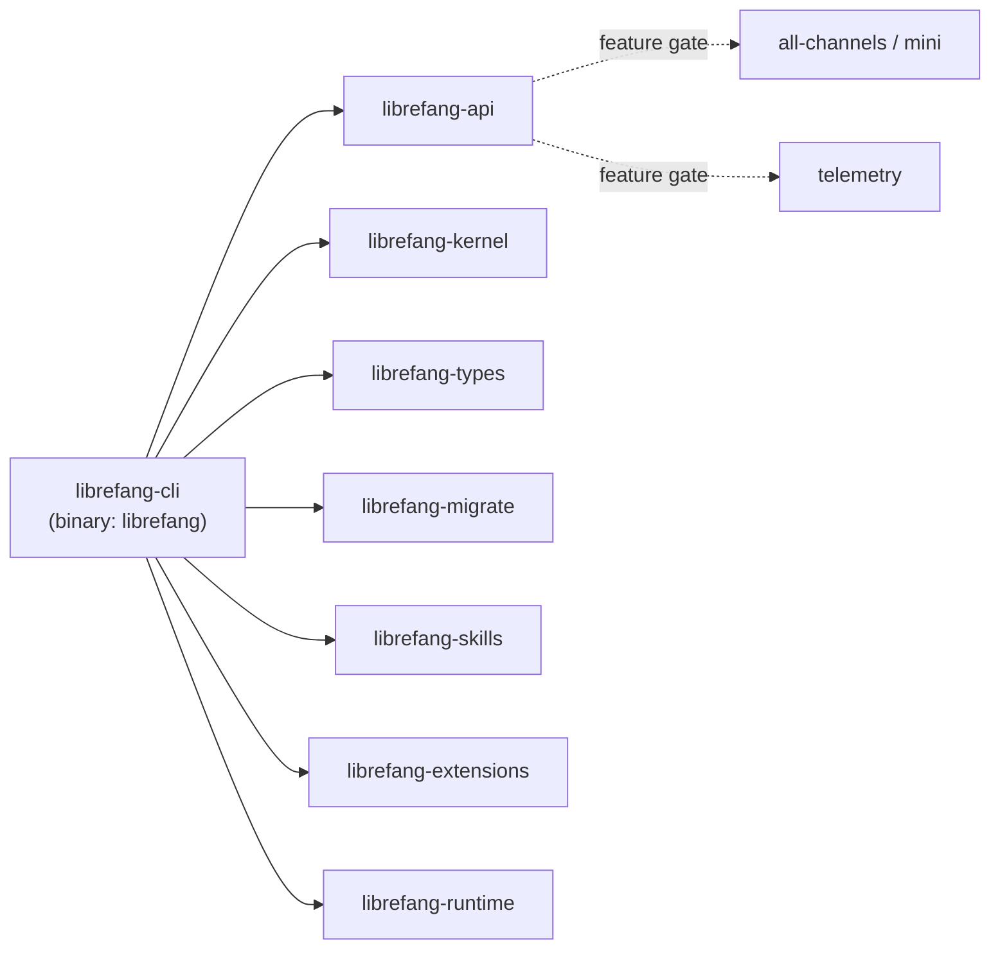

# Other — librefang-cli

# librefang-cli

The command-line interface for the LibreFang Agent OS. Produces the `librefang` binary that serves as the primary entry point for interacting with the system.

## Overview

`librefang-cli` is a thin but feature-rich shell around the LibreFang crate ecosystem. It pulls in nearly every library crate to expose a unified CLI that can configure, migrate, run, and debug agents. The binary is built as `librefang` (see the `[[bin]]` table in `Cargo.toml`).

## Feature Flags

Feature flags control which communication channels and observability capabilities are compiled in.

| Flag | Default | Description |
|------|---------|-------------|
| `default` | **on** | Enables `all-channels` and `telemetry` |
| `all-channels` | via default | Passes through to `librefang-api/all-channels` — compiles every transport/protocol backend |
| `mini` | off | Passes through to `librefang-api/mini` — compiles a minimal subset of channels for constrained builds |
| `telemetry` | via default | Enables OpenTelemetry tracing via `opentelemetry_sdk` and `tracing-opentelemetry`, plus `librefang-api/telemetry` |

To build a minimal binary without telemetry:

```sh
cargo build -p librefang-cli --no-default-features --features mini
```

## Build Script (`build.rs`)

The build script runs three tasks automatically on every compilation:

### 1. Git Hooks Configuration

```sh
git config core.hooksPath scripts/hooks
```

Ensures every developer's local repository uses the shared hook scripts under `scripts/hooks/`. Failures are silently ignored (e.g., when building outside a git checkout).

### 2. Embedding Build Metadata

Three environment variables are captured and embedded into the binary at compile time:

| Variable | Source | Example Value |
|----------|--------|---------------|
| `GIT_SHA` | `git rev-parse --short HEAD` | `a1b2c3d` |
| `BUILD_DATE` | `date -u +%Y-%m-%d` | `2025-01-15` |
| `RUSTC_VERSION` | `rustc --version` | `rustc 1.82.0 (...)` |

These are accessible at runtime via `env!()` macros — for example, `env!("GIT_SHA")` — and are typically displayed in `--version` output or startup banners. Each variable falls back to `"unknown"` when the source command fails.

## Dependency Graph



The CLI sits at the top of the dependency stack and is the only crate that produces an executable. It delegates all substantive logic to the library crates:

- **`librefang-api`** — network/transport layer; feature-gated to control which channels are included
- **`librefang-kernel`** — core agent runtime and scheduling
- **`librefang-types`** — shared data structures and type definitions
- **`librefang-migrate`** — database schema migrations
- **`librefang-skills`** — agent skill definitions and execution
- **`librefang-extensions`** — plugin/extension loading
- **`librefang-runtime`** — runtime support (TUI via `ratatui`, async runtime via `tokio`)

## Key External Dependencies

| Crate | Purpose |
|-------|---------|
| `clap` / `clap_complete` | Argument parsing and shell completion generation |
| `tokio` | Async runtime |
| `tracing` / `tracing-subscriber` | Structured logging |
| `ratatui` | Terminal UI rendering |
| `colored` | Colored terminal output |
| `reqwest` (blocking) | Synchronous HTTP client for select operations |
| `toml` / `toml_edit` | Reading and modifying TOML configuration files |
| `serde` / `serde_json` | Serialization |
| `fluent` / `unic-langid` | Internationalization (i18n) support |
| `open` | Open URLs/files in the user's default application |
| `zeroize` | Secure memory clearing for sensitive data |
| `rustls` | TLS without OpenSSL dependency |

## Configuration and Paths

The CLI uses the `dirs` crate to resolve standard platform directories (config, data, cache). Configuration files are expected in TOML format.

## Adding a New Subcommand

1. Define the command variant in the `clap` argument parser (in `src/main.rs` or a dedicated `args.rs` module).
2. Add a handler function or module that dispatches into the appropriate library crate.
3. If the command requires a new feature-gated dependency, add a Cargo feature in `Cargo.toml` and gate the import with `#[cfg(feature = "...")]`.

## Cross-Compilation Notes

The build script uses the system `date` command, which may produce different results or fail on some cross-compilation targets. The `GIT_SHA` variable also requires a git checkout. Both gracefully degrade to `"unknown"`, so cross-compilation will succeed but version metadata will be absent.