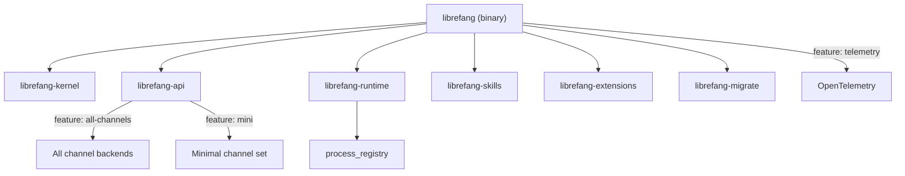

# Other — librefang-cli

# librefang-cli

The command-line interface for LibreFang Agent OS. This crate produces the `librefang` binary — the primary entry point for interacting with, configuring, and running the agent system.

## Overview

`librefang-cli` is a thin but feature-rich shell that wires together the core LibreFang libraries and exposes them through CLI subcommands, an optional TUI, and configuration management. It does not implement business logic itself; instead, it delegates to the following internal crates:

| Dependency | Role |
|---|---|
| `librefang-kernel` | Core agent runtime and orchestration |
| `librefang-api` | Communication channels (feature-gated) |
| `librefang-runtime` | Process registry and execution environment |
| `librefang-types` | Shared data structures and types |
| `librefang-migrate` | Database schema migrations |
| `librefang-skills` | Skill/plugin loading and management |
| `librefang-extensions` | Extension system |

## Architecture



## Feature Flags

Features control which capabilities are compiled into the binary.

### `default`
Enables `librefang-api/all-channels` and `telemetry`. Produces a full-featured build.

### `all-channels`
Forwarded to `librefang-api/all-channels`. Includes all communication channel backends.

### `mini`
Forwarded to `librefang-api/mini`. Produces a minimal binary with reduced channel support — useful for constrained environments or faster builds during development.

### `telemetry`
Enables OpenTelemetry tracing export. Pulls in `opentelemetry_sdk` and `tracing-opentelemetry`. Also forwards the `telemetry` feature to `librefang-api`. When disabled, tracing still works locally via `tracing-subscriber` but no OTLP export occurs.

## Build Script (`build.rs`)

The build script performs four tasks at compile time:

### 1. Git Hooks Configuration
```
git config core.hooksPath scripts/hooks
```
Automatically sets the shared hook path for all developers on first build. Failures are silently ignored (e.g., when not in a git repository).

### 2. Git Commit Hash
```
GIT_SHA=<short hash>
```
Captured via `git rev-parse --short HEAD`. Falls back to `"unknown"` when not in a git repo. Embedded as a runtime-accessible environment variable for version display.

### 3. Build Date
```
BUILD_DATE=<YYYY-MM-DD>
```
UTC date at build time. Used alongside the git hash in version output. Falls back to `"unknown"`.

### 4. Rustc Version
```
RUSTC_VERSION=<version string>
```
Captured from `rustc --version`. Included in diagnostic output.

All four values are set via `cargo:rustc-env=...` and accessible at runtime through the `env!` macro.

## Key External Dependencies

| Crate | Purpose |
|---|---|
| `clap` / `clap_complete` | Argument parsing and shell completion generation |
| `ratatui` | Terminal UI framework for interactive mode |
| `tokio` | Async runtime |
| `tracing` / `tracing-subscriber` | Structured logging |
| `serde` / `serde_json` / `toml` / `toml_edit` | Configuration file serialization |
| `dirs` | Standard directory paths (config, data, cache) |
| `reqwest` | HTTP client (blocking feature enabled) |
| `rusqlite` | SQLite database access |
| `colored` | Terminal color output |
| `fluent` / `unic-langid` | Localization/i18n |
| `open` | Open URLs/files in the system default handler |
| `rustls` | TLS without OpenSSL dependency |
| `walkdir` | Recursive directory traversal |
| `zeroize` | Secure memory clearing for sensitive data |
| `uuid` | UUID generation |

### Memory Allocator

On non-MSVC targets (Linux, macOS, BSD), the binary uses `tikv-jemallocator` with `disable_initial_exec_tls` for improved allocation performance. This is not used on Windows MSVC builds.

## Version Information

The binary reports version metadata composed of:
- `GIT_SHA` — embedded at build time
- `BUILD_DATE` — embedded at build time
- `RUSTC_VERSION` — embedded at build time
- Package version — from `Cargo.toml` workspace

This is typically exposed through a `--version` flag or `version` subcommand.

## Configuration

The CLI uses TOML-based configuration, with paths resolved via the `dirs` crate for platform-appropriate locations (`~/.config/librefang/` on Linux, `%APPDATA%` on Windows, etc.). The `toml_edit` dependency allows the CLI to modify configuration files while preserving comments and formatting.

## Building

```bash
# Full build (default features)
cargo build -p librefang-cli

# Minimal build
cargo build -p librefang-cli --no-default-features --features mini

# Without telemetry
cargo build -p librefang-cli --no-default-features --features all-channels
```

The resulting binary is located at `target/debug/librefang` (or `target/release/librefang`).