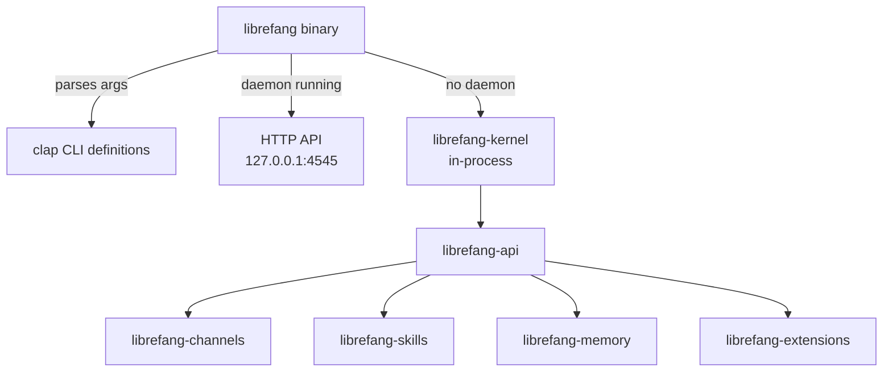

# Other — librefang-cli

# librefang-cli

Command-line interface for the LibreFang Agent OS. Ships the `librefang` binary and serves as the primary entry point for interacting with the system.

## Overview

`librefang-cli` is a thin but feature-rich binary crate. It delegates almost all logic to library crates in the workspace, acting as the glue between user input (via `clap`), the kernel, and the HTTP API. The binary operates in one of two modes depending on whether a daemon is already running:

- **Daemon mode** — When `librefang start` has been called, the CLI sends commands to the running daemon over HTTP at `http://127.0.0.1:4545` (default). This is the typical production flow.
- **Single-shot mode** — When no daemon is running, commands boot an in-process kernel, execute, and shut down. Useful for scripting and one-off operations.

## Architecture



The CLI depends on nearly every library crate in the workspace but does not contain business logic itself. It wires together configuration loading, signal handling, TUI rendering, and the HTTP client/server boundary.

## Feature Flags

Feature flags control which channel adapters are compiled and whether OpenTelemetry tracing is active. This is critical for build times — the full channel set pulls in heavy dependencies like `matrix-sdk-crypto`, `lettre`, `imap`, `rsa`, `rumqttc`, and `nostr-sdk`.

| Feature | Default | Description |
|---|---|---|
| `default` | ✅ | `core-channels` (telegram, discord, slack, webhook, ntfy) + `telemetry` |
| `all-channels` | ❌ | All ~25 channel adapters. **Does not imply `telemetry`.** |
| `mini` | ❌ | Minimal channel set for resource-constrained environments |
| `android` | ❌ | All channels except email (rustls incompatibility on Android) |
| `telemetry` | ✅ | OpenTelemetry + tracing-opentelemetry integration |

### Typical build commands

```bash
# Fast developer build (core channels only)
cargo build -p librefang-cli

# Release binary with full channel set + telemetry
cargo build -p librefang-cli --release --features all-channels

# Minimal build, no telemetry
cargo build -p librefang-cli --no-default-features --features mini
```

## Build-time Metadata

The `build.rs` script embeds three environment variables at compile time for use in `--version` output and diagnostics:

| Variable | Source | Example |
|---|---|---|
| `GIT_SHA` | `git rev-parse --short HEAD` | `a3f7c2d` |
| `BUILD_DATE` | `date -u +%Y-%m-%d` | `2025-01-15` |
| `RUSTC_VERSION` | `rustc --version` | `rustc 1.82.0` |

All three gracefully fall back to `"unknown"` if the external command fails (e.g., building from a tarball without git).

## Common Commands

```
librefang start              # Start the daemon (HTTP API + dashboard)
librefang init               # Write starter ~/.librefang/config.toml
librefang agent spawn        # Create a new agent
librefang agent list         # List running agents
librefang agent message      # Send a message to an agent
librefang doctor             # Diagnose the local environment
librefang help               # Full command catalog
```

Every subcommand accepts `--help` for detailed usage.

## Key Dependencies

| Crate | Role |
|---|---|
| `librefang-kernel` | Core runtime and lifecycle management |
| `librefang-api` | HTTP API layer; re-exports channel feature flags |
| `librefang-channels` | Channel adapter implementations |
| `librefang-types` | Shared type definitions |
| `librefang-migrate` | Database migrations |
| `librefang-skills` | Agent skill system |
| `librefang-extensions` | Extension loading and management |
| `librefang-memory` | Agent memory and context storage |
| `librefang-runtime` | Async runtime configuration |
| `librefang-acp` | Access control policy (with `kernel-adapter` feature) |
| `clap` / `clap_complete` | Argument parsing and shell completion generation |
| `ratatui` | Terminal UI for dashboard rendering |
| `tikv-jemallocator` | Global allocator on non-MSVC targets (performance) |

## Global Allocator

On non-MSVC targets (Linux, macOS, BSD), `tikv-jemallocator` is used as the global allocator with `disable_initial_exec_tls` to avoid issues in certain linking contexts. This is configured in `main.rs` and excluded automatically on Windows MSVC via the `cfg` target predicate in `Cargo.toml`.

## Development Notes

- **Cold builds are fast by default.** The `default` feature set avoids pulling in heavy channel dependencies. Use `all-channels` only when testing specific adapters.
- **Release CI passes `--features all-channels`** without `--no-default-features`, so published binaries include both the full channel set and telemetry.
- **Shell completions** can be generated at runtime via `clap_complete` — check `librefang completions --help`.
- **Configuration** lives at `~/.librefang/config.toml` by default; `librefang init` creates a starter file.
- The `rusqlite` dependency indicates direct SQLite usage for local data storage outside the kernel's own storage layer.