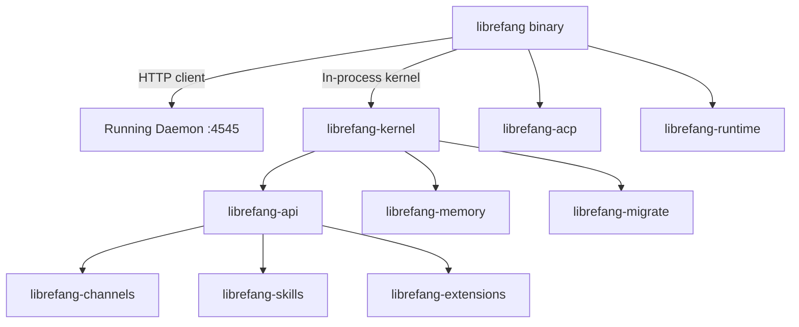

# Other — librefang-cli

# librefang-cli

Command-line interface for the LibreFang Agent OS. Produces the `librefang` binary that serves as the primary entry point for interacting with the system.

## Overview

The CLI operates in two modes depending on whether a daemon is already running:

- **Daemon mode** (`librefang start`): Starts a long-lived HTTP API server and dashboard at `http://127.0.0.1:4545`.
- **Single-shot mode**: When no daemon is detected, individual commands boot an in-process kernel, execute, and exit.

## Architecture



## Feature Flags

Feature flags control which channel adapters and capabilities are compiled. This keeps developer build times reasonable — the default feature set avoids heavy dependencies like `matrix-sdk-crypto`, `lettre`, `imap`, `rsa`, `rumqttc`, and `nostr-sdk`.

| Feature | Description |
|---|---|
| `default` | Enables `core-channels` (telegram, discord, slack, webhook, ntfy) and `telemetry`. |
| `all-channels` | Enables the full ~25-channel adapter set. Does **not** imply `telemetry`. |
| `mini` | Minimal build via `librefang-api/mini`. |
| `android` | All channels except email (excluded due to `rustls-connector` + `rustls-platform-verifier` incompatibility on Android). |
| `telemetry` | Enables OpenTelemetry tracing export. Brings in `opentelemetry`, `opentelemetry_sdk`, and `tracing-opentelemetry`. |

**Release CI** builds with `--features all-channels` (default features remain active, so `telemetry` is included). To build everything explicitly with no defaults:

```bash
cargo build -p librefang-cli --no-default-features --features all-channels,telemetry
```

## Common Commands

| Command | Description |
|---|---|
| `librefang start` | Start the daemon (HTTP API + dashboard). |
| `librefang init` | Write a starter config to `~/.librefang/config.toml`. |
| `librefang agent <subcommand>` | Spawn, list, or message agents. |
| `librefang doctor` | Diagnose the local environment and configuration. |

Run `librefang help` or any subcommand with `--help` for the full catalog.

## Build Script (`build.rs`)

The build script captures metadata at compile time and injects it via `cargo:rustc-env`:

| Variable | Source | Fallback |
|---|---|---|
| `GIT_SHA` | `git rev-parse --short HEAD` | `"unknown"` |
| `BUILD_DATE` | `date -u +%Y-%m-%d` | `"unknown"` |
| `RUSTC_VERSION` | `rustc --version` | `"unknown"` |

These are accessible at runtime via `env!("GIT_SHA")`, `env!("BUILD_DATE")`, and `env!("RUSTC_VERSION")` — typically used in `--version` output or diagnostic commands like `doctor`.

## Key Dependencies

### Internal crates

- **librefang-kernel** — Core agent runtime and orchestration.
- **librefang-api** — HTTP API layer and channel adapter registry. The CLI passes feature flags through to this crate.
- **librefang-channels** — Channel adapter implementations (feature-gated).
- **librefang-migrate** — Database migration logic.
- **librefang-skills** — Agent skill definitions.
- **librefang-extensions** — Extension system.
- **librefang-memory** — Agent memory and persistence.
- **librefang-runtime** — Runtime support utilities.
- **librefang-acp** — Access control policies (with `kernel-adapter` feature).
- **librefang-types** — Shared type definitions.

### Notable external crates

- **clap** / **clap_complete** — Argument parsing and shell completion generation.
- **tokio** — Async runtime.
- **tracing** / **tracing-subscriber** — Structured logging.
- **reqwest** (blocking) — HTTP client for daemon communication.
- **ratatui** — Terminal UI framework (used for the dashboard).
- **rusqlite** — SQLite for local state.
- **toml** / **toml_edit** — Configuration file parsing and manipulation.
- **tikv-jemallocator** — Global allocator on non-MSVC targets, replacing the system allocator for improved performance. Gated behind `cfg(not(target_env = "msvc"))`.

## Configuration

The CLI reads configuration from `~/.librefang/config.toml`. Generate a starter config with:

```bash
librefang init
```

The config file controls the HTTP bind address, channel credentials, telemetry endpoints, and other agent settings.